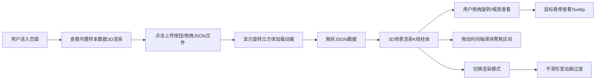

## 1. 产品概述

本产品是一个3D K线瀑布图可视化应用，用于解决传统2D K线图在分析长期趋势时时间维度被压缩、历史K线与当前K线重叠导致视觉混乱的问题。目标用户为交易员和数据分析师，让他们能够在三维空间中沿时间轴旋转视角，直观对比不同交易日之间的价格形态和成交量变化。

## 2. 核心功能

### 2.1 用户角色
| 角色 | 注册方式 | 核心权限 |
|------|----------|----------|
| 普通用户 | 无需注册 | 上传JSON数据、查看3D K线图、切换渲染模式、调整时间轴 |

### 2.2 功能模块
1. **主界面**: 文件上传、3D场景渲染、侧边操作面板
2. **3D K线图**: 柱体渲染、Tooltip交互、轨道控制、时间轴过滤
3. **渲染模式切换**: K线柱体模式、热力图模式、线框图模式
4. **数据处理**: JSON解析、时间区间过滤、动画状态管理

### 2.3 页面详情
| 页面名称 | 模块名称 | 功能描述 |
|----------|----------|----------|
| 主界面 | 文件上传区 | 支持点击或拖拽上传JSON文件，带有渐变按钮和涟漪动画 |
| 主界面 | 3D场景 | Three.js渲染K线柱体，支持轨道控制、鼠标悬停交互 |
| 主界面 | 侧边操作面板 | 包含上传区、时间轴滑块、渲染模式切换按钮、当前区间显示 |
| 主界面 | 加载动画 | Three.js旋转立方体加载动画，半透明棱边 |
| 主界面 | 时间轴滑块 | 自定义样式，拖动聚焦日期区间，区间外柱体半透明微缩 |

## 3. 核心流程

## 4. 用户界面设计

### 4.1 设计风格
- **主色调**: 浅蓝(#42a5f5)到深蓝(#1565c0)渐变
- **副色调**: 阳线红色渐变(#e53935到#ff8a80)，阴线绿色渐变(#43a047到#a5d6a7)
- **背景色**: 深色主题#0d1117，面板#161b22
- **文字色**: 浅灰#c9d1d9，hover时变为白色
- **按钮样式**: 圆角矩形，上传按钮带渐变填充，点击有涟漪扩散动画
- **字体**: 无衬线字体，统一简洁风格
- **布局**: 桌面端左15%操作面板，右85% 3D场景；移动端面板折叠为顶部悬停栏

### 4.2 页面设计概述
| 页面名称 | 模块名称 | UI元素 |
|----------|----------|--------|
| 主界面 | 文件上传区 | 虚线边框区域，渐变上传按钮，涟漪动画 |
| 主界面 | 3D场景 | Three.js Canvas，渐变边框，轨道控制器 |
| 主界面 | 侧边面板 | 深灰背景，圆角8px，白色细边框 |
| 主界面 | 时间轴滑块 | 自定义圆形滑块(20px直径)，渐变背景 |
| 主界面 | 渲染模式切换 | 三个并排圆角按钮，深灰背景，选中亮蓝#2196f3 |
| 主界面 | 加载动画 | 半透明立方体，每个面缓慢自转 |
| 主界面 | Tooltip | 包含完整日期、开收高低、成交量信息 |

### 4.3 响应式
- 桌面端(≥768px): 左侧15%操作面板 + 右侧85% 3D场景
- 移动端(<768px): 操作面板折叠为顶部悬停栏(高度60px)，3D场景占满全屏
- 触摸优化: 支持双指缩放、单指旋转

### 4.4 3D场景指导
- **环境**: 深色背景#0d1117，微弱渐变边框(透明到深蓝#58a6ff)
- **光照**: 环境光 + 方向光，确保柱体颜色真实呈现
- **相机**: 透视相机，初始位置可俯视整个K线阵列
- **运动**: OrbitControls轨道控制，支持旋转、缩放、平移
- **构图**: X轴时间、Z轴价格、Y轴成交量，K线柱体按时间排列
- **交互**: 鼠标悬停柱体微上浮(10px)并显示Tooltip，点击可选中高亮
- **动画**: 区间内柱体脉冲放大1.1倍(2s周期)，模式切换0.4s平滑过渡
- **性能**: 最多500个柱体，帧率≥40fps，使用instanced mesh优化
