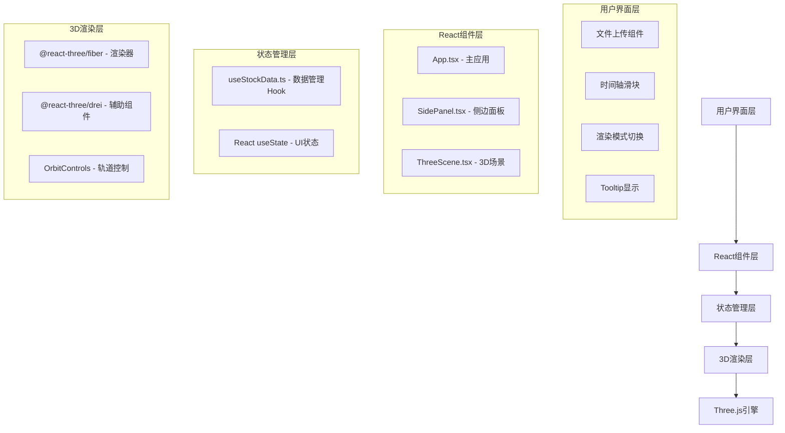
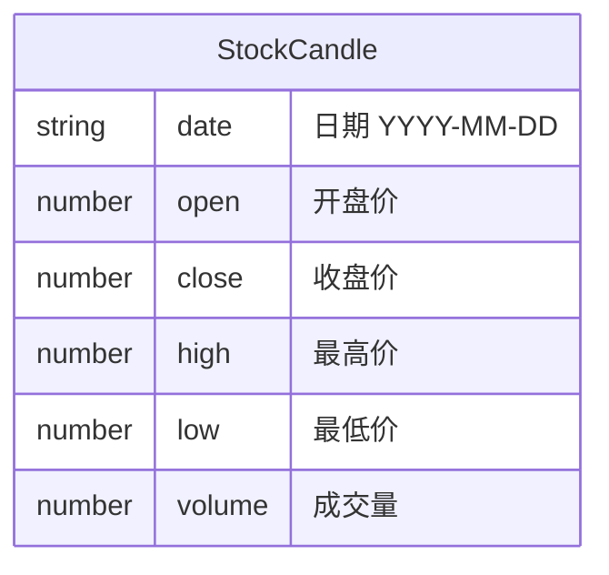

## 1. 架构设计



## 2. 技术描述

- **前端框架**: React@18 + TypeScript@5
- **构建工具**: Vite@5 + @vitejs/plugin-react
- **3D渲染**: Three@0.160 + @react-three/fiber@8 + @react-three/drei@9
- **类型定义**: @types/three@0.160
- **样式方案**: CSS Modules / 内联样式 + CSS变量
- **无后端**: 纯前端应用，数据由用户上传JSON提供
- **内置样本数据**: 代码中内置模拟股票数据用于演示

## 3. 路由定义

| 路由 | 用途 |
|------|------|
| / | 主应用页面，包含所有功能 |

## 4. 数据模型

### 4.1 数据模型定义



### 4.2 TypeScript类型定义

```typescript
interface StockCandle {
  date: string;
  open: number;
  close: number;
  high: number;
  low: number;
  volume: number;
}

type RenderMode = 'candle' | 'heatmap' | 'wireframe';

interface TimeRange {
  start: number;
  end: number;
}
```

## 5. 文件组织结构

```
├── package.json          # 项目依赖配置
├── index.html            # 入口HTML
├── vite.config.js        # Vite配置
├── tsconfig.json         # TypeScript配置
└── src/
    ├── main.tsx          # React入口
    ├── App.tsx           # 主应用组件
    ├── types.ts          # 类型定义
    ├── hooks/
    │   └── useStockData.ts    # 数据管理Hook
    └── components/
        ├── ThreeScene.tsx     # 3D场景组件
        └── SidePanel.tsx      # 侧边面板组件
```

## 6. 性能优化策略

1. **InstancedMesh**: 使用实例化网格渲染500个K线柱体，减少Draw Call
2. **按需更新**: 仅在数据、时间区间、渲染模式变化时更新3D对象
3. **动画优化**: 使用useFrame钩子进行帧动画，避免不必要的重渲染
4. **层级细节**: 距离较远的柱体可降低几何体细分
5. **内存管理**: 组件卸载时清理Three.js资源，避免内存泄漏
6. **帧率监控**: 确保500个柱体时帧率≥40fps
