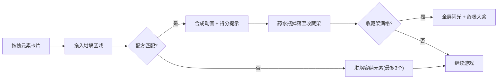

## 1. 产品概述

魔法药水工坊是一款炼金术主题的网页合成小游戏，玩家通过拖拽基础元素到坩埚中合成各种药水，体验连锁反应的乐趣与收集的成就感。

- 核心玩法：拖拽火、水、土、气四种基础元素到坩埚，按配方自动合成新药水
- 目标用户：休闲游戏玩家、炼金术/魔法题材爱好者
- 产品价值：提供轻量有趣的合成收集体验，精美的视觉反馈带来愉悦感

## 2. 核心功能

### 2.1 功能模块

1. **材料区**：四个基础元素卡片，支持拖拽交互
2. **坩埚区**：元素投放、配方匹配、合成特效、结果提示
3. **收藏架**：药水瓶展示、队列动画、满格奖励

### 2.3 页面详情

| 页面名称 | 模块名称 | 功能描述 |
|---------|---------|---------|
| 主游戏页 | 材料区 | 展示火、水、土、气四张元素卡片，带微光脉动动画，支持拖拽 |
| 主游戏页 | 坩埚区 | SVG绘制的坩埚，接收拖拽元素，最多容纳3个，匹配配方时触发合成动画 |
| 主游戏页 | 收藏架 | 展示已合成药水，从右向左推入队列，每格最多3瓶，满格触发大奖 |
| 主游戏页 | 得分系统 | 合成成功时显示得分数字和弹跳动画 |
| 主游戏页 | 背景层 | 缓慢旋转的星云粒子背景，营造神秘氛围 |

## 3. 核心流程

玩家从左侧材料区拖拽元素卡片 → 元素拖入坩埚时触发放置特效 → 坩埚内元素达到配方条件时自动合成 → 生成新药水瓶并显示成功提示与得分 → 药水瓶掉落到右侧收藏架 → 收藏架满格后触发终极大奖特效

## 4. 用户界面设计

### 4.1 设计风格

- **主色调**：深紫色 #2D1B4E（背景）搭配金色 #D4AF37（强调色）
- **整体风格**：暗色神秘炼金术风，毛玻璃质感卡片，星云粒子背景
- **动效风格**：所有交互过渡 0.2-0.4s 缓冲，柔和优雅
- **元素卡片**：半透明毛玻璃质感，微光脉动动画
- **坩埚**：SVG 绘制，动态蒸汽上升动画

### 4.2 页面设计概览

| 页面名称 | 模块名称 | UI元素 |
|---------|---------|-------|
| 主游戏页 | 材料区 | 4张竖向排列的元素卡片，毛玻璃质感，微光脉动，拖拽时缩小跟随 |
| 主游戏页 | 坩埚区 | 中央大坩埚SVG，内部元素图标，合成时粒子爆炸特效，成功提示弹跳文字 |
| 主游戏页 | 收藏架 | 右侧横向格子，药水瓶图标，从右向左推入动画，满格闪光 |
| 主游戏页 | 背景层 | 深蓝色渐变背景，缓慢旋转的星云粒子层 |

### 4.3 响应式

桌面端优先设计，采用 Flex 布局自适应，三栏式结构（材料区-坩埚-收藏架）

### 4.4 视觉特效

- **拖拽反馈**：卡片跟随鼠标，缩小效果
- **放置特效**：水花溅射粒子（Canvas渲染）
- **合成特效**：元素消失 + 粒子爆炸 + 得分弹跳文字
- **蒸汽动画**：坩埚上方持续上升的蒸汽粒子
- **星云背景**：缓慢旋转的星点粒子层
- **满格特效**：全屏闪光 + 大奖提示
