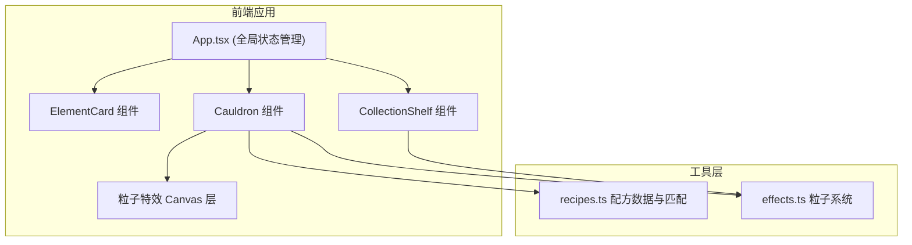

## 1. 架构设计



## 2. 技术说明

- **前端框架**：React 18 + TypeScript
- **构建工具**：Vite
- **渲染方式**：DOM 组件 + Canvas 粒子特效混合
- **状态管理**：React useState/useReducer 局部状态
- **拖拽实现**：原生 HTML5 Drag API + 鼠标事件
- **动画方案**：CSS transitions/animations + Canvas requestAnimationFrame

## 3. 目录结构

| 文件路径 | 用途 |
|---------|------|
| package.json | 项目依赖与脚本配置 |
| index.html | 入口页面，挂载 React 根节点 |
| vite.config.js | Vite 配置（React 插件） |
| tsconfig.json | TypeScript 配置（严格模式、ES2020、react-jsx） |
| src/App.tsx | 主应用组件，全局状态管理，协调各组件交互 |
| src/components/ElementCard.tsx | 基础元素卡片组件，可拖拽 + 微光动画 |
| src/components/Cauldron.tsx | 坩埚组件，投放检测、配方匹配、合成特效 |
| src/components/CollectionShelf.tsx | 收藏架组件，药水展示、队列动画、满格特效 |
| src/utils/recipes.ts | 合成配方数据与匹配逻辑函数 |
| src/utils/effects.ts | Canvas 粒子特效绘制工具 |

## 4. 数据模型

### 4.1 元素类型

```typescript
type ElementType = 'fire' | 'water' | 'earth' | 'air';

interface ElementInfo {
  id: string;
  type: ElementType;
  name: string;
  color: string;
  icon: string;
}
```

### 4.2 药水类型

```typescript
type PotionType = 'magma' | 'storm' | 'steam' | 'mud' | 'lightning' | 'dust' | 'philosopher';

interface PotionInfo {
  id: string;
  type: PotionType;
  name: string;
  color: string;
  score: number;
  recipe: ElementType[];
}
```

### 4.3 配方数据

| 配方名称 | 元素组合 | 得分 |
|---------|---------|------|
| 岩浆 | 火 + 土 | 100 |
| 风暴 | 水 + 气 | 100 |
| 蒸汽 | 火 + 水 | 80 |
| 泥土 | 水 + 土 | 80 |
| 闪电 | 火 + 气 | 120 |
| 尘埃 | 土 + 气 | 80 |
| 贤者之石 | 火 + 水 + 土 | 500 |

### 4.4 粒子系统

```typescript
interface Particle {
  x: number;
  y: number;
  vx: number;
  vy: number;
  life: number;
  maxLife: number;
  color: string;
  size: number;
}
```

## 5. 性能指标

- **帧率**：稳定 60FPS
- **粒子上限**：单帧不超过 200 个粒子
- **每帧计算**：小于 0.5ms
- **动画过渡**：0.2-0.4s 缓动效果
