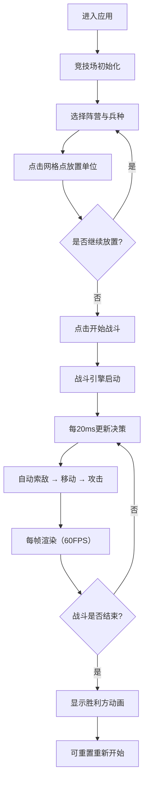

## 1. 产品概述

圆形竞技场战斗推演应用，用于策略型游戏设计过程中快速验证不同兵种组合、站位阵型和升级路径对战斗结果的影响。

- 主要用途：模拟红蓝双方阵营士兵在圆形竞技场中的自动对战，提供实时战斗数据可视化
- 目标用户：游戏设计师、策略游戏开发者、平衡性测试人员

## 2. 核心功能

### 2.1 功能模块

1. **圆形竞技场主界面**：深棕色石质地砖背景，蓝色发光边界，左右对称网格放置点
2. **兵种放置系统**：支持蓝方/红方各4种兵种的放置，带弹跳入场动画
3. **单位属性面板**：点击单位显示雷达图形式的属性展示（攻击、防御、攻速、移速、技能冷却）
4. **战斗控制系统**：开始/暂停/重置按钮，圆角矩形蓝橙渐变样式
5. **实时战斗引擎**：20ms决策帧更新，60FPS渲染，自动索敌、移动、攻击逻辑
6. **视觉特效系统**：远程弹药拖尾粒子、命中闪白、伤害数值浮动、溅射伤害圆环、胜利粒子爆发
7. **实时统计面板**：存活单位数、总击杀数、战斗时长

### 2.2 页面详情

| 页面名称 | 模块名称 | 功能描述 |
|---------|---------|---------|
| 主战斗页面 | 圆形竞技场 | 深棕色石质地砖背景(#3e2723)，蓝色发光光晕边界，左右对称网格点 |
| 主战斗页面 | 兵种选择与放置 | 左侧蓝方、右侧红方，各4种兵种（剑士、弓箭手、骑兵、法师），点击网格放置 |
| 主战斗页面 | 单位属性面板 | 点击单位弹出雷达图显示5维属性 |
| 主战斗页面 | 战斗控制栏 | 底部固定，开始/暂停/重置按钮，蓝橙渐变圆角矩形 |
| 主战斗页面 | 实时统计面板 | 战局上方显示存活数、击杀数、战斗时长 |
| 主战斗页面 | 胜利结算 | 战斗结束显示胜利方，全屏金色粒子爆发2秒 |

## 3. 核心流程

## 4. 用户界面设计

### 4.1 设计风格

- **主色调**：深棕色背景(#2c1a0e, #3e2723)，蓝色阵营(#42a5f5)，红色阵营(#f44336)
- **辅助色**：满血绿(#4caf50)，半血橙(#ff9800)，残血红(#f44336)
- **按钮样式**：圆角矩形，蓝到橙线性渐变背景
- **字体**：使用现代无衬线字体，标题加粗，数据等宽显示
- **布局风格**：桌面端竞技场占宽70%居中，底部控制栏固定高度，统计面板浮于战局上方
- **动画风格**：单位弹跳入场(scale + translateY)，平滑移动插值(0.15s ease-out)，命中闪白，粒子效果

### 4.2 兵种属性

| 兵种 | 定位 | 特点 | 颜色标识 |
|-----|-----|-----|---------|
| 剑士 | 近战 | 血量高，防御强 | 深灰 |
| 弓箭手 | 远程 | 攻击低，射速快 | 森林绿 |
| 骑兵 | 突击 | 移速快，冲锋击退 | 金黄 |
| 法师 | 范围 | 范围攻击，血量低 | 紫罗兰 |

### 4.3 响应式设计

- 桌面端优先：竞技场宽度70%居中显示
- 移动端适配：竞技场宽度95%，控制栏自适应
- 触控优化：放置区域触控友好，按钮最小尺寸44px

## 5. 性能要求

- 渲染帧率：60FPS稳定运行
- 单位上限：50个（每方25个）
- 降级策略：单位超限时自动减少粒子渲染数量
- 逻辑帧率：决策更新20ms/帧（50Hz）
