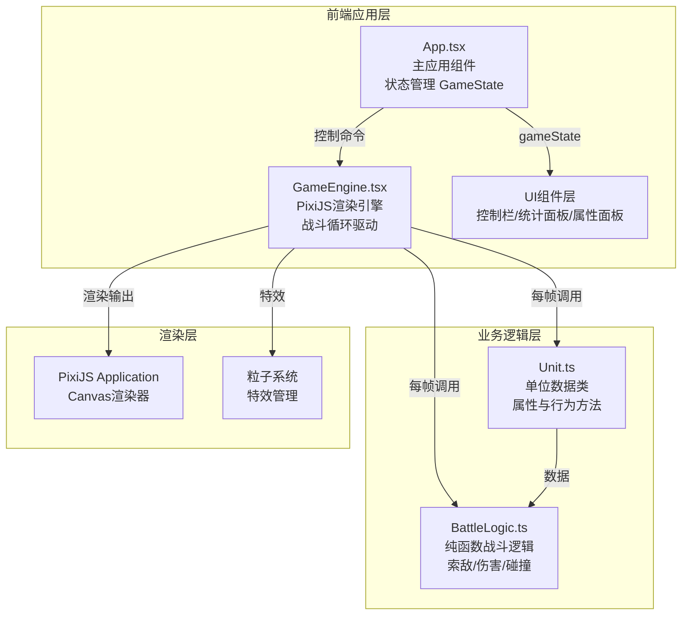

## 1. 架构设计



## 2. 技术描述

- **前端框架**：React@18 + TypeScript@5
- **构建工具**：Vite@5 + @vitejs/plugin-react
- **渲染引擎**：PixiJS@7（Canvas 2D高性能渲染）
- **工具库**：react-use（useRafLoop实现稳定帧循环）
- **状态管理**：React useState/useRef（轻量场景，无需额外状态库）
- **初始化工具**：npm init vite-init

## 3. 文件组织结构

```
d:\Pro\tasks\auto240\
├── index.html              # 入口HTML
├── package.json            # 依赖与脚本
├── vite.config.js          # Vite配置
├── tsconfig.json           # TypeScript配置
└── src/
    ├── main.tsx            # React应用入口
    ├── App.tsx             # 主应用组件（状态管理、UI布局）
    ├── GameEngine.tsx      # 核心游戏引擎（PixiJS渲染、战斗循环）
    ├── Unit.ts             # 单位数据类
    └── BattleLogic.ts      # 纯函数战斗逻辑模块
```

## 4. 核心数据模型

### 4.1 单位类型定义

```typescript
type Faction = 'blue' | 'red';
type UnitType = 'swordsman' | 'archer' | 'cavalry' | 'mage';

interface UnitStats {
  maxHp: number;
  attack: number;
  defense: number;
  attackSpeed: number;   // 攻击/秒
  moveSpeed: number;     // 像素/秒
  range: number;         // 攻击范围（像素）
  splashRadius: number;  // 溅射范围（0表示无溅射）
  knockback: number;     // 击退力度
  skillCooldown: number; // 技能冷却（秒）
}

interface UnitData {
  id: string;
  faction: Faction;
  type: UnitType;
  x: number;
  y: number;
  hp: number;
  stats: UnitStats;
  targetId: string | null;
  lastAttackTime: number;
  flashUntil: number;     // 受击闪白截止时间戳
  knockbackUntil: number;
  knockbackVelocity: { x: number; y: number };
}
```

### 4.2 游戏状态

```typescript
type GamePhase = 'placing' | 'fighting' | 'paused' | 'ended';

interface GameState {
  phase: GamePhase;
  units: UnitData[];
  blueAlive: number;
  redAlive: number;
  totalKills: number;
  battleDuration: number;  // 秒
  winner: Faction | null;
  selectedUnitId: string | null;
}
```

### 4.3 兵种基础属性表

| 属性 | 剑士 | 弓箭手 | 骑兵 | 法师 |
|-----|-----|-------|-----|-----|
| maxHp | 150 | 70 | 100 | 60 |
| attack | 20 | 10 | 25 | 18 |
| defense | 10 | 3 | 6 | 2 |
| attackSpeed | 1.0 | 2.5 | 0.8 | 0.7 |
| moveSpeed | 60 | 50 | 120 | 45 |
| range | 25 | 150 | 30 | 120 |
| splashRadius | 0 | 0 | 0 | 50 |
| knockback | 0 | 0 | 40 | 0 |
| skillCooldown | 5 | 4 | 6 | 8 |

## 5. 战斗逻辑模块（BattleLogic.ts）

核心纯函数，不依赖PixiJS：

| 函数 | 用途 |
|-----|-----|
| `findNearestEnemy(unit, allUnits)` | L2距离最近敌方索敌 |
| `isInRange(attacker, target)` | 判断是否在攻击范围内 |
| `calculateDamage(attacker, target)` | 考虑攻防的伤害计算 |
| `applyKnockback(target, source, force)` | 击退位移计算 |
| `getSplashTargets(center, radius, allUnits, excludeFaction)` | 溅射目标选取 |
| `moveTowards(unit, target, dt)` | 向目标直线移动 |

## 6. 渲染与性能策略

### 6.1 双循环架构
- **逻辑循环**：20ms固定步长（useRef + setInterval），更新单位决策
- **渲染循环**：useRafLoop 60FPS，执行位置插值与Canvas重绘

### 6.2 平滑插值
- 单位位置使用目标位置 + ease-out插值（0.15s过渡）
- PixiJS displayObject.position 存储渲染位置，逻辑位置存在UnitData中

### 6.3 粒子降级
- 单位数 > 40：关闭拖尾粒子，仅保留命中闪白
- 单位数 > 50：限制同屏粒子最多20个
- 粒子对象池复用，避免频繁GC

### 6.4 碰撞检测优化
- 按阵营分桶存储单位引用
- 索敌仅遍历敌方阵营桶
- L2距离计算使用平方距离比较避免开方
