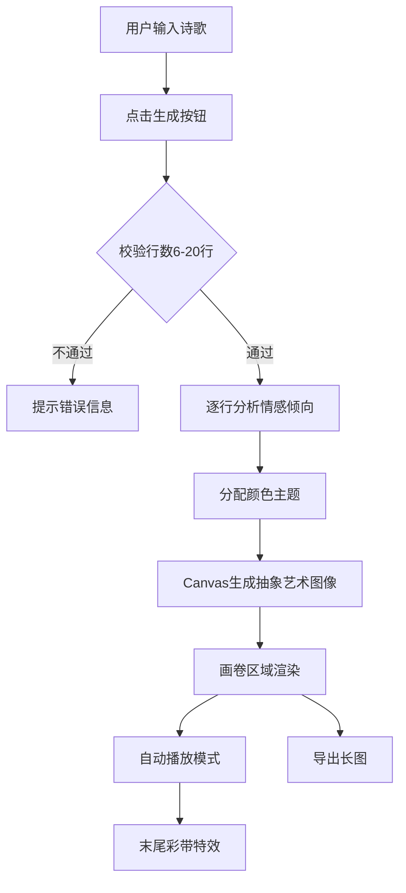

## 1. 产品概述
交互式诗歌创作与视觉生成应用——用户输入短诗（6-20行），系统自动为每行诗句分析情感倾向并生成对应的抽象艺术图像，以滚动画卷形式同步展示诗文与画面，支持自动播放与长图导出。

- 目标用户：诗歌爱好者、创意写作者、艺术创作者
- 核心价值：将文字诗意转化为视觉艺术，提供沉浸式的诗文-图像同步浏览体验

## 2. 核心功能

### 2.1 用户角色
| 角色 | 注册方式 | 核心权限 |
|------|----------|----------|
| 普通用户 | 无需注册 | 输入诗歌、生成画卷、自动播放、导出长图 |

### 2.2 功能模块
1. **诗歌输入页**：文本输入区域、生成按钮、输入校验
2. **画卷展示页**：诗句与图像滚动列表、自动播放控制、导出功能

### 2.3 页面详情
| 页面名称 | 模块名称 | 功能描述 |
|----------|----------|----------|
| 诗歌输入页 | 文本输入区 | 支持输入/粘贴6-20行诗歌，每行不超过30字符 |
| 诗歌输入页 | 生成按钮 | 点击后分析诗句情感并生成抽象图像 |
| 画卷展示页 | 画卷滚动列表 | 垂直滚动布局，诗句与图像同步展示 |
| 画卷展示页 | 自动播放 | 每2秒滚动一行，高亮当前诗句，末尾彩带特效 |
| 画卷展示页 | 导出长图 | 将整个画卷导出为PNG长图，含加载遮罩 |

## 3. 核心流程

用户在文本区域输入诗歌 → 点击生成按钮 → 系统校验行数与字数 → 逐行分析情感倾向（积极/消极） → 分配颜色主题（暖色/冷色） → Canvas 2D API 生成抽象艺术图像 → 画卷区域展示诗句与图像 → 支持自动播放模式 → 支持导出长图

## 4. 用户界面设计

### 4.1 设计风格
- 主色调：深色渐变背景 #0d1b2a → #1b2838
- 强调色：积极暖色 #ff6b6b → #ffd93d，消极冷色 #6c5ce7 → #74b9ff
- 按钮风格：玻璃态设计，悬停渐变，点击波纹扩散
- 字体：手写风格 Dancing Script（Google Fonts），正文 20px，行高 1.8
- 布局风格：居中对齐画卷，最大宽度 900px，响应式适配
- 图标风格：简洁线性图标

### 4.2 页面设计概览
| 页面名称 | 模块名称 | UI元素 |
|----------|----------|--------|
| 诗歌输入页 | 文本输入区 | 玻璃态背景 rgba(255,255,255,0.05)，模糊10px，边框1px solid rgba(255,255,255,0.1) |
| 诗歌输入页 | 生成按钮 | 悬停 #6c5ce7→#a29bfe 渐变，点击波纹动效 |
| 画卷展示页 | 诗句卡片 | 半透明白色磨砂背景，柔和阴影，Dancing Script 20px |
| 画卷展示页 | 抽象图像 | 280×280px Canvas，0.5s 淡入动画 |
| 画卷展示页 | 分隔线 | 细虚线 #495057 |
| 画卷展示页 | 当前高亮 | 背景 #ffeaa7，0.3s 过渡 |
| 画卷展示页 | 自动播放按钮 | 播放/暂停切换 |
| 画卷展示页 | 导出按钮 | 弧度反馈动画，加载遮罩 |

### 4.3 响应式设计
- 桌面端优先：图像与诗句左右排列
- 移动端适配（<600px）：图像与诗句上下排列
- 平滑减速滚动（scroll-behavior: smooth）

### 4.4 3D场景指导
- 不适用
