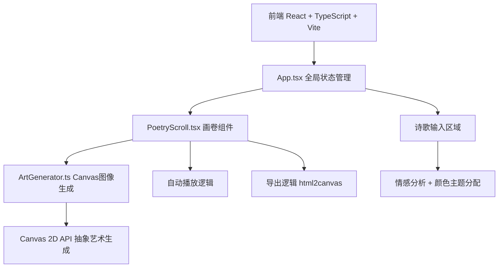
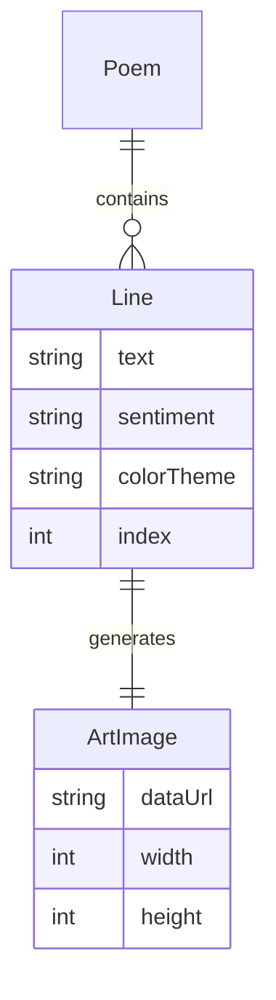

## 1. 架构设计



## 2. 技术说明
- 前端：React 18 + TypeScript + Vite
- 初始化工具：vite-init（react-ts 模板）
- 后端：无
- 数据库：无
- 图像生成：Canvas 2D API（纯前端）
- 彩带特效：canvas-confetti
- 长图导出：html2canvas
- 样式方案：纯 CSS（styles.css），不使用 Tailwind
- 状态管理：React useState/useRef（轻量应用，无需 Zustand）

## 3. 路由定义
| 路由 | 用途 |
|------|------|
| / | 单页应用，包含诗歌输入和画卷展示 |

## 4. API定义
- 无后端API，所有逻辑纯前端实现

## 5. 服务器架构图
- 不适用

## 6. 数据模型

### 6.1 数据模型定义



### 6.2 数据定义语言
- 无数据库，使用 TypeScript 接口定义：

```typescript
interface PoemLine {
  text: string;
  sentiment: 'positive' | 'negative';
  colorTheme: { start: string; end: string };
  index: number;
}

interface ArtImage {
  dataUrl: string;
  width: number;
  height: number;
}

interface PoemState {
  lines: PoemLine[];
  images: ArtImage[];
  isPlaying: boolean;
  currentLine: number;
}
```
