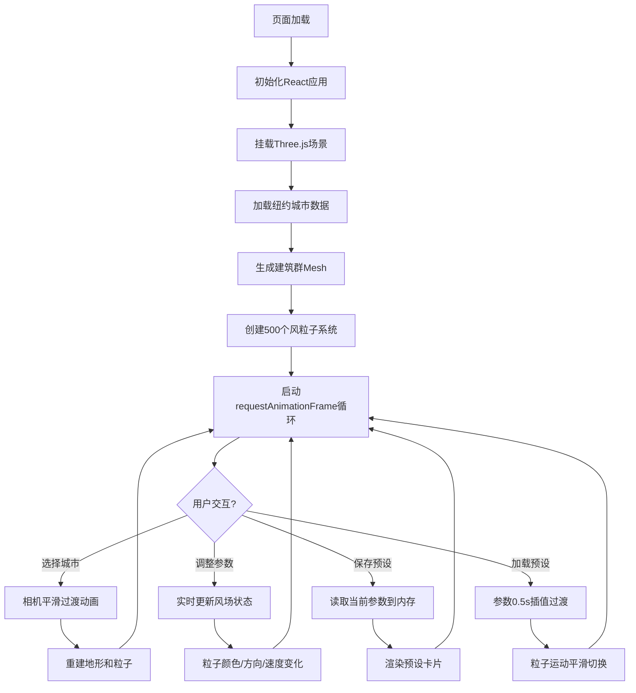

## 1. 产品概述

城市风场3D可视化应用，帮助城市规划师和气象爱好者直观分析城市风环境。通过Three.js构建三维场景，动态粒子系统模拟全年风流动模式，解决传统2D风向图无法表达垂直空间风力变化和涡流效应的痛点。

- 核心价值：将抽象的风场数据转化为沉浸式3D交互体验
- 目标用户：城市规划师、建筑设计师、气象研究爱好者、环境科学学生

---

## 2. 核心功能

### 2.1 用户角色
| 角色 | 注册方式 | 核心权限 |
|------|----------|----------|
| 访客用户 | 无需注册 | 选择城市、调整风场参数、保存/加载预设、查看性能数据 |

### 2.2 功能模块
1. **3D场景渲染区**：全屏幕Three.js画布，包含建筑群、粒子风场、辅助网格、风向标
2. **风场控制面板**：风速滑块、风向旋钮、湍流滑块、粒子数调节、预设列表
3. **城市选择器**：预设城市（纽约、东京、上海）快速切换
4. **性能监控条**：实时FPS显示、粒子计数、性能降级提示

### 2.3 页面详情
| 页面名称 | 模块名称 | 功能描述 |
|----------|----------|----------|
| 主应用页 | 3D场景区 | 全屏Three.js渲染，鼠标左键旋转/右键平移/滚轮缩放，建筑群按密度着色，粒子系统动态模拟风流动 |
| 主应用页 | 城市选择 | 下拉选择城市，相机平滑飞行过渡，地形重新生成 |
| 主应用页 | 控制面板 | 风速0-20m/s滑块、360°风向旋钮、湍流0-1滑块、保存预设按钮、预设卡片列表 |
| 主应用页 | 性能监控 | 底部悬浮条显示FPS和粒子数，FPS<30自动降质提示 |

---

## 3. 核心流程

### 3.1 主要用户流程
1. 页面加载 → 自动初始化纽约场景并播放粒子动画
2. 用户选择城市 → 相机平滑飞行 → 地形重建 → 风场重置
3. 调整风速/风向/湍流滑块 → 粒子系统实时响应 → 风向标同步旋转
4. 点击保存预设 → 输入名称 → 预设卡片添加到列表
5. 点击预设卡片 → 风场参数0.5s过渡到配置值

### 3.2 流程图

---

## 4. 用户界面设计

### 4.1 设计风格
- **主色调**：深空蓝黑背景 `#1a1a2e`
- **建筑配色**：密度渐变 `#b0bec5`（低密度，浅灰）→ `#455a64`（高密度，深灰），白色轮廓线
- **粒子配色**：风速渐变 `#2196f3`（蓝色，低速）→ `#f44336`（红色，高速）
- **交互元素**：圆角 `border-radius: 8px`，悬停发光 `box-shadow: 0 0 8px rgba(33,150,243,0.3)`
- **毛玻璃面板**：`backdrop-filter: blur(10px)` + `rgba(0,0,0,0.5)` 半透明深色
- **风向标**：红色箭头 `#ff5722` 三角形箭形
- **网格辅助**：淡灰色 `#e0e0e0`，间距20单位

### 4.2 页面设计概览
| 页面/区域 | 模块名称 | UI元素 |
|-----------|----------|--------|
| 全屏3D场景 | 画布层 | Three.js WebGLRenderer，暗色背景，正交透视相机 |
| 右侧浮动 | 控制面板 | 毛玻璃容器、滑块（带数值即时显示）、圆形风向旋钮、预设卡片栅格 |
| 顶部左侧 | 城市选择器 | 下拉菜单，圆角风格，城市图标 |
| 底部中心 | 性能条 | 渐变背景色标签，FPS数值、粒子计数、异常提示气泡 |
| 场景中心 | 辅助元素 | 半透明网格平面、中心风向标、建筑边缘轮廓 |

### 4.3 响应式设计
- 桌面端（1920x1080）：控制面板宽360px，右边缘浮动，不遮挡场景核心
- 窄屏（1366x768）：控制面板宽300px，缩小间距，预设卡片单列布局
- 所有控件最小可点击区域40x40px，支持触屏操作
- 场景自适应窗口resize，相机aspect实时更新

### 4.4 3D场景指引
- **环境光**：AmbientLight 强度0.4 + DirectionalLight 强度0.8 模拟日间光照
- **相机设置**：PerspectiveCamera，初始fov=60，距离场景中心约200单位
- **相机运动**：OrbitControls，enableDamping=true，阻尼0.05，切换城市时tween动画0.5s ease-in-out
- **粒子系统**：BufferGeometry + PointsMaterial，sizeAttenuation=true，vertexColors启用按顶点着色
- **拖尾效果**：通过保留历史位置数组，使用LineSegments或自定义Shader实现半透明拖尾（alpha 0.2-0.6）
- **建筑群**：批量BoxGeometry，通过merge或InstancedMesh优化性能，材质MeshStandardMaterial带emissive微弱边缘发光
- **性能优化**：粒子位置计算使用Float32Array批量更新，每帧一次setFromArray避免GC压力
