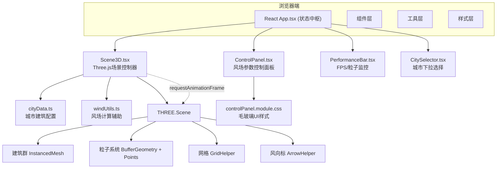

## 1. 架构设计



## 2. 技术描述

- **前端框架**：React@18 + TypeScript@5，严格模式 `strict: true, noUnusedLocals: true`
- **构建工具**：Vite@5 + @vitejs/plugin-react，路径别名 `@` → `src`
- **3D渲染引擎**：Three.js@0.160，原生THREE API（不使用react-three-fiber，以获得最大性能控制）
- **样式方案**：CSS Modules，避免全局类名冲突；UI层使用内联transition实现微动画
- **状态管理**：React useState + useCallback + forwardRef/useImperativeHandle实现父子双向通信
- **动画库**：不依赖第三方Tween库，手动实现线性插值lerp（ease-in-out缓动函数）

## 3. 文件结构

```
src/
├── App.tsx                         # 主组件，状态管理中枢
├── main.tsx                        # React入口挂载
├── components/
│   ├── Scene3D.tsx                 # Three.js场景（粒子/建筑/网格/风向标）
│   ├── ControlPanel.tsx            # 右侧浮动控制面板
│   ├── PerformanceBar.tsx          # 底部性能监控条
│   └── CitySelector.tsx            # 城市选择下拉框
├── utils/
│   └── cityData.ts                 # 城市预设数据（纽约/东京/上海）
├── types/
│   └── index.ts                    # 全局TypeScript接口
└── styles/
    ├── App.module.css              # 主布局样式
    ├── controlPanel.module.css     # 控制面板毛玻璃效果
    └── performanceBar.module.css   # 性能条渐变样式
```

## 4. 核心类型定义

```typescript
// src/types/index.ts
export interface Building {
  x: number;
  z: number;
  width: number;
  depth: number;
  height: number;
  density: number; // 0-1，决定颜色深浅
}

export interface CityData {
  id: string;
  name: string;
  center: [number, number]; // 场景中心坐标
  buildings: Building[];
  defaultWind: WindParams;
}

export interface WindParams {
  speed: number;       // 0-20 m/s
  direction: number;   // 0-360 度（0=正北）
  turbulence: number;  // 0-1 湍流强度
}

export interface WindPreset {
  id: string;
  name: string;
  cityId: string;
  wind: WindParams;
  particleCount: number;
  createdAt: number;
}

export interface Particle {
  position: Float32Array;  // [x,y,z]
  velocity: Float32Array;  // [vx,vy,vz]
  history: Float32Array;   // 拖尾历史位置 N*3
  speed: number;
}

export interface Scene3DHandle {
  updateWindParams: (wind: WindParams) => void;
  setParticleCount: (n: number) => void;
  loadCity: (city: CityData) => void;
  resetCamera: () => void;
  getParticleCount: () => number;
}
```

## 5. 关键实现策略

### 5.1 粒子系统性能优化
- 使用单个 `BufferGeometry` + `Points`，position属性为 `Float32Array(particleCount * 3)`
- 拖尾使用额外的 `LineSegments` BufferGeometry，每粒子保留8个历史位置点
- 每帧只调用一次 `geometry.attributes.position.needsUpdate = true`
- 粒子出界后wrap回场景对侧，避免频繁分配内存

### 5.2 风场物理
- 粒子速度 = 基础风向向量 × speed + 湍流向量（柏林噪声或伪随机）× turbulence
- 颜色映射：`speed` 归一化后在 `#2196f3` → `#f44336` 之间做RGB线性插值
- 拖尾长度 = `clamp(speed / maxSpeed, 0, 1) * maxHistoryLength`
- 湍流闪烁：在湍流>0.5时颜色通道加入 ±15% 随机扰动

### 5.3 相机过渡动画
- 切换城市时记录 `startCameraPos`、`startTarget`、`endCameraPos`、`endTarget`
- 在500ms内对两个Vector3分别执行lerp + easeInOutCubic缓动
- 动画期间临时禁用OrbitControls，完成后restore

### 5.4 参数过渡（加载预设）
- 在Scene3D内部维护 `targetWind` 和 `currentWind` 两个状态
- 每帧 `currentWind` 向 `targetWind` lerp过渡（alpha=0.04，约0.5s稳定）
- 粒子物理计算始终使用 `currentWind`，从而获得平滑过渡

### 5.5 性能监控
- 使用 `performance.now()` 记录每帧delta，滑动窗口平均最近30帧计算FPS
- FPS状态颜色：>55绿色 `#4caf50`，30-55黄色 `#ffc107`，<30红色 `#f44336`
- FPS<30持续3秒后触发降质提示，建议用户降低粒子数量

## 6. 构建与开发

- **启动**：`npm run dev` → http://localhost:5173
- **依赖安装**：`npm install`（package-lock.json由Vite自动生成）
- **构建产物**：`npm run build` → dist/（不列入本次需求范围）
- **TypeScript检查**：`npx tsc --noEmit`（确保noUnusedLocals通过）
