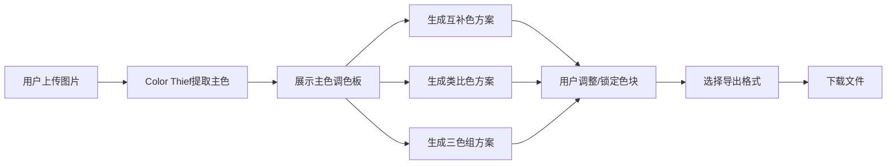

## 1. 产品概述
在线色彩主题发现与配色方案生成应用，允许用户通过上传图片或文字描述自动提取并生成多组协调的配色方案，支持多种格式导出。
- 核心功能：图片主色提取、配色方案生成、多格式导出
- 目标用户：设计师、前端开发者、创意工作者
- 产品价值：快速从灵感图片中提取专业级配色方案，提升设计效率

## 2. 核心功能

### 2.1 用户角色
| 角色 | 注册方式 | 核心权限 |
|------|----------|----------|
| 普通用户 | 无需注册 | 使用所有核心功能，上传图片、生成配色、导出方案 |

### 2.2 功能模块
1. **主页面**：图片上传区、主色展示区、配色方案生成区、导出功能

### 2.3 页面详情
| 页面名称 | 模块名称 | 功能描述 |
|---------|----------|----------|
| 主页面 | 图片上传区 | 支持点击上传和拖拽上传图片，实时预览 |
| 主页面 | 主色展示区 | 展示提取的3-5个主色，支持锁定/解锁、复制色值 |
| 主页面 | 配色方案区 | 生成互补色、类比色、三色组三种配色方案，显示对比度评分 |
| 主页面 | 导出功能 | 支持CSS变量、Figma JSON、Sketch JSON格式导出 |

## 3. 核心流程
用户上传图片 → 系统使用Color Thief算法提取主色 → 基于主色生成三种配色方案 → 用户可锁定色块调整参数 → 选择导出格式下载文件

## 4. 用户界面设计

### 4.1 设计风格
- **主色调**：#6b5b95（紫色系），悬停 #5a4a85
- **背景色**：#f5f0eb（暖白米色），卡片背景 #ffffff
- **文字色**：#2d2d2d
- **装饰条**：顶部渐变色从 #6b5b95 过渡到 #b8a9c9，高度6px
- **卡片样式**：圆角16px，阴影 0 2px 12px rgba(0,0,0,0.04)
- **按钮样式**：圆角8px，按压反馈 scale 0.95（0.2s）
- **字体**：使用 Playfair Display 作为标题字体，Inter 作为正文字体
- **动效**：色块悬停放大1.05倍，更新动画0.3s ease透明度过渡

### 4.2 页面设计概述
| 页面名称 | 模块名称 | UI元素 |
|---------|----------|--------|
| 主页面 | 图片上传区 | 虚线边框拖拽区域，图片预览，文件选择按钮 |
| 主页面 | 主色展示区 | 横向色条（200x80px，圆角8px，间隔12px，阴影12px），锁定图标，色值显示 |
| 主页面 | 配色方案区 | 三种方案标签切换，4个色块，对比度进度条，AA/AAA评分 |
| 主页面 | 导出模态框 | 格式选择，下载按钮，关闭按钮 |

### 4.3 响应式设计
- **桌面版（>=1024px）**：三栏布局（上传区、主色、配色方案）
- **平板版（>=768px）**：两栏布局（上传区和主色合并一列，配色方案另一列）
- **手机版（<768px）**：单栏堆叠布局

### 4.4 视觉细节
- 色块悬停显示HEX和RGB色值
- 锁定色块左上角显示FontAwesome锁图标
- 导出按钮有按压反馈动画
- 所有更新使用0.3s ease透明度过渡
