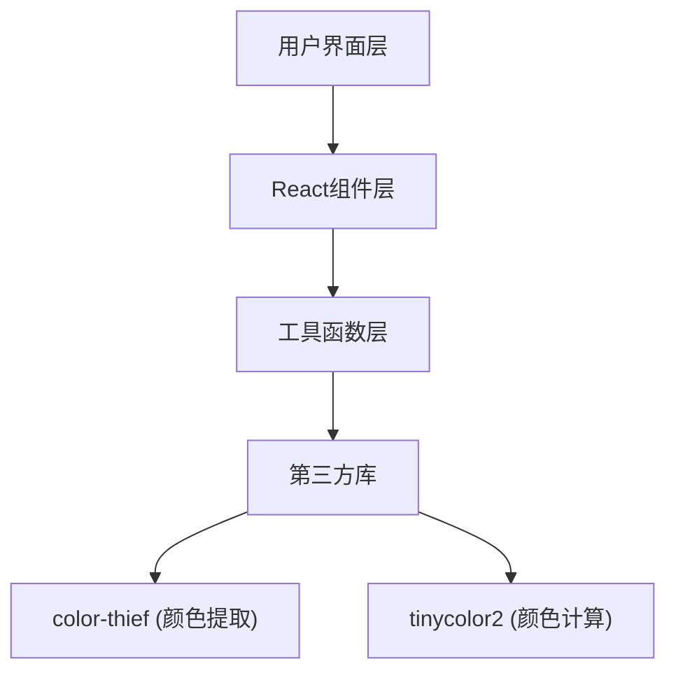

## 1. 架构设计
纯前端React应用，使用Vite构建，无需后端服务。



## 2. 技术描述
- **前端框架**：React 18 + TypeScript
- **构建工具**：Vite 5
- **颜色提取**：color-thief
- **颜色计算**：tinycolor2
- **类型支持**：@types/react, @types/react-dom
- **图标**：FontAwesome（通过CDN引入）

## 3. 项目结构
```
├── package.json
├── vite.config.js
├── tsconfig.json
├── index.html
└── src/
    ├── components/
    │   ├── ImageUploader.tsx    # 图片上传组件
    │   ├── ColorPalette.tsx     # 调色板展示组件
    │   └── SchemeGenerator.tsx  # 配色方案生成组件
    ├── utils/
    │   ├── colorAnalysis.ts     # 颜色分析工具
    │   └── exportFormatters.ts  # 格式转换工具
    └── main.tsx                 # React入口
```

## 4. 核心类型定义
```typescript
interface ColorItem {
  hex: string;
  rgb: { r: number; g: number; b: number };
  name?: string;
  locked: boolean;
}

interface ColorScheme {
  name: string;
  type: 'complementary' | 'analogous' | 'triadic';
  colors: ColorItem[];
  contrastScores: number[];
}

interface ExportFormat {
  type: 'css' | 'figma' | 'sketch';
  name: string;
  extension: string;
}
```

## 5. 性能要求
- 图片主色提取在200ms内完成（图片<2MB）
- 配色方案实时更新，无明显卡顿
- 响应式布局流畅切换
