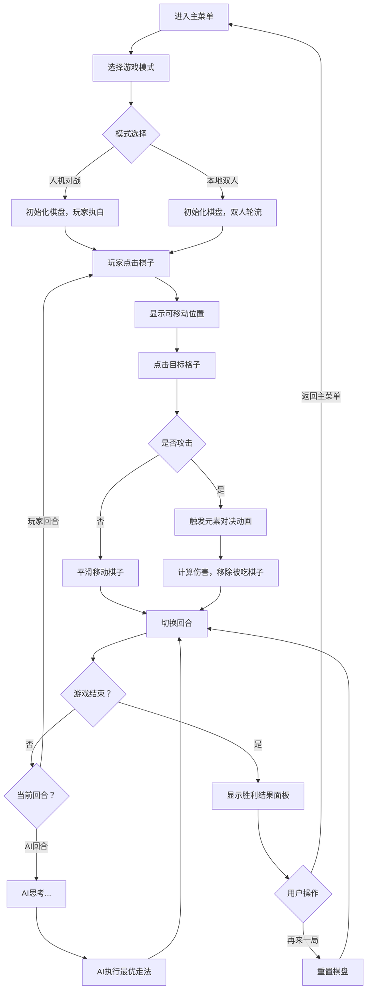

## 1. 产品概述

元素棋局是一款结合国际象棋经典策略与元素相克玩法的创新棋类游戏。每颗棋子带有火、水、土、风四种元素之一，通过元素克制关系增加战斗变数，为传统国际象棋注入全新的策略深度。

- 核心玩法：8x8棋盘对战，棋子移动规则遵循国际象棋，攻击时根据元素克制关系计算伤害
- 目标用户：国际象棋爱好者、策略游戏玩家
- 产品价值：在经典棋类基础上增加元素克制系统，创造更丰富的策略选择和视觉体验

## 2. 核心特性

### 2.1 游戏模式

| 模式 | 描述 | 核心玩法 |
|------|------|----------|
| 人机对战 | 玩家与AI对战，AI采用贪心算法 | 玩家执白先行，AI思考时显示"思考中..."动画 |
| 本地双人对战 | 两人在同一设备轮流对战 | 黑白双方轮流操作，实时显示元素对决效果 |

### 2.2 功能模块

1. **主菜单界面**：游戏标题、模式选择按钮
2. **棋盘对战界面**：8x8棋盘、棋子渲染、移动高亮、攻击特效
3. **AI对战系统**：独立Worker线程运行贪心算法AI
4. **元素克制系统**：火克土、土克风、风克水、水克火，同元素无加成
5. **游戏结束系统**：胜利判定、结果展示面板、再来一局/返回菜单

### 2.3 页面详情

| 页面名称 | 模块名称 | 功能描述 |
|---------|----------|---------|
| 主菜单 | 标题区域 | 显示"元素棋局"游戏名称，48px白色粗体 |
| 主菜单 | 模式选择 | 两个渐变按钮：人机对战、本地双人对战 |
| 游戏界面 | 棋盘区域 | 8x8格子，深浅交替，深蓝色渐变背景 |
| 游戏界面 | 棋子系统 | 32颗棋子，悬浮显示，元素发光边框，弹性入场动画 |
| 游戏界面 | 交互系统 | 点击选中放大、光晕呼吸动画、可移动格子高亮 |
| 游戏界面 | 战斗系统 | 攻击时元素粒子爆炸特效，克制关系影响爆炸范围 |
| 游戏界面 | AI状态 | 思考中文字闪烁提示 |
| 结果面板 | 胜利展示 | 金色皇冠旋转动画、毛玻璃背景面板、操作按钮 |

## 3. 核心流程

### 用户游戏流程

## 4. 用户界面设计

### 4.1 设计风格

- **主色调**：深蓝色 #0d1b2a（背景），淡蓝灰色 #1b2838（浅色格），深蓝黑色 #0e1a2b（深色格）
- **元素色彩**：火 #ff4500、水 #1e90ff、土 #8b4513、风 #00fa9a
- **强调色**：淡金色（高亮）、#ffd700（胜利金色）、#667eea 到 #764ba2（按钮渐变）
- **字体**：使用具有游戏感的粗体标题字体，正文使用清晰易读的无衬线字体
- **动画风格**：弹性动画、呼吸动画、粒子爆炸特效，所有动画使用 requestAnimationFrame 驱动

### 4.2 元素视觉设计

| 元素 | 边框颜色 | 粒子效果 | 克制关系 |
|------|---------|---------|---------|
| 🔥 火 | #ff4500 橙红 | 炽热火焰粒子 | 克制土，被水克制 |
| 💧 水 | #1e90ff 蓝色 | 水波纹粒子 | 克制火，被风克制 |
| 🌍 土 | #8b4513 棕色 | 岩石碎屑粒子 | 克制风，被火克制 |
| 🌪️ 风 | #00fa9a 青绿 | 风旋气流粒子 | 克制水，被土克制 |

### 4.3 页面设计概述

| 页面名称 | 模块名称 | UI元素 |
|---------|----------|--------|
| 主菜单 | 标题区域 | 48px白色粗体字体，居中偏左布局，带微妙发光效果 |
| 主菜单 | 按钮区域 | 横向排列，渐变蓝紫色背景，圆角12px，悬停上浮2px，点击缩放 |
| 游戏界面 | 棋盘区域 | 8x8格子，深浅交替，深蓝渐变背景，Canvas渲染 |
| 游戏界面 | 棋子渲染 | 半透明立体模型，40x60px，2px发光边框，悬浮效果 |
| 游戏界面 | 选中状态 | 1.2倍放大，80px圆形光晕，0.3透明度，1s呼吸动画 |
| 游戏界面 | 攻击特效 | 30个粒子爆炸，半径3-5px，扩散100px，0.6s渐隐 |
| 结果面板 | 胜利动画 | 60x60px皇冠图标，从底部弹出，2s一圈旋转 |
| 结果面板 | 操作按钮 | 毛玻璃背景，缩放出现动画0.3s，两个功能按钮 |

### 4.4 响应式设计

- **桌面优先**：棋盘固定尺寸，居中显示
- **移动适配**：根据屏幕宽度动态调整棋盘大小，保持8x8比例
- **触摸优化**：增大点击热区，确保棋子在小屏幕上可准确点击

## 5. 性能要求

- **帧率**：棋盘渲染和棋子移动稳定60fps
- **DOM节点**：棋盘DOM节点不超过64+32个
- **动画驱动**：使用requestAnimationFrame
- **资源预加载**：精灵图使用预加载机制
- **线程分离**：AI逻辑在独立Web Worker中运行，不阻塞主线程
