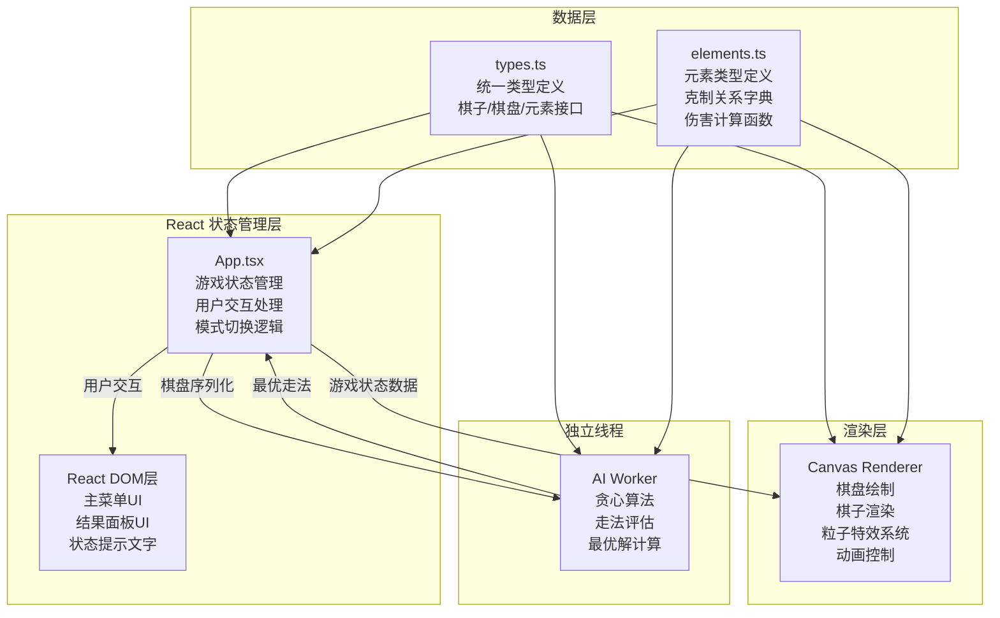

## 1. 架构设计



## 2. 技术栈描述

| 层级 | 技术选择 | 版本要求 | 用途说明 |
|------|---------|---------|---------|
| 前端框架 | React | ^18.x | UI组件、状态管理、交互事件 |
| 类型系统 | TypeScript | ^5.x | 类型安全、接口定义 |
| 构建工具 | Vite | ^5.x | 快速构建、HMR热更新 |
| React插件 | @vitejs/plugin-react | ^4.x | Vite React支持 |
| 渲染技术 | HTML5 Canvas API | - | 棋盘、棋子、粒子特效渲染 |
| 多线程 | Web Worker API | - | AI计算线程隔离 |
| 动画 | requestAnimationFrame | - | 60fps动画驱动 |

### 项目初始化
- 使用 `npm init vite-init@latest` 创建 React + TypeScript 项目
- 依赖：react, react-dom, typescript, vite, @vitejs/plugin-react, @types/react, @types/react-dom

## 3. 项目文件结构

```
src/
├── types.ts              # 统一类型定义
├── elements.ts           # 元素系统与伤害计算
├── index.tsx             # React入口文件
├── components/
│   └── App.tsx           # 主应用组件
├── canvas/
│   └── renderer.ts       # Canvas渲染器类
└── worker/
    └── aiWorker.ts       # AI Worker线程
```

## 4. 文件职责说明

### 4.1 src/types.ts
统一定义所有核心类型接口：
```typescript
// 元素类型
type ElementType = 'fire' | 'water' | 'earth' | 'wind';

// 棋子类型
type PieceType = 'king' | 'queen' | 'rook' | 'bishop' | 'knight' | 'pawn';

// 阵营
type Side = 'white' | 'black';

// 坐标
interface Position {
  x: number;
  y: number;
}

// 棋子接口
interface Piece {
  id: string;
  type: PieceType;
  element: ElementType;
  side: Side;
  position: Position;
  hp: number;
}

// 棋盘格子
interface Cell {
  position: Position;
  piece: Piece | null;
  isLight: boolean;
}

// 游戏状态
type GameMode = 'menu' | 'pvp' | 'pve';
type GamePhase = 'playing' | 'aiThinking' | 'ended';

// 走法
interface Move {
  from: Position;
  to: Position;
  piece: Piece;
  capturedPiece?: Piece;
}
```

### 4.2 src/elements.ts
元素系统核心逻辑：
- 定义四种元素类型
- 克制关系字典（火克土，土克风，风克水，水克火）
- `calculateDamage(attacker: ElementType, defender: ElementType): number` 纯函数
  - 克制：伤害x1.5，粒子数x1
  - 被克制：伤害x0.5，粒子数x0.5
  - 同元素：伤害x1，无粒子加成

### 4.3 src/worker/aiWorker.ts
独立Worker线程，使用贪心算法：
1. 接收主线程发送的棋盘状态序列化数据
2. 评估所有合法走法，优先级排序：
   - 优先攻击：低血量且被己方元素克制的棋子
   - 其次保护：移动己方被克制的棋子到安全位置
   - 最后考虑：控制中心区域
3. 返回最优走法坐标

### 4.4 src/canvas/renderer.ts
Canvas渲染器类，职责：
- 棋盘背景和格子绘制（深浅交替）
- 棋子绘制（半透明立体模型、发光边框）
- 选中状态光晕（呼吸动画）
- 可移动格子高亮
- 粒子系统（攻击特效）
- 平滑移动动画
- 入场弹性动画
- 胜利闪烁动画

暴露方法：
- `update(data: RenderData): void` - 更新渲染数据
- `render(): void` - 执行渲染
- `handleClick(x: number, y: number): Position | null` - 处理点击坐标转换

### 4.5 src/components/App.tsx
React主组件，核心职责：
- 游戏状态管理（mode, phase, board, selectedPiece, validMoves）
- 用户交互事件处理
- 人机/双人模式逻辑分发
- Canvas渲染器实例管理
- AI Worker通信管理
- 游戏流程控制（回合切换、胜负判定）
- 主菜单与结果面板渲染

### 4.6 src/index.tsx
React应用入口：
- 渲染 `<App />` 组件到 `#root` DOM节点

## 5. 关键技术实现要点

### 5.1 动画系统
- 所有动画使用 `requestAnimationFrame` 驱动
- 棋子入场动画：`0.6s cubic-bezier(0.68, -0.55, 0.27, 1.55)` 弹性掉落弹跳两次
- 选中光晕：`1s ease-in-out` 呼吸动画
- 棋子移动：`0.3s ease-out` 平滑滑行
- 粒子特效：`0.6s` 渐隐消失，扩散半径100px

### 5.2 性能优化
- Canvas渲染与React DOM分离
- AI计算在Worker线程，不阻塞主线程
- 棋盘DOM节点控制在64+32个以内
- 粒子系统对象池复用
- 仅在状态变化时调用Canvas update

### 5.3 坐标系统
- 棋盘：8x8格子，坐标 (0,0) 到 (7,7)
- 点击坐标转换：屏幕坐标 → Canvas坐标 → 棋盘格子坐标
- 粒子坐标：基于Canvas像素坐标系

## 6. 数据模型

### 6.1 棋子初始布局
```
白方（下方）：
  第7行：车、马、象、后、王、象、马、车
  第6行：兵×8

黑方（上方）：
  第0行：车、马、象、后、王、象、马、车
  第1行：兵×8
```

### 6.2 元素分配策略
- 每方随机分配元素，确保元素多样性
- 王和后分配不同元素
- 同类型棋子（如两个车）分配不同元素

### 6.3 国际象棋走法规则
- 王：横竖斜走1格
- 后：横竖斜走任意格
- 车：横竖走任意格
- 象：斜走任意格
- 马：走日字（2+1）
- 兵：前进1格（首步可2格），斜吃

## 7. 胜负判定
- 一方王被吃掉 → 对方获胜
- 一方无子可走 → 对方获胜
- 达到最大回合数（可选，暂不实现）
