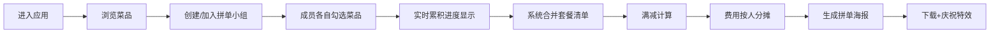

## 1. 产品概述
餐厅拼单凑单应用，为多人聚餐场景提供定制化套餐搭配与费用分摊解决方案。
- 解决多人聚餐时众口难调、单独点餐成本高且容易浪费的痛点，服务对象为餐厅老板和聚餐顾客
- 核心价值：提升点餐效率、降低点餐成本、减少食物浪费、优化聚餐体验

## 2. 核心功能

### 2.1 功能模块
1. **菜品浏览模块**：分类展示菜品、多维度筛选、菜品详情展示
2. **拼单小组模块**：创建/加入小组、成员管理、实时勾选统计
3. **结算分摊模块**：满减策略、费用计算、按人分摊、海报生成

### 2.2 页面详情
| 页面名称 | 模块名称 | 功能描述 |
|---------|---------|---------|
| 主页面（菜品区） | 分类导航栏 | 凉菜/热菜/主食/饮品四类切换，辣度筛选器 |
| 主页面（菜品区） | 菜品卡片网格 | 展示菜品名、价格、辣度(🌶️1-3)、推荐(⭐)，悬停上浮，选中左侧绿标 |
| 拼单面板 | 小组管理 | 创建小组（UUID）、设置成员昵称、加入小组、最多6人 |
| 拼单面板 | 实时统计 | 圆环进度条（#2196f3→#4caf50渐变）显示累积点单人数 |
| 拼单面板 | 合并清单 | 自动合并相同菜品，显示最终套餐清单 |
| 结算面板 | 满减计算 | 满200减20策略，展开动画展示原价/折扣/实付 |
| 结算面板 | 费用分摊 | 按成员勾选菜品分摊，四舍五入到角 |
| 结算面板 | 海报生成 | Canvas绘制海报，emoji代替菜品图，下载触发canvas-confetti |

## 3. 核心流程

顾客进入应用 → 浏览菜品目录 → 创建拼单小组 → 邀请成员加入 → 成员各自勾选菜品 → 实时查看累积进度 → 系统合并生成套餐 → 触发满减计算 → 费用按人分摊 → 生成拼单海报 → 下载庆祝特效

## 4. 用户界面设计

### 4.1 设计风格
- **主色调**：暖色调，背景浅米色 `#fff8e1`
- **辅助色**：蓝色 `#2196f3` → 绿色 `#4caf50` 渐变（进度条）
- **卡片**：白色圆角 `border-radius: 12px`，悬停 `translateY(-3px)` 增强阴影
- **选中动效**：左侧绿色标记 `0.2s ease-out` 动画
- **字体**：标题使用优雅衬线体，正文圆润无衬线，营造温馨聚餐氛围
- **底部结算栏**：毛玻璃 `backdrop-filter: blur(8px)` 半透明固定栏

### 4.2 页面设计概述
| 页面区域 | 模块名称 | UI元素 |
|---------|---------|---------|
| 顶部导航 | 餐厅标题 + 筛选器 | 大字体餐厅名，分类标签Tab，辣度下拉 |
| 主内容区 | 菜品卡片网格 | 桌面端3-4列，卡片悬停上浮阴影动效 |
| 侧边/中部 | 拼单面板 | 成员头像列表，圆环进度条，合并清单 |
| 底部固定 | 结算栏 | 毛玻璃背景，实付金额醒目，展开结算按钮 |

### 4.3 响应式设计
- **桌面端（≥768px）**：菜品卡片3-4列网格，结算栏高度适中
- **移动端（<768px）**：菜品卡片2列网格，结算栏高度增加至80px适配触摸
- **触摸优化**：按钮最小高度44px，增加点击热区

### 4.4 动效与细节
- 卡片入场：staggered 渐入动画
- 进度条：蓝→绿渐变填充动画
- 满减触发：展开折叠动画
- 海报下载：canvas-confetti 彩色纸屑庆祝
