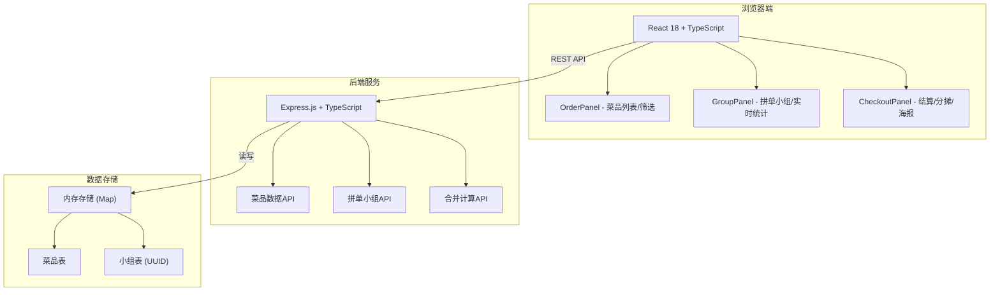
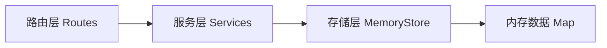

## 1. 架构设计



## 2. 技术栈说明
- **前端框架**：React 18 + TypeScript（严格模式）
- **构建工具**：Vite + @vitejs/plugin-react
- **后端服务**：Node.js Express 4 + TypeScript
- **数据存储**：内存存储（使用 Map + uuid 生成唯一小组ID）
- **第三方库**：
  - canvas-confetti（庆祝粒子特效）
  - cors（跨域支持）
  - zustand（前端状态管理，替代方案可选，本次用 React Context）

## 3. 项目结构

```
auto248/
├── package.json          # 前端+后端依赖与脚本
├── vite.config.js        # Vite构建配置
├── tsconfig.json         # TypeScript严格模式配置
├── index.html            # 入口HTML
├── src/
│   ├── components/
│   │   ├── OrderPanel.tsx    # 菜品列表、筛选、卡片交互
│   │   ├── GroupPanel.tsx    # 小组管理、实时人数、合并清单
│   │   └── CheckoutPanel.tsx # 结算、满减、分摊、海报生成
│   ├── types/            # 共享类型定义
│   ├── App.tsx
│   └── main.tsx
└── server/
    └── index.ts          # Express后端，REST API
```

## 4. API 接口定义

### 4.1 类型定义

```typescript
// 菜品类别
type DishCategory = 'cold' | 'hot' | 'staple' | 'drink'

// 菜品
interface Dish {
  id: string
  name: string
  price: number
  category: DishCategory
  spiciness: 1 | 2 | 3  // 辣度
  rating: 1 | 2 | 3 | 4 | 5  // 推荐指数
  emoji: string  // 菜品emoji
}

// 小组成员
interface Member {
  id: string
  name: string
  selectedDishIds: string[]  // 该成员勾选的菜品ID
}

// 拼单小组
interface Group {
  id: string  // UUID
  createdAt: number
  members: Member[]
  maxMembers: 6
}

// 合并后的菜品项
interface MergedDish {
  dish: Dish
  count: number  // 勾选人数
  memberIds: string[]
}

// 满减策略
interface DiscountRule {
  threshold: number  // 满减门槛
  discount: number   // 减免金额
}

// 分摊结果
interface SplitResult {
  memberId: string
  memberName: string
  amount: number  // 四舍五入到角
}

// 结算结果
interface CheckoutResult {
  originalTotal: number
  discountApplied: number
  finalTotal: number
  splits: SplitResult[]
}
```

### 4.2 REST API

| 方法 | 路由 | 用途 | 请求体 | 响应 |
|------|------|------|--------|------|
| GET | `/api/dishes` | 获取所有菜品 | - | `Dish[]` |
| GET | `/api/dishes?category=cold&spiciness=2` | 条件筛选菜品 | query params | `Dish[]` |
| POST | `/api/groups` | 创建拼单小组 | `{ creatorName: string }` | `Group` |
| GET | `/api/groups/:id` | 获取小组详情 | - | `Group` |
| POST | `/api/groups/:id/members` | 加入小组 | `{ name: string }` | `Member` |
| PATCH | `/api/groups/:id/members/:memberId` | 更新成员选菜 | `{ selectedDishIds: string[] }` | `Member` |
| POST | `/api/groups/:id/merge` | 合并计算 | - | `MergedDish[]` |
| POST | `/api/groups/:id/checkout` | 结算分摊 | `{ rule: DiscountRule }` | `CheckoutResult` |

## 5. 后端服务架构



- **路由层**：定义 REST API 端点，参数校验
- **服务层**：业务逻辑（小组合并、满减计算、费用分摊）
- **存储层**：基于 Map 的内存 CRUD 操作

## 6. 性能目标
- 菜品筛选响应时间：≤150ms（前端本地筛选）
- 拼单状态同步延迟：≤200ms（轮询/WebSocket模拟）
- 首次加载：≤2s

## 7. 前端状态管理方案
使用 React Context + useReducer，全局状态包括：
- 当前小组信息
- 成员选择状态
- 筛选条件

避免引入额外复杂状态库，保持简洁。
