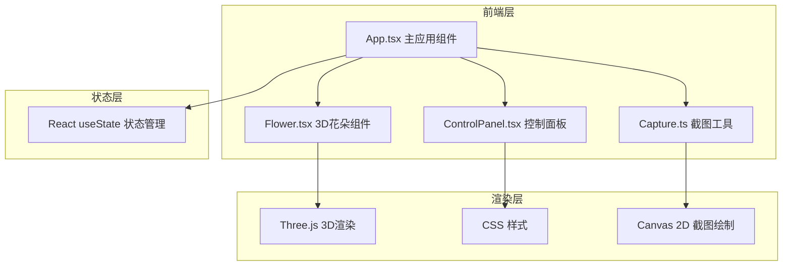

## 1. 架构设计



## 2. 技术描述

- **前端框架**：React 18 + TypeScript
- **构建工具**：Vite
- **3D渲染**：Three.js
- **样式方案**：原生 CSS（不使用 Tailwind）
- **状态管理**：React useState（轻量级，满足需求）
- **项目初始化**：Vite react-ts 模板

## 3. 文件结构

| 文件路径 | 作用 |
|----------|------|
| `package.json` | 项目依赖和脚本配置 |
| `index.html` | 入口HTML页面 |
| `tsconfig.json` | TypeScript 严格模式配置 |
| `vite.config.js` | Vite 构建配置 |
| `src/App.tsx` | 主应用组件，场景初始化、状态管理、布局 |
| `src/Flower.tsx` | 花朵3D模型组件，Three.js场景创建更新，视角控制 |
| `src/ControlPanel.tsx` | 控制面板UI组件，滑块和按钮，回调通知父组件 |
| `src/Capture.ts` | 截图生成工具，`generateCapture` 函数 |
| `src/main.tsx` | 应用入口 |
| `src/index.css` | 全局样式 |

## 4. 数据类型定义

### 花朵参数类型

```typescript
interface FlowerParams {
  petalCount: number;      // 花瓣数量 5-12
  petalHue: number;        // 花瓣色相 0-360
  flowerDiameter: number;  // 花朵直径 40-120px
  stemBend: number;        // 茎弯曲角度 -30~30度
}
```

### 生长阶段

```typescript
type GrowthStage = 'seed' | 'sprouting' | 'growing' | 'bloomed';
```

## 5. 核心技术要点

### 5.1 Three.js 场景搭建
- 使用 WebGLRenderer 渲染
- PerspectiveCamera 透视相机
- OrbitControls 实现视角控制（需限制上下旋转角度）
- AmbientLight + DirectionalLight 光照系统
- 花瓣使用自定义几何体或平面变形
- 茎使用 CylinderGeometry 圆柱体
- 花盆使用 TorusGeometry 环形 + CylinderGeometry 组合

### 5.2 动画系统
- 种子呼吸动画：scale 正弦脉动，周期 2s
- 发芽动画：0.5-1s 芽孢张开，粒子散落效果
- 参数变化过渡：0.3s 平滑插值
- 自动旋转：每秒 0.5°

### 5.3 截图生成
- 创建离屏 Canvas（512x512）
- 白色背景
- 绘制花朵（从Three.js获取像素或重绘）
- 绘制哈希ID和时间戳文字
- 导出为 PNG 并触发下载

### 5.4 性能优化
- requestAnimationFrame 驱动渲染循环
- 合理的几何体分段数
- 材质复用
- 避免每帧创建新对象
