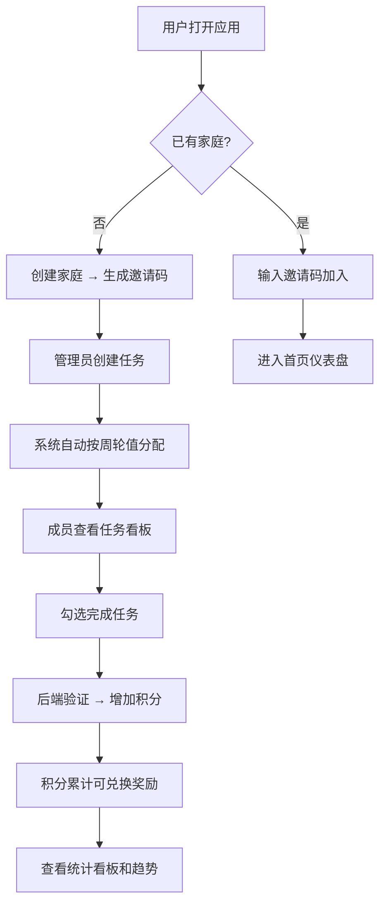

## 1. 产品概述

家务轮值与积分激励管理应用，帮助家庭和合租室友客观量化地分配家务、管理轮值、积分激励，解决分工不均和遗忘问题，提升家庭和谐。

- 核心目标：通过自动化轮值分配和可量化积分系统，减少家务分配矛盾，激励成员主动完成任务
- 目标用户：家庭用户、合租室友群体
- 核心价值：客观公正、可追溯、游戏化激励

## 2. 核心功能

### 2.1 用户角色

| 角色 | 注册方式 | 核心权限 |
|------|----------|----------|
| 管理员 | 创建家庭并设置密码 | 创建/编辑任务、管理成员、设置奖励、查看统计、分配轮值 |
| 普通成员 | 输入邀请码加入家庭 | 查看任务、完成任务、查看积分、兑换奖励 |

### 2.2 功能模块

1. **家庭管理**：创建家庭、生成邀请码、成员加入/退出
2. **任务管理**：创建任务、设置分类和积分、自动轮值分配
3. **任务看板**：查看本周任务、标记完成、任务交换
4. **积分系统**：完成任务获积分、积分变动记录、统计展示
5. **积分商店**：奖励定义、积分兑换、兑换记录
6. **统计看板**：成员积分排名、完成率统计、积分变化趋势图

### 2.3 页面详情

| 页面名称 | 模块名称 | 功能描述 |
|----------|----------|----------|
| 登录/首页 | 家庭入口 | 创建家庭、输入邀请码加入、选择角色 |
| 仪表盘 Dashboard | 概览卡片 | 总积分排名、近期完成率、积分变化折线图、时间范围切换 |
| 任务看板 TaskBoard | 任务列表 | 本周任务卡片、勾选完成、+10积分动画、任务交换 |
| 管理员面板 AdminPanel | 任务管理 | 创建/编辑任务、设置积分值、定义奖励、查看历史统计 |
| 积分商店 | 奖励列表 | 展示可兑换奖励、兑换操作、兑换记录 |

## 3. 核心流程

## 4. 用户界面设计

### 4.1 设计风格
- **主色调**：草绿色 #8BC34A（品牌色）、浅米色 #FFF8E7（背景）、白色（卡片）
- **辅助色**：清洁类绿色 #4CAF50、厨房类橙色 #FF9800、其他类蓝色 #2196F3
- **卡片样式**：白色圆角容器，阴影模糊 8px 透明度 0.1
- **字体**：使用 Noto Sans SC 中文字体，标题加粗、正文常规
- **布局**：顶部导航栏 + 卡片网格布局，响应式自适应
- **动效**：任务完成 0.4s 淡出翻转动画，+10 积分标签弹跳效果 0.3s ease-out

### 4.2 页面设计概述

| 页面名称 | 模块名称 | UI 元素 |
|----------|----------|---------|
| 仪表盘 | 概览卡片 | 成员排名卡片（圆形头像、积分数字）、完成率圆环图、积分折线图 |
| 任务看板 | 任务卡片 | 左侧分类色条、任务标题、分配成员、截止日期、完成勾选框 |
| 管理员面板 | 表单/表格 | 任务创建表单、奖励定义表单、统计数据表格 |
| 积分商店 | 奖励卡片 | 奖励名称、所需积分、兑换按钮、库存状态 |

### 4.3 响应式
- 桌面端（>1024px）：两列网格布局
- 平板端（768-1024px）：单列瀑布流布局
- 移动端（<768px）：顶部导航折叠为汉堡菜单，单列布局

### 4.4 动画细节
- 任务卡片完成：0.4s 淡出后翻转出现
- +10 积分标签：0.3s 缩放弹跳效果 ease-out
- 图表 tooltip：0.2s 渐显动画
- 按钮悬停：背景色微变 + 轻微上浮
