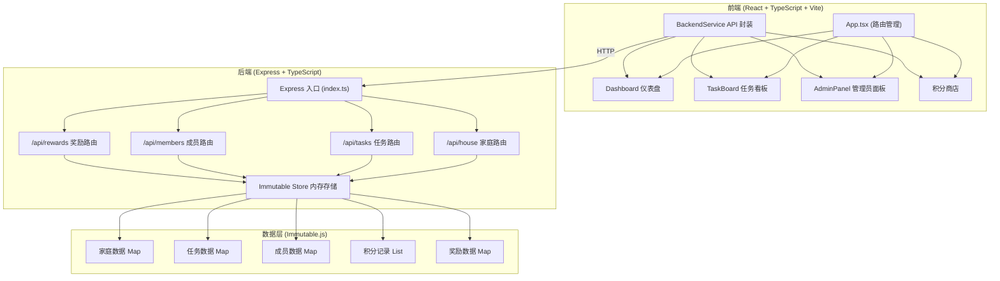
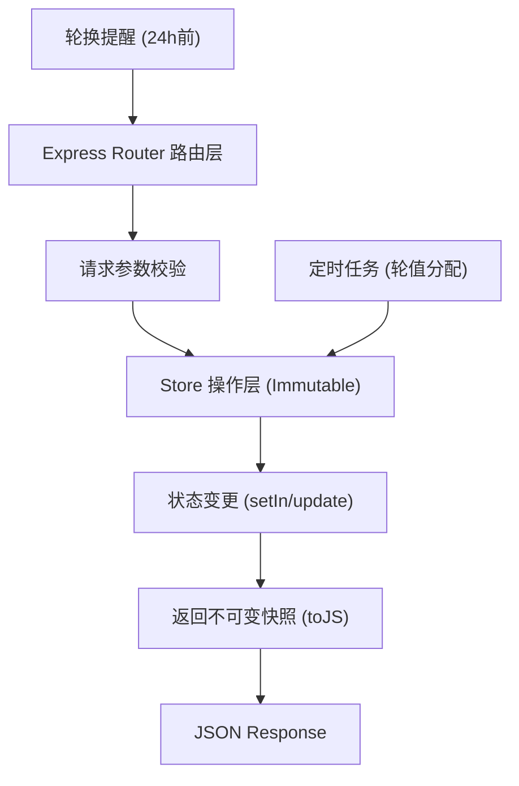
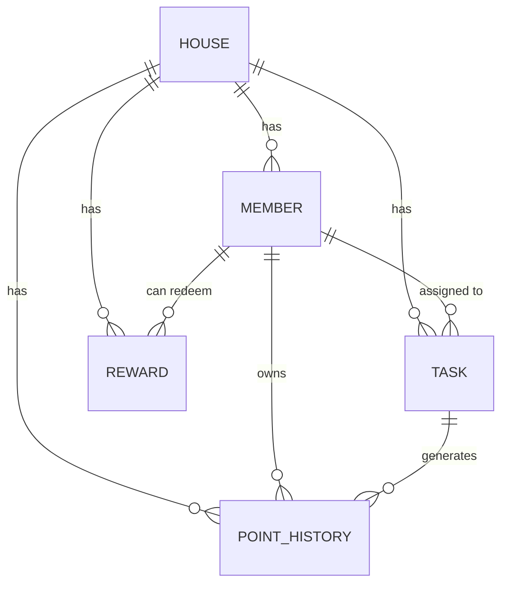

## 1. 架构设计



## 2. 技术描述

- **前端**：React@18 + TypeScript + Vite + react-router-dom + immutable
- **构建工具**：Vite 5.x，含代理配置到后端 3001 端口
- **后端**：Express@4 + TypeScript + immutable.js + cors + uuid
- **数据存储**：内存存储，使用 Immutable.js 管理状态变更，返回不可变数据快照
- **样式方案**：CSS Modules + CSS 变量（不使用 Tailwind，保持暖色调主题一致性）
- **图标库**：lucide-react

## 3. 路由定义

| 前端路由 | 页面 | 权限 |
|----------|------|------|
| / | 首页/家庭入口 | 公开 |
| /dashboard | 仪表盘 | 成员 |
| /tasks | 任务看板 | 成员 |
| /admin | 管理员面板 | 管理员 |
| /shop | 积分商店 | 成员 |

| 后端 API | 方法 | 用途 |
|----------|------|------|
| /api/house | POST | 创建家庭 |
| /api/house/:id | GET | 获取家庭完整数据 |
| /api/house/:id/join | POST | 成员加入家庭 |
| /api/tasks/:houseId | GET | 获取所有任务及分配状态 |
| /api/tasks/:houseId | POST | 创建新任务 |
| /api/tasks/:taskId/complete | PUT | 标记任务完成并增加积分 |
| /api/tasks/:taskId/swap | PUT | 交换任务分配 |
| /api/members/:memberId | DELETE | 成员退出家庭 |
| /api/rewards/:houseId | GET | 获取可兑换奖励列表 |
| /api/rewards/:houseId | POST | 创建奖励（管理员） |
| /api/rewards/:rewardId/redeem | POST | 积分兑换奖励 |
| /api/history/:houseId | GET | 获取积分变动历史 |

## 4. API 类型定义

```typescript
interface Member {
  id: string;
  name: string;
  houseId: string;
  role: 'admin' | 'member';
  points: number;
  avatarColor: string;
  joinDate: string;
}

interface Task {
  id: string;
  houseId: string;
  name: string;
  category: 'cleaning' | 'kitchen' | 'other';
  points: number;
  rotationDays: number;
  currentAssigneeId: string | null;
  isCompleted: boolean;
  completedBy: string | null;
  completedAt: string | null;
  cycleStartDate: string;
  createdAt: string;
}

interface Reward {
  id: string;
  houseId: string;
  name: string;
  description: string;
  pointsCost: number;
  stock: number;
  createdAt: string;
}

interface PointHistory {
  id: string;
  memberId: string;
  houseId: string;
  amount: number;
  reason: string;
  timestamp: string;
}

interface House {
  id: string;
  name: string;
  inviteCode: string;
  members: Member[];
  tasks: Task[];
  rewards: Reward[];
  pointHistory: PointHistory[];
  createdAt: string;
  lastRotationDate: string;
}
```

## 5. 服务端架构图



## 6. 数据模型

### 6.1 ER 图



### 6.2 Store 数据结构

```typescript
// Immutable.js 存储结构
interface StoreState {
  houses: Map<string, House>;
  // 索引结构加速查询
  tasksByHouse: Map<string, List<string>>;
  membersByHouse: Map<string, List<string>>;
  historyByMember: Map<string, List<string>>;
}
```

## 7. 文件结构与调用关系

```
d:\Pro\tasks\auto250\
├── package.json
├── vite.config.js          # Vite 代理到 3001 端口
├── tsconfig.json           # 严格模式
├── index.html
└── src/
    ├── client/             # 前端
    │   ├── App.tsx         # 路由管理 → 调用 BackendService
    │   ├── main.tsx        # React 入口
    │   ├── index.css       # 全局样式 + CSS 变量
    │   ├── components/
    │   │   ├── Dashboard.tsx      # 接收全量 houseData → 渲染概览
    │   │   ├── TaskBoard.tsx      # 调用 submitTask() 更新状态
    │   │   ├── AdminPanel.tsx     # 调用 createTask() 等 → 刷新数据
    │   │   ├── RewardShop.tsx     # 积分兑换组件
    │   │   ├── LineChart.tsx      # Canvas 折线图组件
    │   │   ├── MemberAvatar.tsx   # 成员头像组件
    │   │   ├── TaskCard.tsx       # 任务卡片组件
    │   │   └── Navbar.tsx         # 顶部导航组件
    │   └── services/
    │       └── BackendService.ts  # fetch 封装，统一错误处理
    │
    ├── server/             # 后端
    │   ├── index.ts        # Express 入口，CORS，挂载路由
    │   ├── store.ts        # Immutable 内存存储
    │   ├── routes/
    │   │   ├── house.ts    # /api/house 路由
    │   │   ├── tasks.ts    # /api/tasks 路由
    │   │   ├── members.ts  # /api/members 路由
    │   │   └── rewards.ts  # /api/rewards 路由
    │   └── utils/
    │       ├── rotation.ts # 轮值分配算法
    │       └── seed.ts     # 初始化示例数据
    │
    └── shared/             # 前后端共享类型
        └── types.ts
```

### 调用关系
1. **前端流向**：组件 → BackendService → fetch → Express API → Store → 返回数据 → 组件渲染
2. **数据流向**：路由层接收请求 → Store 执行 immutable 操作 → 返回新状态快照 → 序列化为 JSON
3. **轮值逻辑**：定时任务检查 → 调用 rotation 算法 → 更新任务分配 → 触发提醒
