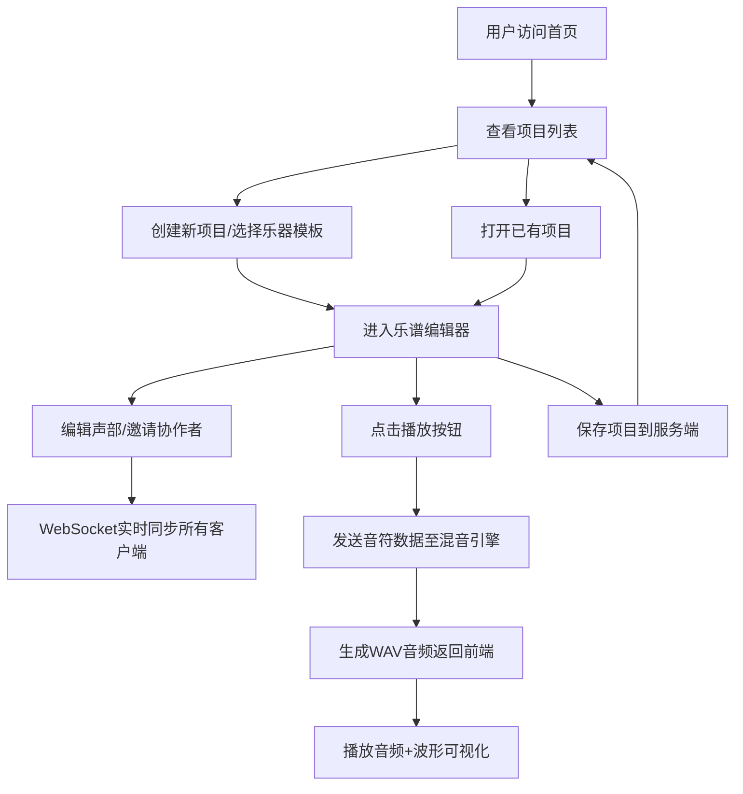

## 1. 产品概述

多声部乐谱协作编辑与实时混音回放应用，解决传统乐谱软件难以支持多人同时对不同声部进行编辑、且无法即时听到混音效果的问题。面向音乐教师和学生，提供在线协作编辑、实时同步、即时混音预览的完整工作流。

## 2. 核心功能

### 2.1 用户角色
| 角色 | 注册方式 | 核心权限 |
|------|---------|---------|
| 音乐教师 | 无需注册，直接使用 | 创建项目、邀请协作者、编辑所有声部、混音播放 |
| 学生 | 无需注册，通过链接加入 | 编辑分配的声部、查看其他声部、参与混音播放 |
| 协作者 | 无需注册，通过链接加入 | 最多6人同时在线，编辑各自声部 |

### 2.2 功能模块
1. **项目列表页**：项目卡片展示、创建新项目、进入编辑页
2. **乐谱编辑器**：多声部轨道条、钢琴卷帘编辑面板、实时协作同步
3. **混音播放系统**：播放控制、波形可视化、后端混音引擎

### 2.3 页面详情
| 页面名称 | 模块名称 | 功能描述 |
|---------|---------|---------|
| 项目列表页 | 项目卡片展示 | 卡片式布局展示所有项目，显示最后编辑时间和协作者数量 |
| 项目列表页 | 创建项目 | 选择乐器声部模板，创建新乐谱项目 |
| 乐谱编辑器 | 轨道条区域 | 彩色轨道条（暖橙到深紫渐变），可拖动调节宽度，显示协作者头像 |
| 乐谱编辑器 | 钢琴卷帘面板 | 网格背景编辑区，音符块拖拽编辑，多色轨道区分 |
| 乐谱编辑器 | 协作同步 | WebSocket实时同步6人以内编辑操作，光标高亮闪烁提示 |
| 乐谱编辑器 | 播放控制 | 绿色渐变播放按钮，混音播放，波形可视化 |
| 乐谱编辑器 | 项目保存 | 保存乐谱到服务端，包含元数据、声部配置、音符序列 |

## 3. 核心流程

## 4. 用户界面设计

### 4.1 设计风格
- **主题**：暗色主题，主背景#121212，卡片区域#1e1e1e
- **色彩系统**：
  - 轨道颜色：暖橙#FF9800 → 深紫#9C27B0 渐变排列
  - 协作者头像：蓝#42a5f5 → 紫#ab47bc 随机分配
  - 播放按钮：绿色渐变#66bb6a → #388e3c
  - 波形区域：背景深灰#424242，波形线条白#ffffff
  - 项目卡片：浅蓝#e3f2fd → 浅紫#f3e5f5 渐变
- **字体**：Inter字族
- **交互风格**：Material Design圆角设计，按钮按下scale(0.95)收缩动画，hover放大效果
- **动效**：
  - 音符块hover：0.2s放大效果
  - 播放按钮按下：0.15s scale(0.95)
  - 协作者光标：0.8s闪烁动画
  - 卡片hover：阴影过渡0.3s

### 4.2 页面设计概述
| 页面名称 | 模块名称 | UI元素 |
|---------|---------|---------|
| 项目列表页 | 顶部导航 | 56px固定高度，标题"协同乐谱编辑器" |
| 项目列表页 | 项目卡片 | 280px宽，2px圆角边框，浅蓝到浅紫渐变背景 |
| 项目列表页 | 创建按钮 | Material Design风格浮动按钮 |
| 乐谱编辑器 | 顶部导航 | 56px固定高度，项目名称、播放控制、协作者头像列表 |
| 乐谱编辑器 | 轨道条区域 | 水平排列彩色轨道，可拖动调节宽度（最小120px） |
| 乐谱编辑器 | 钢琴卷帘 | 浅灰#e0e0e0网格背景，每小格半音+八分音符 |
| 乐谱编辑器 | 波形区域 | Canvas绘制，50fps刷新率，实时更新 |
| 乐谱编辑器 | 协作者头像 | 水平排列，重叠部分2px白色边框 |

### 4.3 响应式设计
- **桌面端（≥768px）**：轨道条水平排列，钢琴卷帘与轨道条分栏显示
- **移动端（<768px）**：轨道条垂直堆叠，钢琴卷帘切换为全屏模式
- **触摸优化**：音符块最小触摸区域40px，轨道拖动增加触摸反馈

## 5. 性能要求
- 协作者编辑操作：100ms内同步至所有客户端
- 混音渲染：5秒内完成并返回音频数据
- 波形可视化：50fps刷新率
- 最大并发协作者：6人
