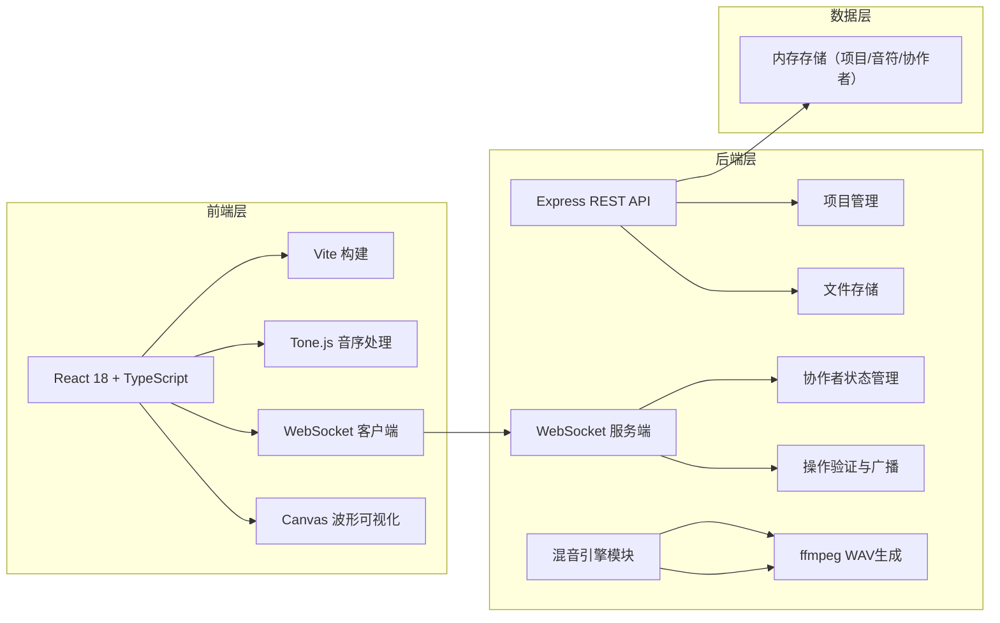
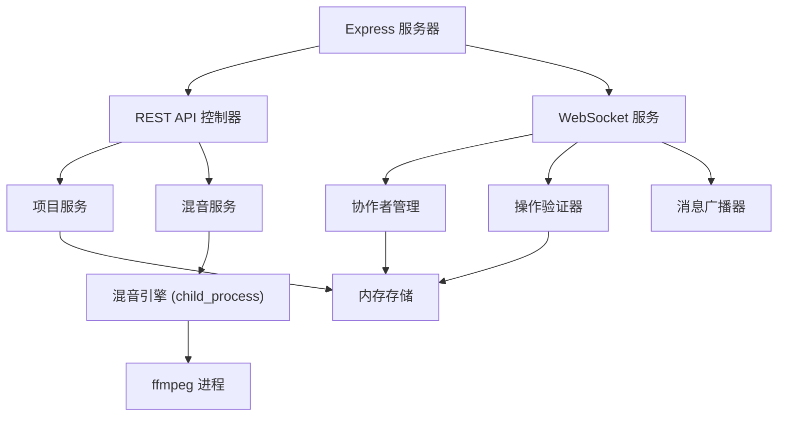
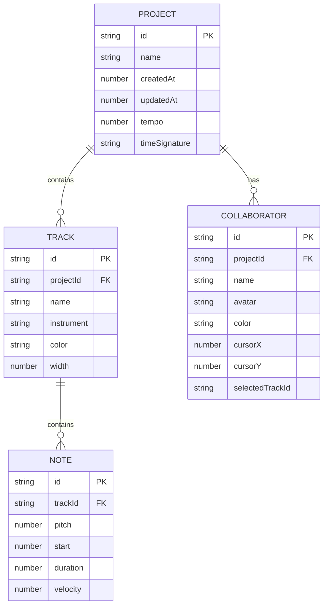

## 1. 架构设计



## 2. 技术描述

- **前端**：React 18 + TypeScript + Vite
- **构建工具**：Vite
- **后端**：Express 4 + WebSocket (ws库)
- **音频处理**：Tone.js（前端音序）+ ffmpeg（后端混音）
- **实时通信**：ws (WebSocket库)
- **数据存储**：内存存储（开发环境）
- **UI框架**：Material Design 风格（自定义CSS）
- **依赖管理**：npm

## 3. 技术栈详细说明：

| 层级 | 技术 | 用途 |
|------|------|------|
| 前端展示 | React 18 | 组件化UI开发 |
| 类型系统 | TypeScript | 类型安全 |
| 构建工具 | Vite | 快速开发构建 |
| 音频处理 | Tone.js | 音序数据处理 |
| 后端服务 | Express 4 | REST API服务 |
| 实时通信 | ws | WebSocket服务端 |
| 音频生成 | ffmpeg | WAV格式音频生成 |
| 唯一标识 | uuid | 生成项目/协作者唯一ID |

## 3. 路由定义

| 路由 | 方法 | 用途 |
|------|------|------|
| / | - | 首页（项目列表） |
| /editor/:projectId | - | 乐谱编辑器页面 |
| /api/projects | GET | 获取项目列表 |
| /api/projects | POST | 创建新项目 |
| /api/projects/:id | GET | 获取单个项目详情 |
| /api/projects/:id | PUT | 更新项目 |
| /api/projects/:id | DELETE | 删除项目 |
| /api/projects/:id/mix | POST | 混音请求，返回WAV音频 |
| /ws | - | WebSocket连接端点 |

## 4. API 定义

### 4.1 类型定义

```typescript
// 音符数据模型
interface Note {
  id: string;
  trackId: string;
  pitch: number; // MIDI音高 0-127
  start: number; // 起始时间（八分音符数）
  duration: number; // 持续时间（八分音符数）
  velocity: number; // 力度 0-127
}

// 轨道（声部）
interface Track {
  id: string;
  name: string;
  instrument: string;
  color: string;
  width: number;
  notes: Note[];
}

// 协作者
interface Collaborator {
  id: string;
  name: string;
  avatar: string;
  color: string;
  cursor?: { x: number; y: number };
  selectedTrackId?: string;
}

// 项目
interface Project {
  id: string;
  name: string;
  createdAt: number;
  updatedAt: number;
  tracks: Track[];
  collaborators: Collaborator[];
  metadata: {
    tempo: number;
    timeSignature: [number, number];
  };
}

// WebSocket消息
interface WSMessage {
  type: 'join' | 'leave' | 'note-add' | 'note-update' | 'note-delete' | 'cursor-move' | 'track-update';
  payload: any;
  projectId: string;
  collaboratorId: string;
  timestamp: number;
}
```

### 4.2 请求/响应模式

**GET /api/projects
```
Response: Project[]
```

**POST /api/projects
```
Request: { name: string; template: string[] }
Response: Project
```

**POST /api/projects/:id/mix
```
Request: { tracks: Track[] }
Response: WAV audio buffer (Content-Type: audio/wav)
```

## 5. 服务器架构图



## 6. 数据模型

### 6.1 数据模型定义



### 6.2 项目文件结构

```
auto251/
├── package.json
├── vite.config.js
├── tsconfig.json
├── index.html
├── src/
│   ├── App.tsx
│   ├── components/
│   │   ├── ProjectList.tsx
│   │   └── EditorPanel.tsx
│   └── types/
│       └── index.ts
└── server/
    ├── index.ts
    └── mixer.ts
    └── types.ts
```

## 7. 关键技术决策

1. **实时同步机制：
   - 使用WebSocket（ws库）实现100ms内同步
   - 操作先在服务端验证再广播
   - 采用增量更新而非全量同步

2. **混音引擎**：
   - 独立模块封装
   - 通过child_process调用ffmpeg
   - 支持多声部合并为16位WAV输出

3. **性能优化**：
   - 音符操作局部更新
   - Canvas波形50fps刷新率
   - 连接池管理协作者状态

4. **安全考虑**：
   - 操作ID防重复
   - 协作者数量限制（最多6人）
   - 音符数据合法性校验
