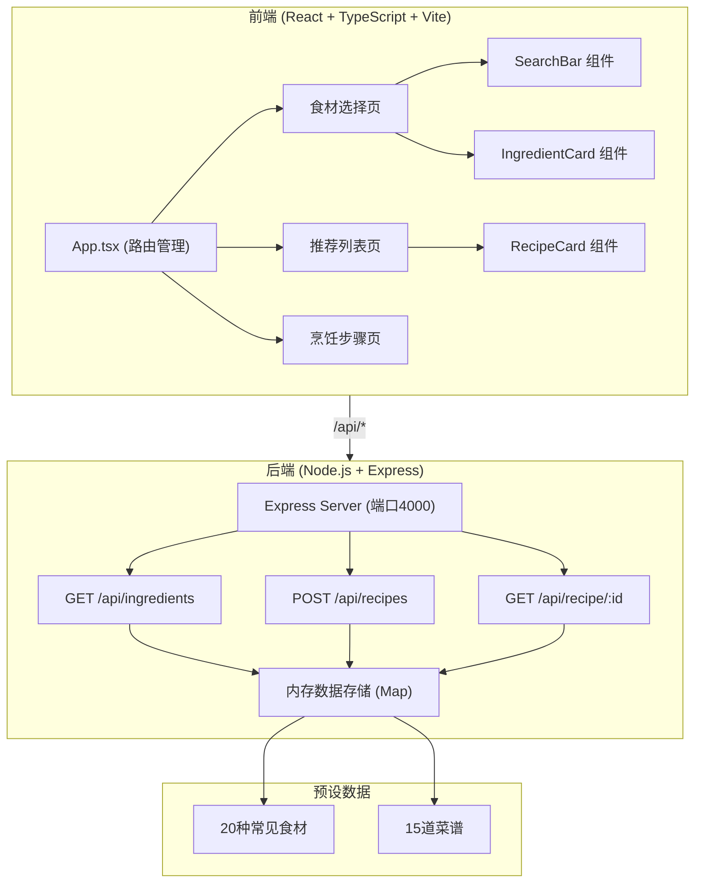
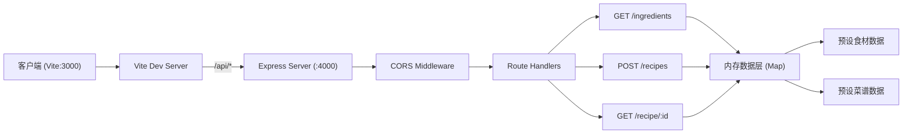
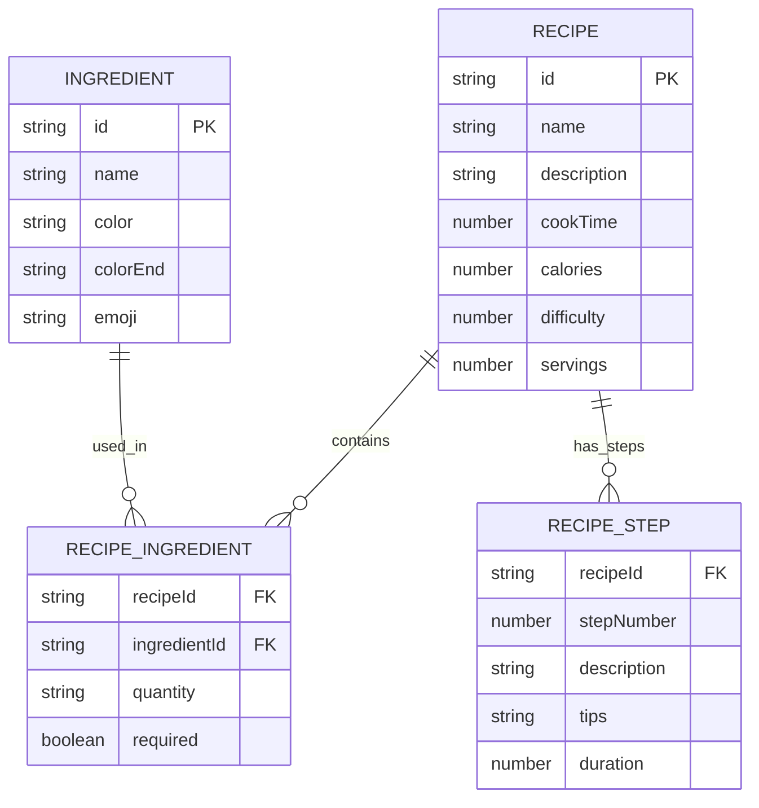

## 1. 架构设计



## 2. 技术描述

- **前端**：React@18 + TypeScript@5 + Vite@5
- **路由**：react-router-dom@6
- **构建工具**：Vite@5，端口3000
- **后端**：Express@4，端口4000
- **跨域处理**：cors + Vite 代理
- **数据存储**：内存 Map 存储，预设数据写死在代码中
- **依赖**：react, react-dom, typescript, vite, @vitejs/plugin-react, express, cors, uuid, @types/react, @types/react-dom

## 3. 路由定义

| 前端路由 | 页面组件 | 用途 |
|---------|---------|------|
| `/` | 食材选择页 | 搜索和添加食材，展示已选食材 |
| `/recipes` | 推荐列表页 | 展示基于已选食材的推荐菜谱 |
| `/recipe/:id` | 烹饪步骤页 | 展示菜品详细烹饪步骤 |

## 4. API 定义

### 4.1 GET /api/ingredients

返回所有预设食材列表

**响应类型：**
```typescript
interface Ingredient {
  id: string;
  name: string;
  color: string;      // 渐变色起始色
  colorEnd: string;   // 渐变色结束色
  emoji: string;      // 食材图标
}

type IngredientsResponse = Ingredient[];
```

### 4.2 POST /api/recipes

接收已选食材数组，筛选并返回匹配的菜谱（最多6道）

**请求类型：**
```typescript
interface RecipesRequest {
  ingredients: string[];  // 已选食材ID数组
}
```

**响应类型：**
```typescript
interface RecipeSummary {
  id: string;
  name: string;
  ingredients: {
    id: string;
    name: string;
    required: boolean;  // 是否为必需食材
  }[];
  cookTime: number;     // 分钟
  calories: number;     // 千卡
  difficulty: 1 | 2 | 3; // 难度星级
  matchScore: number;   // 匹配度百分比
}

type RecipesResponse = RecipeSummary[];
```

### 4.3 GET /api/recipe/:id

返回单道菜谱的完整步骤和详情

**响应类型：**
```typescript
interface RecipeStep {
  stepNumber: number;
  description: string;
  tips?: string;
  duration?: number;    // 该步骤耗时（分钟）
}

interface RecipeDetail {
  id: string;
  name: string;
  description: string;
  ingredients: {
    id: string;
    name: string;
    quantity: string;   // 用量描述
    required: boolean;
  }[];
  cookTime: number;
  calories: number;
  difficulty: 1 | 2 | 3;
  servings: number;     // 几人份
  steps: RecipeStep[];
}
```

## 5. 服务器架构图



## 6. 数据模型

### 6.1 数据模型定义



### 6.2 预设数据说明

**食材数据（约20种）：**
- 蔬菜类：番茄、黄瓜、土豆、胡萝卜、洋葱、青菜、茄子、青椒、白菜、菠菜
- 肉类：猪肉、牛肉、鸡肉、鸡蛋
- 水产类：虾、鱼
- 主食类：米饭、面条
- 调味类：豆腐、蘑菇

**菜谱数据（约15道）：**
- 家常菜：番茄炒蛋、土豆丝、红烧茄子、青椒肉丝、麻婆豆腐
- 肉类：红烧肉、宫保鸡丁、鱼香肉丝
- 汤类：番茄蛋汤、紫菜蛋花汤
- 主食：蛋炒饭、炒面
- 清淡：清炒时蔬、蒜蓉菠菜、蘑菇炖鸡

## 7. 项目文件结构

```
auto253/
├── package.json              # 项目依赖配置
├── vite.config.js            # Vite配置（代理+端口）
├── tsconfig.json             # TypeScript配置
├── index.html                # 入口HTML
├── server/
│   └── index.ts              # Express后端服务
├── src/
│   ├── main.tsx              # React应用入口
│   ├── App.tsx               # 主应用组件（路由+状态）
│   ├── components/
│   │   ├── SearchBar.tsx     # 搜索添加食材组件
│   │   ├── IngredientCard.tsx # 食材卡片组件
│   │   └── RecipeCard.tsx    # 菜谱卡片组件
│   ├── styles/
│   │   └── index.css         # 全局样式
│   └── types/
│       └── index.ts          # TypeScript类型定义
```
