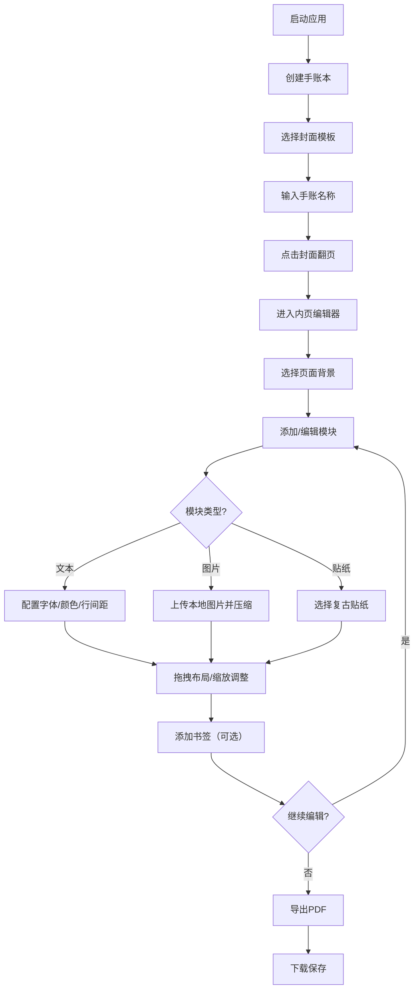

## 1. 产品概述

个性化在线电子手账本应用，解决纸质手账难以修改、无法插入多媒体内容以及容易丢失的问题。用户可在浏览器中自由创作复古拼贴风格的电子手账，支持多媒体插入、灵活布局和PDF导出。

- 目标用户：喜欢手账创作、日记记录、生活规划的年轻用户群体
- 产品价值：提供媲美真实纸质手账的创作体验，同时拥有数字化的便捷性（可编辑、多媒体、易保存分享）

## 2. 核心功能

### 2.1 用户角色

| 角色 | 注册方式 | 核心权限 |
|------|----------|----------|
| 普通用户 | 无需注册，直接使用 | 创建手账本、编辑内容、导出PDF |

### 2.2 功能模块

1. **封面设计**：封面模板选择（布艺纹理、星空、纯色渐变）、手账名称与日期展示、翻页动画
2. **内页编辑器**：模块拖拽布局、文本/图片/贴纸模块、背景模板切换、书签功能
3. **导出功能**：PDF导出、进度条动画、样式保持

### 2.3 页面详情

| 页面名称 | 模块名称 | 功能描述 |
|----------|----------|----------|
| 主应用 | 顶部导航栏 | 新建页面、撤销(Ctrl+Z)、重做(Ctrl+Y)、导出PDF按钮 |
| 封面页 | 封面展示 | 3种封面模板切换、手账名称显示、日期显示、点击翻页 |
| 内页编辑 | 模块画布 | 自由拖拽布局、选中状态显示、缩放控制点、模块删除 |
| 内页编辑 | 模块工具栏 | 添加文本框、添加图片框、添加贴纸、背景切换、添加书签 |
| 内页编辑 | 文本配置 | 字体大小、颜色、行间距调整、实时字数统计 |
| 内页编辑 | 图片配置 | 本地图片上传、自动压缩至2MB以内 |
| 内页编辑 | 贴纸选择 | 10种复古风格贴纸（胶带、回形针、标签等） |
| 内页编辑 | 页面管理 | 页码显示、页面切换、书签丝带图标跳转 |

## 3. 核心流程

用户从主页面开始，创建新手账本 → 选择封面模板并输入名称 → 点击封面翻页进入内页 → 选择背景模板 → 拖拽添加文本/图片/贴纸模块 → 调整模块样式与位置 → 添加书签标记重要页面 → 导出为PDF保存。

## 4. 用户界面设计

### 4.1 设计风格

- **主色调**：奶油色 #FFF8E1（背景）、浅棕色 #D7CCC8（辅助）、复古绿 #81C784（强调）
- **强调渐变色**：导出按钮 绿#4CAF50→青#00BCD4；书签 粉#FF69B4→紫#9C27B0
- **按钮风格**：圆角8px，暖色调半透明阴影，hover淡入淡出0.2s
- **字体**：手写风格 'Patrick Hand'，优雅有温度
- **布局风格**：卡片式布局，顶部圆角导航栏，整体复古拼贴美学
- **圆角规范**：所有元素统一8px圆角
- **阴影风格**：暖色调半透明阴影

### 4.2 页面设计概览

| 页面名称 | 模块名称 | UI元素 |
|----------|----------|--------|
| 主应用 | 顶部导航栏 | 圆角容器、奶油色背景、浅棕分隔线、手写字体按钮 |
| 封面页 | 封面卡片 | 布艺/星空/渐变纹理、名称标题、日期标签、纸张卷曲翻页动画（0.6s ease-out，0-180度） |
| 内页编辑 | 画布区域 | 横线/点阵/方格/空白背景、8px圆角、暖色阴影 |
| 内页编辑 | 模块选中态 | 蓝色虚线边框、8个角落缩放控制点（8px圆角）、等比缩放 |
| 内页编辑 | 工具栏 | 复古绿按钮、图标+文字、奶油色面板 |
| 内页编辑 | 文本样式面板 | 字体大小滑块、颜色选择器、行间距滑块、字数统计标签 |
| 内页编辑 | 书签丝带 | 页码下方、粉紫渐变、丝带形状装饰 |
| 导出弹窗 | 进度条 | 绿青渐变填充、0-100%、每10%弹性弹跳效果 |

### 4.3 响应式设计

- **桌面端**（1024px以上）：完整工具栏、左右分栏布局（模块选择+编辑画布）、鼠标拖拽缩放
- **平板端**（768-1024px）：上下布局（工具栏在上）、触屏手势支持拖拽缩放、自适应控件大小
- **交互适配**：触屏设备自动适配多指手势缩放，拖拽区域增大便于触控

### 4.4 动画与性能

- 翻页动画：纸张卷曲效果 0.6s ease-out，0-180度
- 交互反馈：0.2s 淡入淡出
- 导出进度：每10% 弹性弹跳效果
- 性能要求：页面切换和模块拖拽响应时间 ≤16ms（60FPS），PDF导出 ≤2秒
