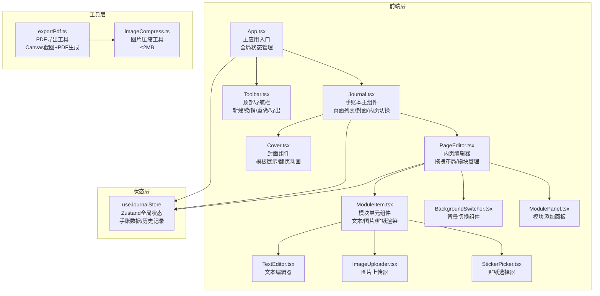

## 1. 架构设计



## 2. 技术描述

- **前端框架**：React@18 + TypeScript@5
- **构建工具**：Vite@5 + @vitejs/plugin-react
- **状态管理**：Zustand（轻量级，支持时间旅行用于撤销/重做）
- **拖拽库**：react-beautiful-dnd（模块自由拖拽布局）
- **PDF导出**：@react-pdf/renderer（PDF生成）+ html2canvas（页面截图）
- **样式方案**：CSS Modules + CSS Variables（复古拼贴美学主题）
- **字体**：Google Fonts - Patrick Hand（手写风格）

## 3. 核心目录结构

```
auto254/
├── index.html                 # 入口HTML
├── package.json               # 项目依赖
├── vite.config.js             # Vite构建配置（含路径别名@）
├── tsconfig.json              # TypeScript严格模式配置
└── src/
    ├── App.tsx                # 主应用组件
    ├── main.tsx               # 应用入口
    ├── index.css              # 全局样式与CSS变量
    ├── modules/
    │   ├── Journal.tsx        # 手账本主组件
    │   ├── PageEditor.tsx     # 内页编辑器组件
    │   ├── Cover.tsx          # 封面组件
    │   ├── Toolbar.tsx        # 顶部导航栏
    │   ├── ModuleItem.tsx     # 可拖拽模块单元
    │   ├── ModulePanel.tsx    # 模块添加面板
    │   ├── BackgroundSwitcher.tsx  # 背景切换
    │   └── Bookmark.tsx       # 书签组件
    ├── components/
    │   ├── TextEditor.tsx     # 文本编辑器
    │   ├── ImageUploader.tsx  # 图片上传组件
    │   ├── StickerPicker.tsx  # 贴纸选择器
    │   └── ResizeHandle.tsx   # 缩放控制点
    ├── store/
    │   └── useJournalStore.ts # Zustand状态管理
    ├── utils/
    │   ├── exportPdf.ts       # PDF导出工具
    │   ├── imageCompress.ts   # 图片压缩工具
    │   └── stickers.ts        # 贴纸预设数据
    └── types/
        └── index.ts           # TypeScript类型定义
```

## 4. 数据模型

### 4.1 核心类型定义

```typescript
// 封面模板类型
type CoverTemplate = 'fabric' | 'starry' | 'gradient';

// 页面背景类型
type PageBackground = 'lines' | 'dots' | 'grid' | 'blank';

// 模块类型
type ModuleType = 'text' | 'image' | 'sticker';

// 贴纸类型（预设10种复古贴纸）
type StickerType = 'tape1' | 'tape2' | 'clip' | 'label1' | 'label2' 
  | 'stamp' | 'polaroid' | 'washi1' | 'washi2' | 'sticker_note';

// 位置与尺寸
interface Position { x: number; y: number; }
interface Size { width: number; height: number; }

// 文本样式
interface TextStyle {
  fontSize: number;       // 12-48px
  color: string;          // 颜色值
  lineHeight: number;     // 行间距 1-3
  content: string;        // 文本内容
}

// 图片数据
interface ImageData {
  src: string;            // base64或URL
  originalSize: Size;
}

// 模块数据
interface ModuleItemData {
  id: string;
  type: ModuleType;
  position: Position;
  size: Size;
  zIndex: number;
  textStyle?: TextStyle;
  imageData?: ImageData;
  stickerType?: StickerType;
}

// 页面数据
interface JournalPage {
  id: string;
  pageNumber: number;
  background: PageBackground;
  modules: ModuleItemData[];
  hasBookmark: boolean;
}

// 手账本数据
interface Journal {
  id: string;
  name: string;
  createdAt: string;       // 日期显示
  coverTemplate: CoverTemplate;
  pages: JournalPage[];
}

// 历史记录（撤销/重做）
interface HistoryState {
  past: Journal[];
  present: Journal;
  future: Journal[];
}
```

## 5. 状态管理设计

使用 Zustand 实现轻量级全局状态管理，内置历史记录栈支持撤销/重做功能：

```typescript
// useJournalStore 核心方法
interface JournalStore {
  // 状态
  history: HistoryState;
  currentPageIndex: number;
  selectedModuleId: string | null;
  isFlipping: boolean;
  exportProgress: number;
  
  // 操作
  createJournal: (name: string) => void;
  setCoverTemplate: (tpl: CoverTemplate) => void;
  flipToPage: (pageIndex: number) => void;
  addPage: () => void;
  setPageBackground: (bg: PageBackground) => void;
  toggleBookmark: (pageId: string) => void;
  
  // 模块操作
  addModule: (type: ModuleType) => void;
  updateModule: (id: string, data: Partial<ModuleItemData>) => void;
  deleteModule: (id: string) => void;
  selectModule: (id: string | null) => void;
  
  // 撤销重做
  undo: () => void;  // Ctrl+Z
  redo: () => void;  // Ctrl+Y
  
  // 导出
  exportPdf: () => Promise<void>;
}
```

## 6. 性能优化策略

1. **渲染优化**：使用 React.memo 包裹 ModuleItem，避免无关模块重渲染
2. **拖拽性能**：使用 requestAnimationFrame 同步位置更新，保持 60FPS
3. **图片压缩**：Canvas 压缩图片至 ≤2MB，异步处理避免阻塞主线程
4. **PDF导出**：html2canvas 分批截图 + Web Worker（可选），控制在 2s 内
5. **懒加载**：贴纸预览图懒加载，非当前页面内容挂起渲染

## 7. 关键算法实现

### 7.1 等比缩放算法
```
缩放控制点拖拽时：
newWidth = |startX - currentX|
ratio = originalHeight / originalWidth
newHeight = newWidth * ratio
position 同步修正保持锚点位置
```

### 7.2 图片压缩算法
```
1. 读取 File 为 Image 对象
2. 计算缩放比例使结果 ≤2MB
   targetSize = 2MB = 2 * 1024 * 1024 bytes
   预计压缩比 ≈ 0.7 (JPEG quality)
   像素预算 = targetSize / 4 (RGBA) / 0.7
3. Canvas drawImage 按比例缩放
4. toBlob('image/jpeg', quality) 输出
5. 若仍超限则降低 quality 重试
```
