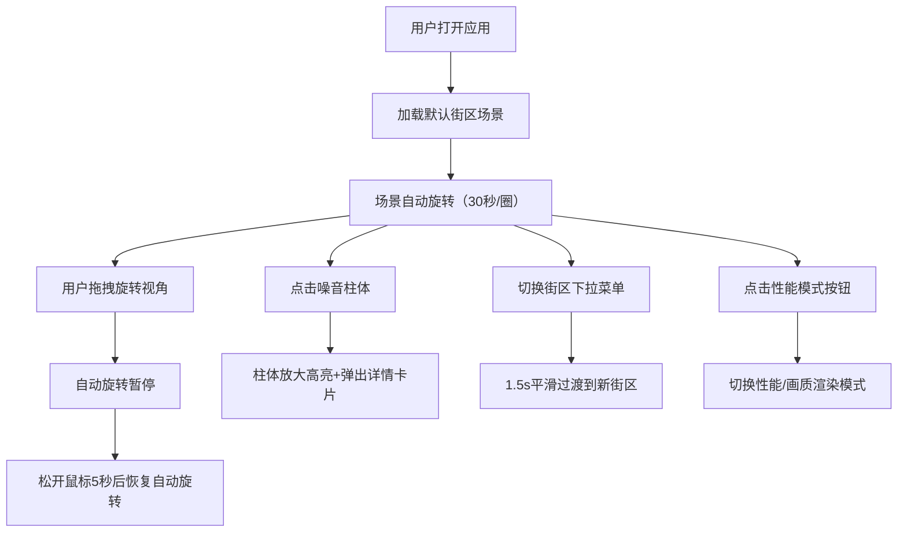

## 1. 产品概述

城市噪音频谱3D可视化分析应用，解决城市规划师和环保人士难以直观展示不同街区噪音污染立体分布的问题。传统2D热力图无法表达垂直高度上的噪音变化，导致对高层住宅和办公楼的噪音影响评估不够准确。

- 核心目标：通过3D柱状图+热力色彩直观展示不同街区、不同高度层的噪音分贝值分布
- 目标用户：城市规划师、环保人士、建筑设计师
- 市场价值：提升噪音污染评估的准确性，助力城市规划决策

## 2. 核心功能

### 2.1 用户角色

| 角色 | 注册方式 | 核心权限 |
|------|----------|----------|
| 普通用户 | 无需注册 | 浏览3D场景、切换街区、查看噪音详情、切换性能模式 |

### 2.2 功能模块

1. **3D场景渲染模块**：Three.js渲染城市街区场景，包含地面、建筑物轮廓线、噪音柱体
2. **街区切换模块**：下拉菜单选择3个预设街区（下沉广场、商业步行街、高架桥旁），平滑过渡动画
3. **噪音柱体交互模块**：点击柱体查看详细信息，包含各高度层分贝值和噪音等级评级
4. **视角控制模块**：自动旋转+手动拖拽旋转，拖拽暂停自动旋转
5. **性能模式模块**：性能/画质切换，优化不同设备下的渲染表现
6. **信息展示模块**：顶部悬浮提示条显示最高分贝信息，点击柱体弹出详情卡片

### 2.3 页面详情

| 页面名称 | 模块名称 | 功能描述 |
|----------|----------|----------|
| 主页面 | 3D场景渲染 | 实时渲染城市街区3D场景，包含80根以内噪音柱体 |
| 主页面 | 街区切换下拉菜单 | 右上角固定位置，选择不同街区场景，1.5s平滑过渡 |
| 主页面 | 顶部信息提示条 | 半透明黑底白字，显示当前视角下最高分贝柱体的坐标和数值 |
| 主页面 | 柱体详情卡片 | 毛玻璃背景，显示柱体坐标、各高度层分贝值、噪音等级评级 |
| 主页面 | 性能切换按钮 | 界面角落，水晶球/闪电图标切换性能/画质模式 |

## 3. 核心流程

用户打开应用 → 自动加载默认街区（下沉广场）→ 场景自动缓慢旋转 → 用户可拖拽旋转视角/滚动缩放 → 点击柱体查看详细分贝信息 → 通过下拉菜单切换其他街区 → 点击性能按钮切换渲染模式

## 4. 用户界面设计

### 4.1 设计风格

- **主色调**：深灰蓝渐变背景 (#1a2332)
- **柱体颜色映射**：绿色(40dB, #4caf50) → 黄色(70dB, #ffeb3b) → 红色(100dB, #f44336)
- **UI元素**：深灰背景 (#333)，白色文字，悬停浅灰蓝 (#2a3a4a)
- **毛玻璃效果**：rgba(255,255,255,0.1) 背景 + 1px 白色半透明边框
- **字体**：科技感无衬线字体，14px-18px 层级分明
- **圆角**：下拉菜单 8px，信息卡片 12px
- **装饰元素**：顶部细条状斜向光晕（透明度0.15）

### 4.2 页面设计概述

| 页面名称 | 模块名称 | UI元素 |
|----------|----------|--------|
| 主页面 | 3D场景 | 深灰蓝渐变背景，噪音柱体带热力色彩和底部投影，柱体加载时有升起动画 |
| 主页面 | 下拉菜单 | 右上角固定，圆角8px，深灰背景，白色16px文字，悬停浅灰蓝 |
| 主页面 | 顶部提示条 | 半透明黑底白字，悬浮顶部，显示最高分贝信息 |
| 主页面 | 详情卡片 | 居中偏上，毛玻璃背景，圆角12px，白色文字，等级颜色标识 |
| 主页面 | 性能按钮 | 界面角落，水晶球/闪电图标，点击切换模式 |

### 4.3 响应性

- 桌面优先设计，最小宽度适配 1024px
- 3D场景自适应容器大小
- UI元素固定定位，不受场景缩放影响

### 4.4 3D场景指导

- **环境与氛围**：冷色调科技感，深灰蓝背景，顶部斜向光晕
- **光照设置**：环境光 + 方向光，柱体底部投影阴影 (opacity 0.2)
- **相机设置**：透视相机，初始视角俯视角45度，可拖拽旋转、滚轮缩放
- **动画效果**：柱体加载从地面升起（0.3s ease-out），街区切换平滑过渡（1.5s ease-in-out）
- **交互效果**：点击柱体放大1.2倍+白色边缘光晕，鼠标拖拽时指针变为grab/grabbing
- **性能策略**：画质模式64边圆柱+光晕特效，性能模式16边圆柱+关闭光晕
