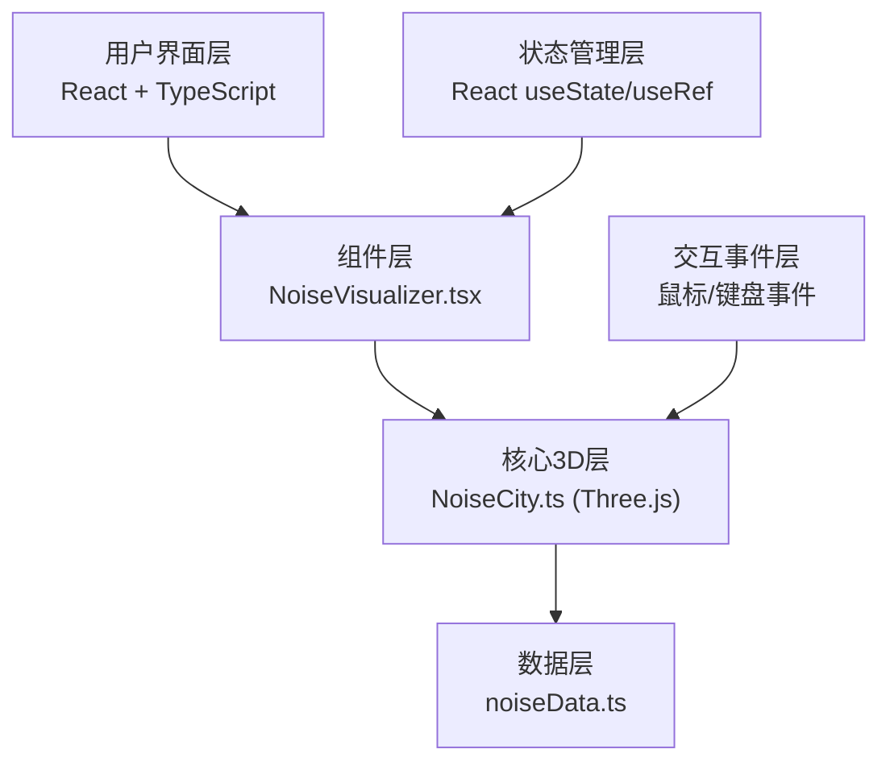

## 1. 架构设计



**模块调用关系：**
- `src/data/noiseData.ts` → 定义数据接口和预设数据集，被 `NoiseCity.ts` 调用
- `src/core/NoiseCity.ts` → Three.js场景核心，接收数据生成3D柱体，导出初始化函数和更新方法，被 `NoiseVisualizer.tsx` 调用
- `src/components/NoiseVisualizer.tsx` → React主组件，挂载3D场景，管理UI状态，处理用户交互

**数据流向：**
1. 用户选择街区 → NoiseVisualizer 更新状态 → 调用 NoiseCity 更新场景
2. 用户点击柱体 → Three.js 射线检测 → NoiseVisualizer 显示详情卡片
3. 性能模式切换 → NoiseVisualizer 传递参数 → NoiseCity 切换几何体精度

## 2. 技术描述

- **前端框架**：React@18 + TypeScript@5 + Vite@5
- **3D渲染引擎**：Three.js@0.160 + @types/three@0.160
- **构建工具**：Vite@5 + @vitejs/plugin-react@4
- **状态管理**：React Hooks (useState, useRef, useEffect)
- **样式方案**：内联样式 + CSS变量（无需Tailwind CSS）
- **初始化工具**：vite-init

## 3. 目录结构

```
auto255/
├── index.html                 # 入口HTML
├── package.json              # 依赖配置
├── vite.config.js            # Vite构建配置
├── tsconfig.json             # TypeScript配置
└── src/
    ├── data/
    │   └── noiseData.ts      # 噪音数据定义与预设数据
    ├── core/
    │   └── NoiseCity.ts      # Three.js场景核心逻辑
    ├── components/
    │   └── NoiseVisualizer.tsx  # React主渲染组件
    ├── App.tsx               # 应用根组件
    ├── main.tsx              # 应用入口
    └── index.css             # 全局样式
```

## 4. 文件职责与接口定义

### 4.1 src/data/noiseData.ts

**接口定义：**
```typescript
export interface NoiseDataPoint {
  x: number;           // X坐标
  z: number;           // Z坐标
  groundDb: number;    // 地面层分贝
  height10Db: number;  // 10m高度分贝
  height20Db: number;  // 20m高度分贝
  height30Db: number;  // 30m高度分贝
  districtId: string;  // 所属街区ID
}

export interface District {
  id: string;
  name: string;
  description: string;
  data: NoiseDataPoint[];
}

export type PerformanceMode = 'performance' | 'quality';
```

**预设数据：** 3个街区（下沉广场、商业步行街、高架桥旁），每个街区包含60-80个数据点

### 4.2 src/core/NoiseCity.ts

**核心函数：**
```typescript
export interface NoiseCityResult {
  scene: THREE.Scene;
  camera: THREE.PerspectiveCamera;
  renderer: THREE.WebGLRenderer;
  update: (delta: number) => void;
  setDistrict: (districtId: string) => Promise<void>;
  setPerformanceMode: (mode: PerformanceMode) => void;
  onBarClick: (callback: (data: NoiseDataPoint | null) => void) => void;
  getMaxDbPoint: () => { point: NoiseDataPoint; maxDb: number } | null;
  dispose: () => void;
}

export function initNoiseCity(
  container: HTMLElement,
  districts: District[],
  initialDistrictId: string,
  performanceMode: PerformanceMode
): NoiseCityResult;
```

**颜色映射函数：**
```typescript
export function getNoiseColor(db: number): THREE.Color {
  // 40dB -> 绿色(#4caf50)
  // 70dB -> 黄色(#ffeb3b)
  // 100dB -> 红色(#f44336)
}
```

### 4.3 src/components/NoiseVisualizer.tsx

**组件Props：** 无
**组件状态：**
- `selectedDistrictId`: string - 当前选中街区
- `selectedBarData`: NoiseDataPoint | null - 选中柱体数据
- `performanceMode`: PerformanceMode - 性能模式
- `autoRotatePaused`: boolean - 自动旋转是否暂停

**渲染结构：**
- 3D Canvas 容器
- 顶部光晕装饰条
- 右上角街区切换下拉菜单
- 顶部信息提示条
- 柱体详情信息卡片
- 右下角性能切换按钮

### 4.4 全局样式 (src/index.css)

- CSS变量定义主题色
- 毛玻璃效果工具类
- 动画关键帧定义
- 响应式媒体查询

## 5. 核心交互实现

### 5.1 街区切换过渡
- 使用 TWEEN.js 或自定义插值函数实现 1.5s ease-in-out 过渡
- 过渡期间：旧柱体缩小淡出 → 地面纹理切换 → 新柱体从地面升起

### 5.2 柱体点击检测
- Three.js Raycaster 实现射线检测
- 点击响应时间 ≤ 100ms
- 选中柱体：scale 1.2倍 + 边缘光晕效果

### 5.3 视角控制
- OrbitControls 实现拖拽旋转和滚轮缩放
- 自动旋转：每30秒转一圈 (0.209 rad/s)
- 拖拽时暂停自动旋转，松开5秒后恢复
- 鼠标指针：拖拽前 grab，拖拽中 grabbing

### 5.4 性能优化
- 画质模式：CylinderGeometry(64 segments) + 光晕特效
- 性能模式：CylinderGeometry(16 segments) + 关闭光晕
- 柱体池化复用，避免频繁创建销毁
- 阴影优化：仅柱体接收/投射阴影

## 6. 关键算法

### 6.1 分贝到颜色映射
```typescript
function dbToColor(db: number): THREE.Color {
  const clampedDb = Math.max(40, Math.min(100, db));
  const t = (clampedDb - 40) / 60; // 归一化到 [0,1]
  
  if (t < 0.5) {
    // 绿 -> 黄 (t: 0 -> 0.5)
    return new THREE.Color().lerpColors(
      new THREE.Color(0x4caf50),
      new THREE.Color(0xffeb3b),
      t * 2
    );
  } else {
    // 黄 -> 红 (t: 0.5 -> 1)
    return new THREE.Color().lerpColors(
      new THREE.Color(0xffeb3b),
      new THREE.Color(0xf44336),
      (t - 0.5) * 2
    );
  }
}
```

### 6.2 噪音等级评定
```typescript
function getNoiseRating(db: number): { level: string; color: string } {
  if (db < 55) return { level: '安静', color: '#4caf50' };
  if (db < 70) return { level: '中等', color: '#ffeb3b' };
  if (db < 85) return { level: '吵闹', color: '#ff9800' };
  return { level: '极吵', color: '#f44336' };
}
```

## 7. 性能指标

| 模式 | 柱体数量 | 目标FPS | 几何体边数 | 光晕特效 |
|------|----------|---------|-----------|----------|
| 画质模式 | ≤80 | ≥50 | 64 | 开启 |
| 性能模式 | ≤80 | ≥30 | 16 | 关闭 |
