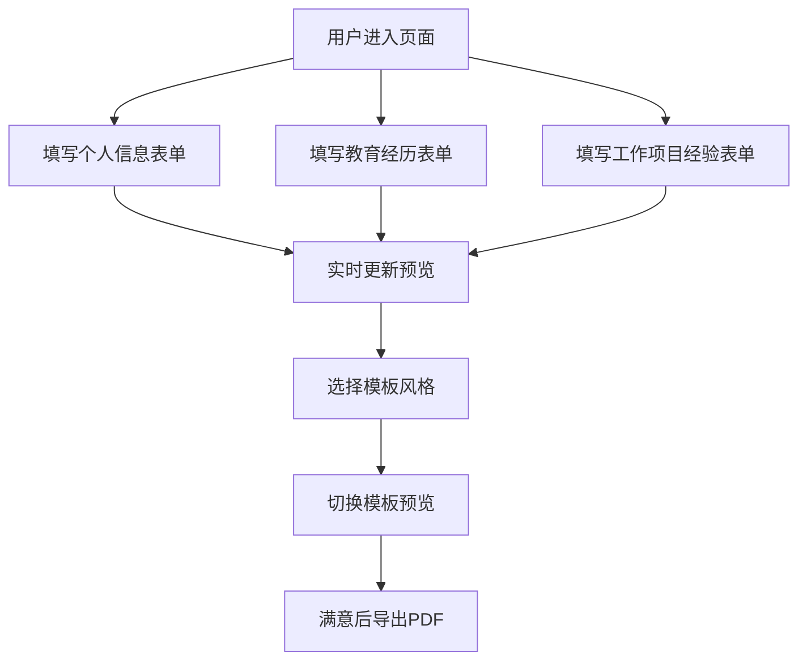

## 1. 产品概述
实时简历生成器是一款帮助求职者快速创建个性化简历的在线工具，解决求职者面对不同岗位需反复修改简历格式和内容的痛点。用户可以通过表单输入个人信息、教育经历和工作项目经验，选择不同风格的简历模板，实时预览效果并导出为PDF文件。

## 2. 核心功能

### 2.1 用户角色
| 角色 | 注册方式 | 核心权限 |
|------|----------|----------|
| 普通用户 | 无需注册，直接使用 | 编辑简历数据、切换模板、实时预览、导出PDF |

### 2.2 功能模块
1. **编辑面板**：个人信息输入、教育经历管理、工作项目经验管理
2. **预览面板**：实时渲染简历、模板切换、PDF导出
3. **模板系统**：简约风格、创意风格、商务风格三套模板

### 2.3 页面详情
| 页面名称 | 模块名称 | 功能描述 |
|----------|----------|----------|
| 主页面 | 顶部导航栏 | 显示产品名称、模板切换按钮、导出按钮，固定定位带渐变动效 |
| 主页面 | 左侧编辑面板 | 表单输入区域，包含个人信息、教育经历、工作项目经验三个模块 |
| 主页面 | 右侧预览面板 | 实时渲染简历内容，根据选择的模板展示不同风格 |

## 3. 核心流程
用户进入页面后，首先在左侧编辑面板填写个人基本信息、教育经历和工作项目经验。填写过程中，右侧预览面板实时更新展示简历效果。用户可以通过顶部导航栏的模板切换按钮在简约、创意、商务三种风格间一键切换，预览区会立即更新为对应模板样式。当简历内容和样式都满意后，点击导出按钮即可将当前预览的简历导出为PDF文件，保持模板样式和排版不丢失。

## 4. 用户界面设计

### 4.1 设计风格
- **主色调**：深蓝灰 (#2C3E50)，用于导航栏、标题文字和重要元素
- **强调色**：浅蓝 (#3498DB)，用于按钮、链接和交互元素
- **背景色**：浅灰 (#F8F9FA)，用于页面背景
- **卡片背景**：白色 (#FFFFFF)，配合柔和阴影增强层次感
- **按钮样式**：圆角8px，hover时有阴影加深效果，400ms缓动过渡
- **字体**：使用系统字体栈，标题16-20px，正文14px
- **图标**：使用lucide-react图标库，保持统一线条风格

### 4.2 页面设计概述
| 页面名称 | 模块名称 | UI元素 |
|----------|----------|--------|
| 主页面 | 顶部导航栏 | 固定定位，深蓝灰背景，微光渐变动效，包含Logo、模板切换下拉框、导出按钮 |
| 主页面 | 左侧编辑面板 | 宽度30%，白色卡片背景，柔和阴影，分三个区块（个人信息、教育经历、工作项目），每个区块可折叠 |
| 主页面 | 右侧预览面板 | 宽度70%，浅灰背景，内有白色简历卡片，A4比例，实时渲染内容 |

### 4.3 响应式
- **桌面端**：左右分栏布局，左侧表单30%，右侧预览70%
- **移动端**：自动堆叠为上下布局，编辑面板在上，预览面板在下，支持滑动切换
- **触摸优化**：按钮最小高度44px，输入框有足够内边距，避免误触

### 4.4 动画效果
- 顶部导航栏：微光渐变背景动画，持续缓慢流动
- 模板切换：400ms ease-in-out 缓动过渡，淡出旧模板淡入新模板
- 导出按钮：点击时有缩放反馈，导出过程显示加载状态
- 表单输入：focus时边框变为强调色，平滑过渡
