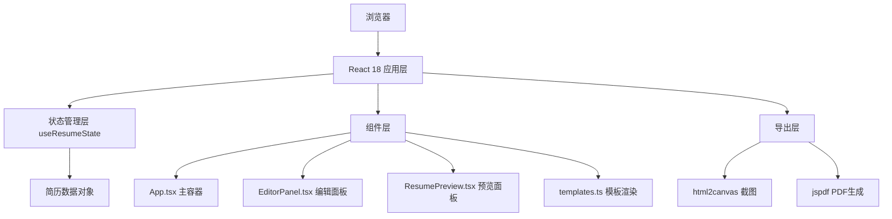

## 1. 架构设计



## 2. 技术描述
- **前端框架**：React 18 + TypeScript + Vite
- **状态管理**：React useState + 自定义Hook useResumeState
- **样式方案**：Tailwind CSS 3 + 内联样式（模板特定样式）
- **PDF导出**：jspdf + html2canvas
- **图标库**：lucide-react
- **构建工具**：Vite

## 3. 核心数据结构

```typescript
interface PersonalInfo {
  name: string;
  title: string;
  email: string;
  phone: string;
  location: string;
  summary: string;
}

interface Education {
  id: string;
  school: string;
  degree: string;
  major: string;
  startDate: string;
  endDate: string;
  description: string;
}

interface WorkExperience {
  id: string;
  company: string;
  position: string;
  startDate: string;
  endDate: string;
  description: string;
  highlights: string[];
}

interface ResumeData {
  personalInfo: PersonalInfo;
  education: Education[];
  workExperience: WorkExperience[];
}

type TemplateId = 'minimal' | 'creative' | 'business';
```

## 4. 项目文件结构

```
├── package.json          # 项目依赖和脚本
├── vite.config.js        # Vite配置，React插件和别名
├── tsconfig.json         # TypeScript配置，严格模式
├── index.html            # 入口HTML页面
└── src/
    ├── App.tsx           # 主容器组件，全局状态管理
    ├── EditorPanel.tsx   # 左侧编辑面板组件
    ├── ResumePreview.tsx # 右侧预览面板组件
    ├── templates.ts      # 三套模板渲染函数
    ├── hooks/
    │   └── useResumeState.ts  # 自定义Hook管理简历状态
    └── main.tsx          # React应用入口
```

## 5. 核心模块说明

### 5.1 useResumeState Hook
- 维护简历数据的完整状态
- 提供更新个人信息、添加/删除/更新教育经历、添加/删除/更新工作经验的方法
- 使用 useCallback 优化性能，确保预览更新延迟 < 50ms

### 5.2 模板系统 (templates.ts)
- `renderMinimalTemplate(data)` - 简约风格模板
- `renderCreativeTemplate(data)` - 创意风格模板  
- `renderBusinessTemplate(data)` - 商务风格模板
- 每个函数接收 ResumeData 对象，返回 JSX 元素

### 5.3 PDF导出
- 使用 html2canvas 将预览区域转换为canvas
- 使用 jspdf 将canvas转换为PDF
- 设置A4纸张尺寸，确保样式不丢失
- 导出时自动处理高清渲染

## 6. 性能优化策略

1. **状态本地化**：表单输入使用受控组件，状态变更立即反映到预览
2. **批量更新**：使用 React 18 自动批处理减少重渲染
3. **组件记忆化**：使用 React.memo 包裹预览组件，避免不必要重渲染
4. **防抖处理**：对于复杂字段，使用 useDeferredValue 优化响应
5. **CSS过渡**：使用纯CSS过渡动画，避免JS阻塞

## 7. 依赖版本

```json
{
  "react": "^18.2.0",
  "react-dom": "^18.2.0",
  "typescript": "^5.0.0",
  "vite": "^5.0.0",
  "@vitejs/plugin-react": "^4.2.0",
  "jspdf": "^2.5.1",
  "html2canvas": "^1.4.1",
  "lucide-react": "^0.294.0"
}
```
