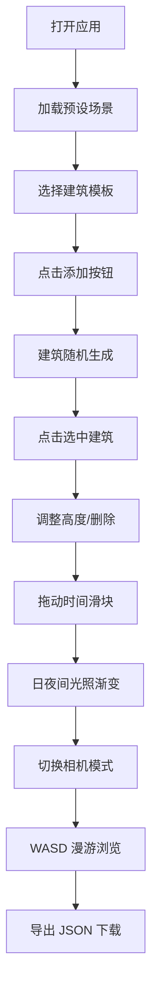

## 1. 产品概述
三维城市天际线动态编辑与漫游预览应用，用户可在浏览器中通过拖拽方式添加、删除和调整建筑体块，实时切换日夜间光照效果，体验第一人称漫游模式。
- 面向城市规划师、建筑设计师和爱好者，提供直观的三维城市设计工具
- 降低三维设计门槛，实现所见即所得的城市天际线创作体验

## 2. 核心 Features

### 2.1 User Roles
| Role | Registration Method | Core Permissions |
|------|---------------------|------------------|
| 普通用户 | 无需注册 | 使用所有编辑和漫游功能，导出城市布局 |

### 2.2 Feature Module
1. **三维场景主界面**：城市场景渲染、建筑体块展示、日夜间光照切换
2. **左侧控制面板**：建筑模板选择、添加/删除按钮、时间滑块、高度调整、导出功能
3. **右上角状态显示**：相机模式指示、FPS 实时计数
4. **建筑交互系统**：点击选中、高亮光晕、高度调整、删除动画
5. **相机控制系统**：轨道模式、第一人称漫游模式、平滑过渡
6. **后端数据服务**：建筑模板 API 接口

### 2.3 Page Details
| Page Name | Module Name | Feature description |
|-----------|-------------|---------------------|
| 主页面 | 三维场景 | Three.js 渲染城市天际线，支持 InstancedMesh 优化，50 个建筑 FPS ≥ 30 |
| 主页面 | 控制面板 | React 组件，深色半透明毛玻璃效果，建筑添加/删除/编辑功能 |
| 主页面 | 光照系统 | 0-24 小时时间循环，环境光和方向光渐变，夜间窗口发光 |
| 主页面 | 相机控制 | 轨道模式（鼠标旋转缩放）、第一人称模式（WASD + 鼠标转向、碰撞检测） |
| 主页面 | 数据管理 | CityManager 存储建筑数据，一键导出带时间戳的 JSON 文件 |

## 3. 核心 Process
用户打开应用 → 从左侧面板选择建筑模板 → 点击添加按钮 → 建筑随机出现在场景中 → 点击建筑选中 → 调整高度或删除 → 拖动时间滑块切换日夜 → 切换相机模式漫游 → 点击导出 JSON 下载城市布局

## 4. User Interface Design

### 4.1 Design Style
- **主色调**：#00BFFF（深空蓝），辅色：#FFFFFF（白色文字）
- **背景**：深色半透明毛玻璃效果 `backdrop-filter: blur(8px)`
- **按钮样式**：圆角 6px，悬停缩放 1.05 倍，点击缩回 0.95 倍，带平滑过渡动画
- **字体**：现代无衬线字体，标题 16px 加粗，正文 14px 常规
- **布局**：控制面板固定左侧 300px，右上角状态显示浮动层
- **图标风格**：线性简洁图标，与深空蓝主题统一

### 4.2 Page Design Overview
| Page Name | Module Name | UI Elements |
|-----------|-------------|-------------|
| 主页面 | 控制面板 | 建筑模板下拉选择、添加/删除按钮、时间滑块（金色到深蓝渐变）、高度滑条（选中时启用）、导出按钮（带加载旋转动画） |
| 主页面 | 状态显示 | 相机模式标签（轨道/第一人称）、FPS 计数（每秒更新）、右上角固定位置 |
| 主页面 | 三维场景 | 网格平面、建筑体块（带顶部白色边缘高亮）、选中蓝色旋转光晕、日夜间光照效果 |

### 4.3 Responsiveness
- 桌面端：左侧固定 300px 控制面板，右侧三维场景
- 移动端（宽度 < 768px）：控制面板折叠为顶部可展开横条，点击展开/收起
- 触摸优化：按钮最小尺寸 44px，支持触摸滑动操作

### 4.4 3D Scene Guidance
- **环境**：程序化天空渐变，白天暖黄色，夜晚深蓝色
- **光照**：方向光模拟太阳光（投射阴影），环境光补光，夜间建筑窗口点光源
- **相机**：透视相机，默认轨道模式，第一人称模式支持 WASD 移动 + 鼠标转向
- **交互**：射线检测选中建筑，光晕环旋转动画，删除缩放动画
- **后处理**：抗锯齿，阴影柔和，光晕效果
- **性能**：InstancedMesh 批量渲染建筑，每帧光照更新 < 0.1ms

