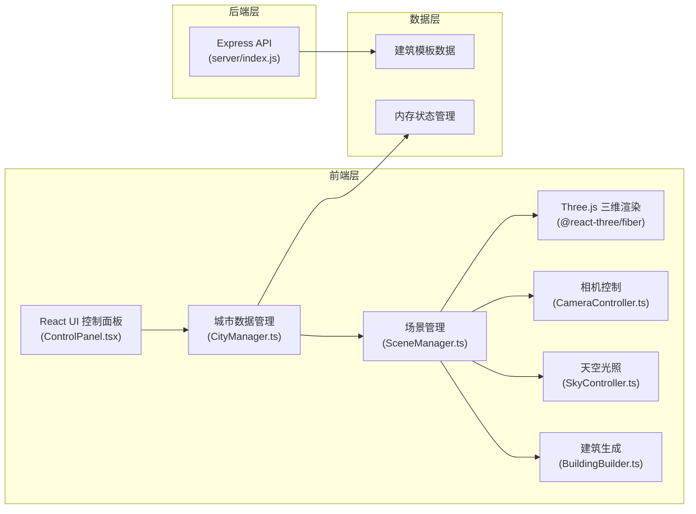
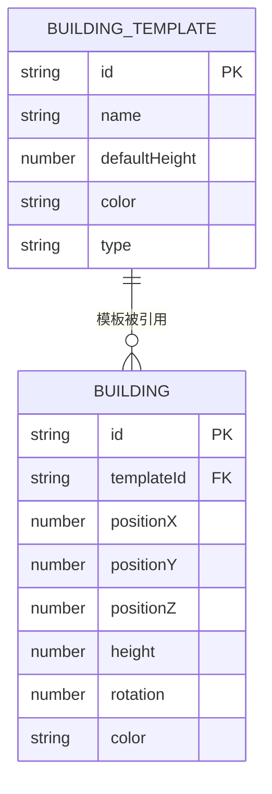

## 1. 架构设计



## 2. 技术栈说明

| 层级 | 技术选型 | 版本 | 用途 |
|------|----------|------|------|
| 前端框架 | React | 18.x | UI 组件库 |
| 渲染引擎 | Three.js | 0.160.x | 三维渲染核心 |
| React-Three 桥接 | @react-three/fiber | 8.x | React 与 Three.js 集成 |
| 辅助组件 | @react-three/drei | 9.x | 常用 Three.js 组件封装 |
| 开发语言 | TypeScript | 5.x | 类型安全 |
| 构建工具 | Vite | 5.x | 开发服务器与构建 |
| 后端框架 | Express | 4.x | 后端 API 服务 |
| 唯一 ID | uuid | 9.x | 建筑 ID 生成 |
| 跨域中间件 | cors | 2.x | 跨域请求处理 |

## 3. 文件结构

```
auto49/
├── package.json
├── index.html
├── vite.config.js
├── tsconfig.json
├── src/
│   ├── main.tsx
│   ├── App.tsx
│   ├── index.css
│   ├── types/
│   │   └── index.ts
│   └── modules/
│       ├── scene/
│       │   ├── SceneManager.ts
│       │   ├── BuildingBuilder.ts
│       │   └── SkyController.ts
│       ├── ui/
│       │   └── ControlPanel.tsx
│       ├── managers/
│       │   └── CityManager.ts
│       └── camera/
│           └── CameraController.ts
└── server/
    └── index.js
```

## 4. 数据模型定义

### 4.1 TypeScript 类型定义

```typescript
// 建筑模板类型
interface BuildingTemplate {
  id: string;
  name: string;
  defaultHeight: number;
  color: string;
  type: 'residential' | 'office' | 'commercial' | 'hotel';
}

// 建筑实例类型
interface Building {
  id: string;
  templateId: string;
  position: { x: number; y: number; z: number };
  height: number;
  rotation: number;
  color: string;
}

// 城市布局导出类型
interface CityLayout {
  buildings: Building[];
  timestamp: number;
  version: string;
}

// 相机模式类型
type CameraMode = 'orbit' | 'firstPerson';
```

### 4.2 ER 图



## 5. API 接口定义

### 5.1 获取建筑模板列表

- **GET** `/api/buildings`
- **描述**：返回预设建筑模板列表
- **响应**：
  ```typescript
  interface BuildingTemplatesResponse {
    success: boolean;
    data: BuildingTemplate[];
  }
  ```
- **示例响应**：
  ```json
  {
    "success": true,
    "data": [
      { "id": "residential", "name": "住宅", "defaultHeight": 40, "color": "#8BC34A", "type": "residential" },
      { "id": "office", "name": "办公", "defaultHeight": 80, "color": "#2196F3", "type": "office" },
      { "id": "commercial", "name": "商业", "defaultHeight": 30, "color": "#FF9800", "type": "commercial" },
      { "id": "hotel", "name": "酒店", "defaultHeight": 60, "color": "#E91E63", "type": "hotel" }
    ]
  }
  ```

## 6. 核心模块职责

| 模块 | 职责 | 关键方法 |
|------|------|----------|
| `SceneManager` | 场景、相机、渲染器管理，灯光初始化，建筑增删改，渲染循环 | `init()`, `addBuilding()`, `removeBuilding()`, `updateBuilding()`, `render()` |
| `BuildingBuilder` | 生成带纹理和边缘高亮的建筑网格 | `createBuilding()`, `updateHeight()`, `createEdges()`, `createWindowLights() |
| `SkyController` | 日夜间时间循环，光照颜色强度更新 | `setTime()`, `update()`, `getCurrentTime()` |
| `CityManager` | 建筑数据存储，增删改操作，数据同步三维模块 | `addBuilding()`, `removeBuilding()`, `updateBuildingHeight()`, `exportLayout()`, `selectBuilding() |
| `CameraController` | 轨道控制和第一人称漫游控制，模式切换，碰撞检测 | `setMode()`, `update()`, `getPosition()`, `getMode() |
| `ControlPanel` | React UI 组件，建筑模板选择，按钮交互，滑块控制 | `handleAddBuilding()`, `handleDeleteBuilding()`, `handleTimeChange()`, `handleHeightChange()`, `handleExport()` |

## 7. 性能优化策略

1. **InstancedMesh 优化**：使用 `InstancedMesh` 批量渲染建筑，减少绘制调用
2. **LOD 层级**：远距离建筑降低几何细节
3. **矩阵更新**：仅在建筑变化时更新矩阵，避免每帧重建
4. **阴影优化**：限制阴影贴图分辨率和阴影相机范围
5. **光照计算**：将日夜间光照计算移至 CPU 预计算，每帧仅插值
6. **窗口光源**：使用 `InstancedMesh 模拟发光窗口而非真实点光源
7. **材质复用**：共享材质实例，减少 GPU 资源占用

