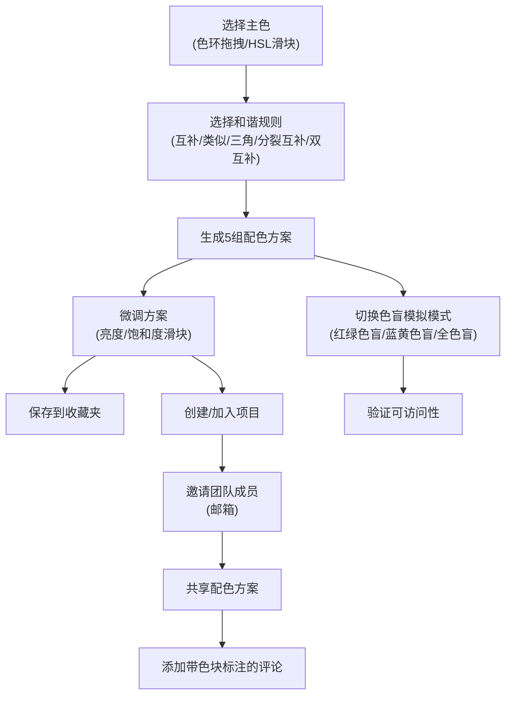

## 1. 产品概述

ColorPalette Studio 是一款面向插画师和设计师的在线配色方案生成与团队协作应用，解决个人创作时配色灵感不足以及团队项目中色彩方案沟通效率低的问题。

- **核心目标**：提供专业的色彩和谐算法生成配色方案，支持团队协作与可访问性验证
- **目标用户**：插画师、UI/UX设计师、品牌设计师、前端开发人员
- **产品价值**：通过科学的色彩理论与协作工具，提升设计效率与方案质量

## 2. 核心功能

### 2.1 用户角色

| 角色 | 注册方式 | 核心权限 |
|------|----------|----------|
| 普通用户 | 模拟邮箱登录 | 生成配色方案、管理收藏夹、创建/加入项目、发表评论 |

### 2.2 功能模块

1. **配色方案生成器**：交互式色环、HSL滑块微调、色彩和谐规则选择、5种关联方案生成
2. **方案收藏夹**：方案微调、保存收藏、时间倒序排列、缩略预览与展开详情
3. **项目协作空间**：创建项目、邮箱邀请成员、共享配色方案、评论批注
4. **色盲模拟模式**：红绿色盲、蓝黄色盲、全色盲三种模拟，验证配色可访问性

### 2.3 页面详情

| 页面名称 | 模块名称 | 功能描述 |
|----------|----------|----------|
| 主页面 | 工具面板 | 交互式色环（拖拽选择主色）、H/S/L滑块微调、色彩和谐规则选择器、色盲模拟切换 |
| 主页面 | 配色方案区 | 5张配色方案卡片网格、每张卡片显示5个色块与HEX值、亮度/饱和度微调滑块、收藏按钮 |
| 主页面 | 收藏夹区域 | 按时间倒序排列的收藏方案缩略卡片、展开查看大图与完整色值、标签管理 |
| 主页面 | 项目协作区 | 项目列表、创建新项目、邀请成员输入框、项目内配色方案共享、评论气泡组件 |

## 3. 核心流程

用户在工具面板通过色环或滑块选择主色调，选择色彩和谐规则后，系统实时生成5组配色方案。用户可对方案进行微调后收藏，或创建项目邀请团队成员协作。团队成员可在共享方案上添加带色块标注的评论，实现高效沟通。色盲模拟模式帮助用户验证方案的可访问性。

## 4. 用户界面设计

### 4.1 设计风格
- **主色调**：工具面板深灰 `#2D2D3F`，内容区浅白 `#F5F5FA`
- **交互强调色**：根据用户选择的主色动态适配，提供视觉一致性
- **字体**：采用现代无衬线字体，标题使用具有设计感的展示字体
- **布局**：桌面端左右分栏，左侧工具面板固定320px，右侧自适应
- **动效**：色环圆环插值动画、卡片淡入上移过渡（0.3s）、评论气泡平滑展开
- **图标**：使用 lucide-react 线性图标，保持简洁专业

### 4.2 页面设计概览

| 页面名称 | 模块名称 | UI元素 |
|----------|----------|--------|
| 主页面 | 工具面板 | 圆环色环（带拖拽指示器）、三个HSL滑块（带数值显示）、规则选择按钮组、色盲模式切换器 |
| 主页面 | 方案卡片 | 五个色块横向排列（圆角矩形）、HEX值标签、亮度/饱和度微调滑块（悬浮显示）、收藏/分享操作按钮 |
| 主页面 | 收藏夹 | 时间分组标题、缩略卡片网格、展开时的大图预览、标签编辑、删除按钮 |
| 主页面 | 协作区 | 项目卡片、成员头像列表、评论输入框、带色块引用的评论气泡、实时更新指示器 |

### 4.3 响应式设计
- **桌面端（≥1200px）**：左侧工具面板固定320px宽，右侧内容区自适应
- **平板端（768px-1199px）**：工具面板折叠为顶部工具栏，点击展开功能区
- **手机端（<768px）**：全屏显示内容区，工具面板以抽屉方式从左侧呼出，优化触控区域

### 4.4 性能指标
- 色环拖拽生成配色方案响应时间：< 200ms
- 方案卡片网格滚动帧率：稳定 60fps
- 动画流畅度：所有过渡动画 GPU 加速

