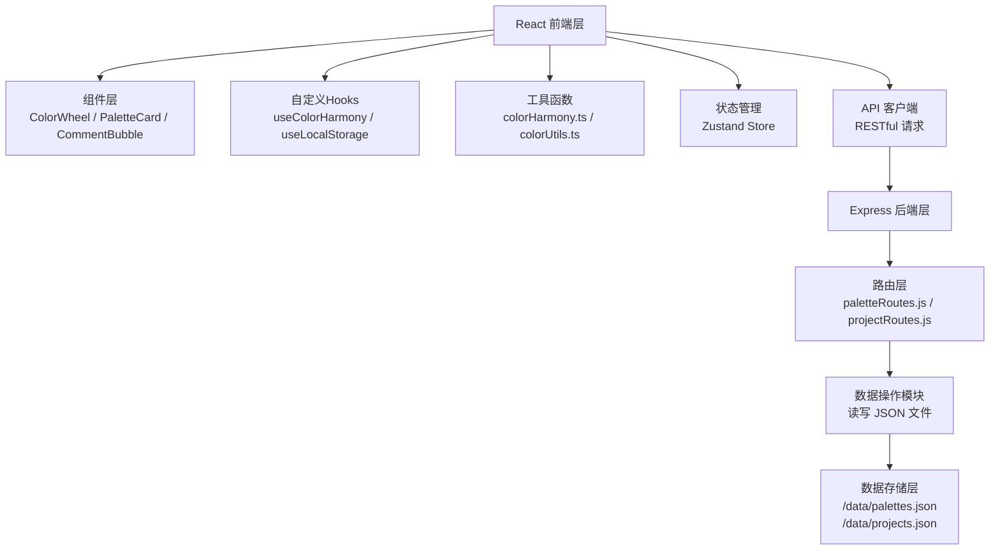
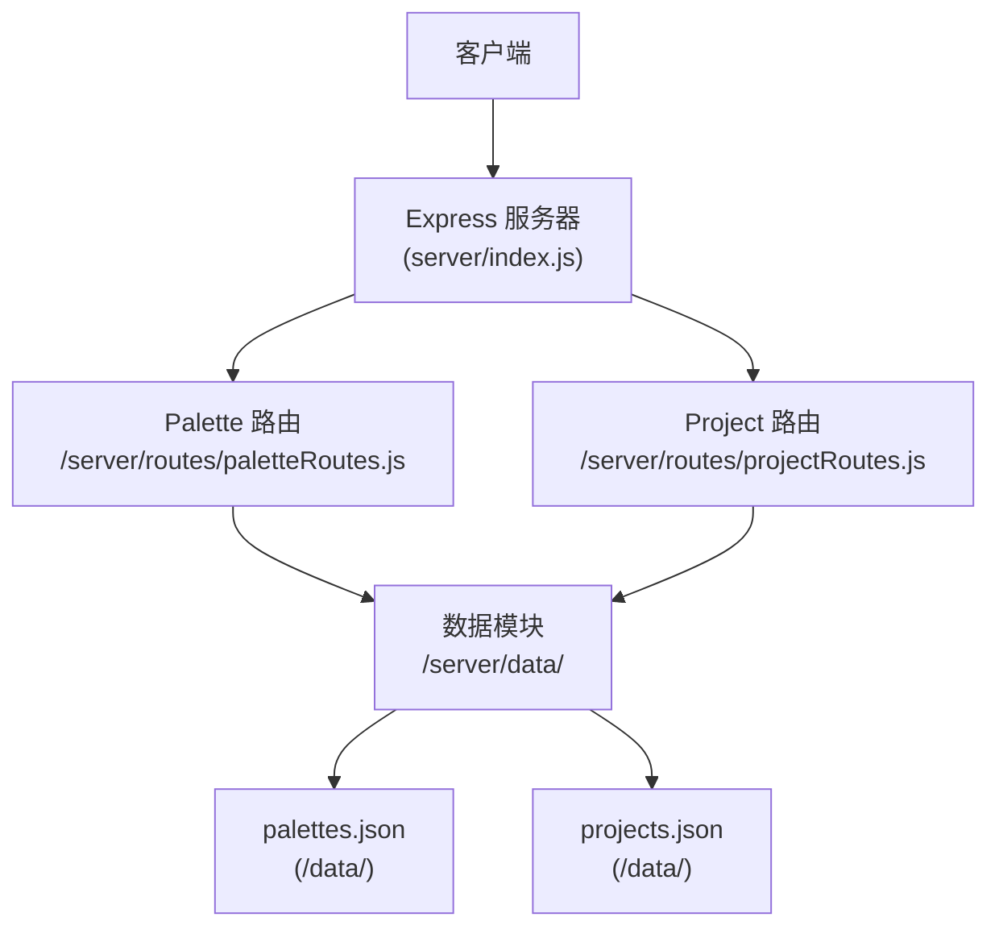
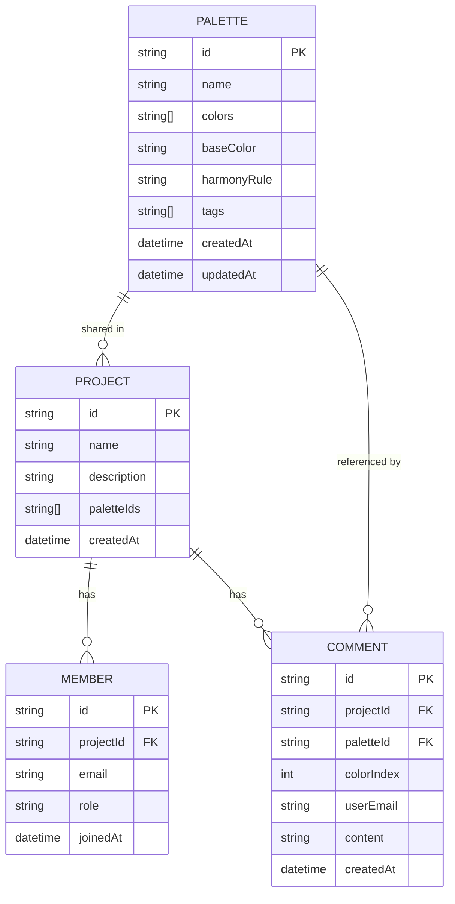

## 1. 架构设计



## 2. 技术描述

- **前端**：React 18 + TypeScript + Vite 5，使用 Zustand 进行状态管理
- **样式**：CSS Modules + CSS Variables，实现主题切换与色盲模拟
- **后端**：Node.js + Express 4，提供 RESTful API
- **数据存储**：本地 JSON 文件（/data/palettes.json、/data/projects.json）
- **构建工具**：Vite 5，配置后端代理端口
- **依赖库**：uuid（ID生成）、date-fns（日期处理）、lucide-react（图标）

## 3. 路由定义

### 前端路由
| 路由 | 用途 |
|------|------|
| / | 主页面（配色生成、收藏夹、项目协作） |

### 后端 API 路由
| 路由 | 方法 | 用途 |
|------|------|------|
| /api/palettes | GET | 获取所有配色方案 |
| /api/palettes | POST | 保存新配色方案 |
| /api/palettes/:id | PUT | 更新配色方案 |
| /api/palettes/:id | DELETE | 删除配色方案 |
| /api/projects | GET | 获取所有项目 |
| /api/projects | POST | 创建新项目 |
| /api/projects/:id | GET | 获取项目详情 |
| /api/projects/:id/invite | POST | 邀请成员加入项目 |
| /api/projects/:id/palettes | POST | 共享配色方案到项目 |
| /api/projects/:id/comments | POST | 添加评论 |

## 4. API 定义

### TypeScript 类型定义

```typescript
// 配色方案
interface Palette {
  id: string;
  name: string;
  colors: string[]; // HEX 色值数组
  baseColor: string; // 主色
  harmonyRule: string; // 和谐规则
  tags: string[];
  createdAt: string;
  updatedAt: string;
}

// 项目
interface Project {
  id: string;
  name: string;
  description: string;
  members: ProjectMember[];
  palettes: string[]; // 配色方案 ID 列表
  comments: Comment[];
  createdAt: string;
}

// 项目成员
interface ProjectMember {
  id: string;
  email: string;
  role: 'owner' | 'editor' | 'viewer';
  joinedAt: string;
}

// 评论
interface Comment {
  id: string;
  userId: string;
  userEmail: string;
  paletteId?: string; // 关联的配色方案
  colorIndex?: number; // 标注的色块索引
  content: string;
  createdAt: string;
}

// 色彩和谐规则
type HarmonyRule = 'complementary' | 'analogous' | 'triadic' | 'splitComplementary' | 'doubleComplementary';

// 色盲模式
type ColorBlindMode = 'normal' | 'protanopia' | 'deuteranopia' | 'tritanopia' | 'achromatopsia';
```

### 请求响应示例

**POST /api/palettes**
```json
{
  "name": "深海主题",
  "colors": ["#0A2463", "#3E92CC", "#D8315B", "#1E1B4B", "#FFFAFF"],
  "baseColor": "#0A2463",
  "harmonyRule": "triadic",
  "tags": ["海洋", "商务"]
}
```

**响应 201 Created**
```json
{
  "id": "uuid-string",
  "name": "深海主题",
  "colors": ["#0A2463", "#3E92CC", "#D8315B", "#1E1B4B", "#FFFAFF"],
  "baseColor": "#0A2463",
  "harmonyRule": "triadic",
  "tags": ["海洋", "商务"],
  "createdAt": "2026-06-20T12:00:00.000Z",
  "updatedAt": "2026-06-20T12:00:00.000Z"
}
```

## 5. 服务器架构图



## 6. 数据模型

### 6.1 数据模型定义



### 6.2 初始数据文件

**/data/palettes.json**
```json
[]
```

**/data/projects.json**
```json
[]
```

## 7. 文件结构

```
auto51/
├── package.json
├── vite.config.js
├── tsconfig.json
├── index.html
├── src/
│   ├── components/
│   │   ├── ColorWheel.tsx
│   │   ├── PaletteCard.tsx
│   │   ├── Slider.tsx
│   │   ├── CommentBubble.tsx
│   │   ├── ProjectCard.tsx
│   │   └── Drawer.tsx
│   ├── pages/
│   │   └── HomePage.tsx
│   ├── utils/
│   │   ├── colorHarmony.ts
│   │   ├── colorUtils.ts
│   │   └── colorBlindness.ts
│   ├── store/
│   │   └── useStore.ts
│   ├── hooks/
│   │   └── useLocalStorage.ts
│   ├── types/
│   │   └── index.ts
│   ├── App.tsx
│   └── main.tsx
├── server/
│   ├── index.js
│   ├── routes/
│   │   ├── paletteRoutes.js
│   │   └── projectRoutes.js
│   └── data/
│       ├── paletteData.js
│       └── projectData.js
└── data/
    ├── palettes.json
    └── projects.json
```

