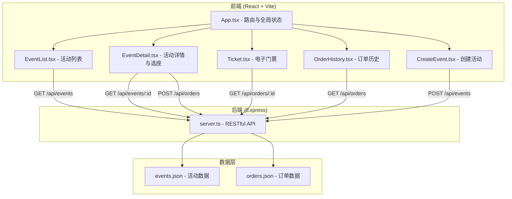
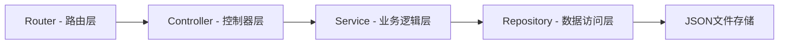
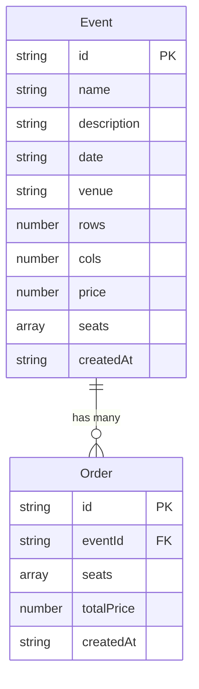

## 1. 架构设计



## 2. 技术说明

- 前端：React 18 + TypeScript + Vite
- 初始化工具：vite-init（react-express-ts模板）
- 后端：Express 4 + TypeScript
- 数据库：本地JSON文件存储（events.json, orders.json）
- 状态管理：zustand
- 路由：react-router-dom
- 样式：Tailwind CSS
- 图标：lucide-react
- 日期处理：date-fns
- 唯一ID：uuid
- 二维码：Canvas API原生绘制

## 3. 路由定义

| 路由 | 用途 |
|------|------|
| / | 首页，活动列表浏览与筛选 |
| /create | 创建活动页面 |
| /event/:id | 活动详情页，含座位图与购票 |
| /ticket/:orderId | 电子门票页面，含二维码与下载 |
| /orders | 订单历史页面 |

## 4. API定义

### 4.1 TypeScript类型定义

```typescript
interface Seat {
  row: number;
  col: number;
  status: 'available' | 'sold' | 'reserved';
}

interface Event {
  id: string;
  name: string;
  description: string;
  date: string;
  venue: string;
  rows: number;
  cols: number;
  price: number;
  seats: Seat[][];
  createdAt: string;
}

interface Order {
  id: string;
  eventId: string;
  seats: { row: number; col: number }[];
  totalPrice: number;
  createdAt: string;
}
```

### 4.2 请求/响应Schema

| 方法 | 路径 | 请求体 | 响应 | 说明 |
|------|------|--------|------|------|
| GET | /api/events | - | Event[] | 获取所有活动列表 |
| GET | /api/events/:id | - | Event | 获取单个活动详情 |
| POST | /api/events | CreateEventDTO | Event | 创建新活动 |
| POST | /api/orders | CreateOrderDTO | Order | 创建购票订单 |
| GET | /api/orders | - | Order[] | 获取所有订单 |
| GET | /api/orders/:id | - | Order | 获取单个订单详情 |

**CreateEventDTO**:
```typescript
{
  name: string;
  description: string;
  date: string;
  venue: string;
  rows: number;
  cols: number;
  price: number;
}
```

**CreateOrderDTO**:
```typescript
{
  eventId: string;
  seats: { row: number; col: number }[];
}
```

## 5. 服务端架构图



- **路由层**：定义API端点，映射到控制器方法
- **控制器层**：解析请求参数，调用服务层，格式化响应
- **服务层**：核心业务逻辑（座位状态管理、订单创建、价格计算）
- **数据访问层**：读写JSON文件，封装数据操作

## 6. 数据模型

### 6.1 数据模型定义



### 6.2 数据定义

**events.json** 示例初始数据：
```json
[
  {
    "id": "evt-001",
    "name": "2026前端技术大会",
    "description": "汇聚业界顶尖前端工程师，分享最新技术趋势与最佳实践",
    "date": "2026-07-15T09:00:00.000Z",
    "venue": "深圳会展中心A厅",
    "rows": 10,
    "cols": 15,
    "price": 299,
    "seats": [],
    "createdAt": "2026-06-20T00:00:00.000Z"
  }
]
```

**orders.json** 初始数据：
```json
[]
```

座位数据在创建活动时根据行列数自动生成二维数组，所有初始状态为 `available`。
