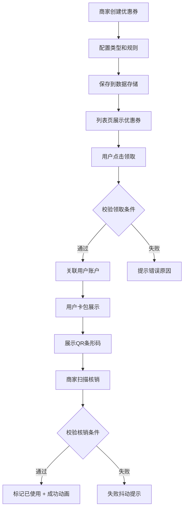

## 1. 产品概述

促销优惠券管理与核销应用，为小型电商和手工艺人提供轻量级的优惠券创建、发放和核销解决方案。支持多种优惠券类型（满减券、折扣券、礼品券），规则可视化配置，用户领取后通过QR条形码进行核销。

- 主要目的：解决小型商家定制化优惠券发放与核销需求
- 目标用户：小型电商、手工艺人、线下零售商家
- 产品价值：低成本搭建、规则灵活、可视化配置、移动端友好

## 2. 核心功能

### 2.1 用户角色

| 角色 | 注册方式 | 核心权限 |
|------|----------|----------|
| 商家 | 默认登录 | 创建优惠券、管理优惠券、核销优惠券 |
| 用户 | 模拟固定ID | 浏览优惠券、领取优惠券、查看卡包、展示核销码 |

### 2.2 功能模块

1. **优惠券列表页**：展示所有可用优惠券、领取功能、有效期倒计时
2. **创建优惠券页**：表单配置优惠券类型和规则
3. **我的卡包页**：横向滚动展示已领取优惠券、QR条形码
4. **核销页**：扫码/输入核销码、校验并核销优惠券

### 2.3 页面详情

| 页面名称 | 模块名称 | 功能描述 |
|----------|----------|----------|
| 优惠券列表页 | 优惠券卡片网格 | 瀑布流3列布局，卡片展示类型、折扣、有效期、领取按钮 |
| 优惠券列表页 | 有效期倒计时 | 实时更新剩余时间，过期自动置灰 |
| 创建优惠券页 | 类型选择器 | 满减券/折扣券/礼品券切换，动态显示对应字段 |
| 创建优惠券页 | 规则配置表单 | 金额、折扣率、有效期、适用商品ID、发行量、用户等级 |
| 我的卡包页 | 横向滚动卡片容器 | 带滚动条美化，展示已领取优惠券 |
| 我的卡包页 | QR条形码 | 根据优惠券ID和用户ID生成二维码 |
| 核销页 | 扫码输入框 | 简洁输入框，支持手动输入核销码 |
| 核销页 | 结果反馈 | 成功勾号动画/失败抖动提示 |

## 3. 核心流程

### 3.1 优惠券创建流程
商家进入创建页 → 选择优惠券类型 → 填写规则配置 → 提交表单 → 后端保存到JSON → 返回成功 → 列表页展示新优惠券

### 3.2 优惠券领取流程
用户浏览列表 → 点击领取按钮 → 校验是否已领取/是否还有库存 → 关联用户ID → 更新库存 → 显示已领取状态

### 3.3 优惠券核销流程
用户在卡包展示QR码 → 商家扫码或输入核销码 → 系统校验有效期/使用条件/是否已使用 → 扣减库存标记已使用 → 返回成功动画或失败提示

## 4. 用户界面设计

### 4.1 设计风格
- **主色调**：暖橙色 #FF6B35
- **辅助色**：深灰 #2D2D2D、白色 #FFFFFF
- **按钮样式**：圆角按钮，主色调填充，悬停微上浮
- **字体**：现代无衬线字体，标题加粗，正文常规
- **布局风格**：卡片式布局，顶部Tab导航
- **图标风格**：Lucide线性图标

### 4.2 页面设计概述

| 页面名称 | 模块名称 | UI元素 |
|----------|----------|--------|
| 优惠券列表页 | 导航栏 | 暖橙色背景，白色标题文字，Tab切换 |
| 优惠券列表页 | 优惠券卡片 | 圆角8px，box-shadow: 0 4px 12px rgba(0,0,0,0.1)，悬停上移3px |
| 优惠券列表页 | 领取按钮 | 波纹扩散动画，主色调圆角按钮 |
| 创建优惠券页 | 表单 | 左侧标签+右侧输入分栏布局，提交按钮带加载旋转动画 |
| 我的卡包页 | 横向滚动容器 | 卡片横向排列，自定义滚动条样式 |
| 核销页 | 输入框 | 简洁大方，聚焦时主色边框高亮 |
| 核销页 | 反馈动画 | 成功：勾号从中心放大，1秒消失；失败：红色抖动 |

### 4.3 响应式设计
- 桌面端（≥768px）：卡片3列瀑布流布局
- 平板端：卡片2列布局
- 移动端（<768px）：卡片单列全宽布局
- 触摸优化：按钮最小触控区域44px，手势友好
