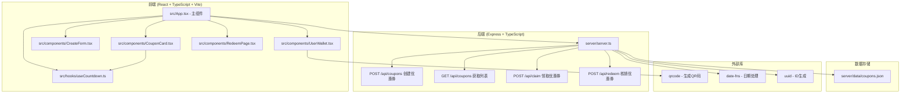
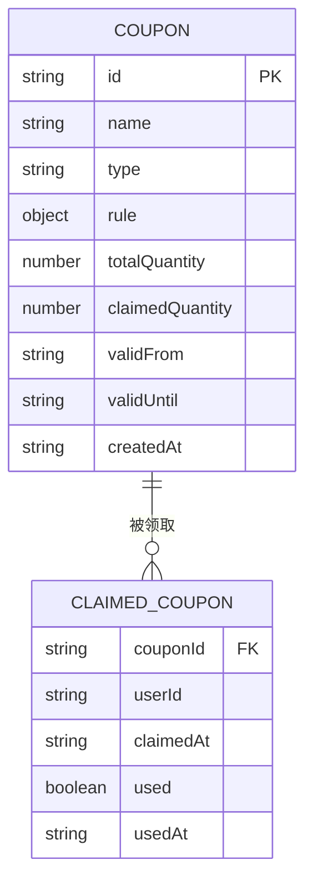

## 1. 架构设计



## 2. 技术描述

- **前端框架**：React 18 + TypeScript
- **构建工具**：Vite 5.x + @vitejs/plugin-react
- **后端框架**：Express 4.x + TypeScript
- **数据存储**：本地JSON文件（server/data/coupons.json）
- **样式方案**：原生CSS（CSS变量 + 响应式媒体查询）
- **状态管理**：React useState/useEffect（轻量级场景）
- **辅助库**：
  - uuid：生成唯一ID
  - date-fns：日期计算与格式化
  - qrcode：QR条形码生成
  - body-parser：请求体解析
  - cors：跨域支持

## 3. 路由定义

| 前端视图 | 对应URL Hash | 用途 |
|----------|-------------|------|
| 优惠券列表 | #/list | 浏览可领取优惠券，首页默认视图 |
| 创建优惠券 | #/create | 商家创建优惠券表单 |
| 我的卡包 | #/wallet | 用户查看已领取的优惠券 |
| 核销页面 | #/redeem | 商家扫码核销优惠券 |

## 4. API 定义

### 4.1 类型定义

```typescript
type CouponType = 'fixed' | 'discount' | 'gift';

interface CouponRule {
  minAmount?: number;      // 最低消费金额（满减券/折扣券）
  discountAmount?: number; // 减免金额（满减券）
  discountRate?: number;   // 折扣率 0-1（折扣券）
  maxDiscount?: number;    // 折扣上限（折扣券）
  giftAmount?: number;     // 礼品金额（礼品券）
  applicableProducts: string[]; // 适用商品ID列表
  userLevel?: number;      // 适用用户等级
}

interface Coupon {
  id: string;
  name: string;
  type: CouponType;
  rule: CouponRule;
  totalQuantity: number;   // 总发行量
  claimedQuantity: number; // 已领取数量
  validFrom: string;       // 生效时间 ISO
  validUntil: string;      // 过期时间 ISO
  createdAt: string;
}

interface ClaimedCoupon {
  couponId: string;
  userId: string;
  claimedAt: string;
  used: boolean;
  usedAt?: string;
}

interface CouponData {
  coupons: Coupon[];
  claims: ClaimedCoupon[];
}
```

### 4.2 接口列表

| Method | Path | 请求体 | 响应 |
|--------|------|--------|------|
| POST | /api/coupons | `{ name, type, rule, totalQuantity, validDays }` | `{ success: true, coupon: Coupon }` |
| GET | /api/coupons?userId=xxx | - | `{ coupons: (Coupon & { claimed: boolean })[] }` |
| POST | /api/claim | `{ couponId, userId }` | `{ success: boolean, message: string }` |
| GET | /api/claims?userId=xxx | - | `{ claims: (ClaimedCoupon & { coupon: Coupon })[] }` |
| POST | /api/redeem | `{ code: string, purchaseAmount?: number, productIds?: string[] }` | `{ success: boolean, message: string }` |

## 5. 服务器架构


数据流向说明：
1. 前端通过 fetch 发送 HTTP 请求到后端 3001 端口
2. Vite 开发服务器通过代理将 /api 请求转发到 Express 后端
3. Express 路由匹配请求，解析请求体
4. 业务逻辑处理：校验条件、更新数据
5. 读写 server/data/coupons.json 持久化数据
6. 返回 JSON 响应，前端更新本地状态并重新渲染

## 6. 数据模型

### 6.1 ER图



### 6.2 数据文件结构 (coupons.json)

```json
{
  "coupons": [
    {
      "id": "uuid-string",
      "name": "新用户满减券",
      "type": "fixed",
      "rule": {
        "minAmount": 100,
        "discountAmount": 20,
        "applicableProducts": ["P001", "P002"],
        "userLevel": 1
      },
      "totalQuantity": 100,
      "claimedQuantity": 0,
      "validFrom": "2025-06-20T00:00:00.000Z",
      "validUntil": "2025-07-20T23:59:59.999Z",
      "createdAt": "2025-06-20T10:00:00.000Z"
    }
  ],
  "claims": []
}
```
