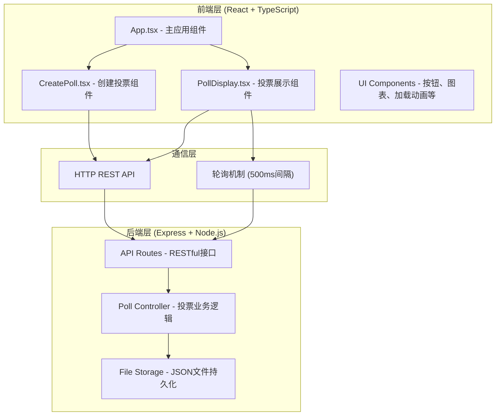
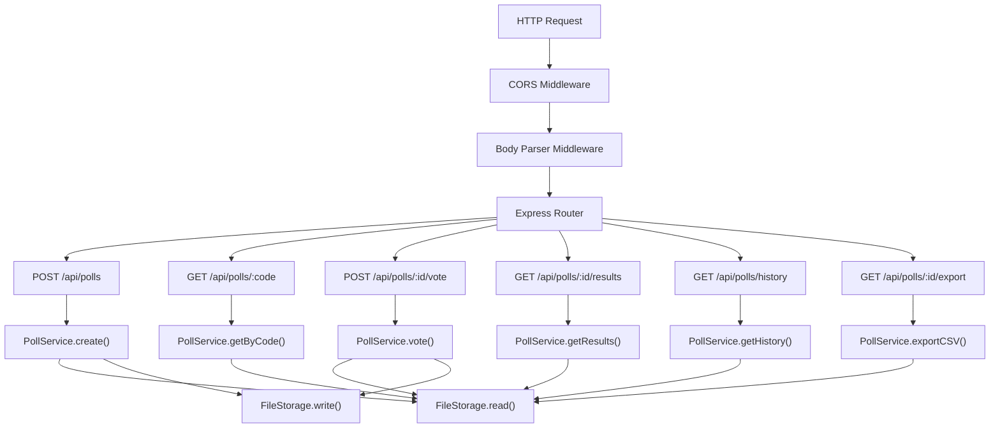
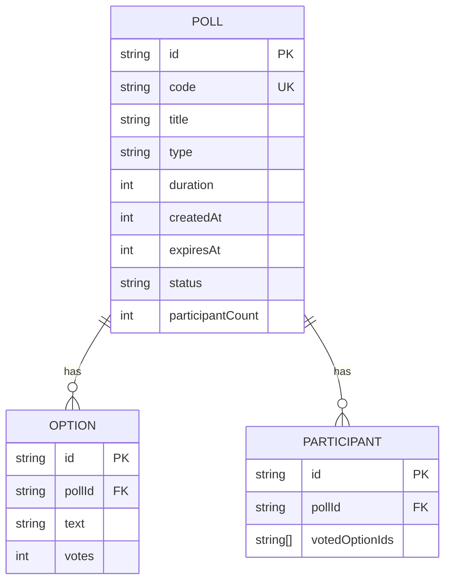

## 1. 架构设计



## 2. 技术描述

- **前端框架**：React 18 + TypeScript
- **构建工具**：Vite 5
- **前端路由**：React Router（可选，使用状态管理替代）
- **状态管理**：React useState/useReducer（轻量级场景）
- **图表库**：原生SVG实现（避免引入重型图表库）
- **后端框架**：Express 4
- **运行环境**：Node.js 18+
- **数据存储**：本地JSON文件（polls.json）
- **HTTP客户端**：原生Fetch API
- **工具库**：uuid（生成唯一ID）、date-fns（日期处理）、body-parser（请求解析）、cors（跨域处理）

## 3. 目录结构

```
auto54/
├── index.html                 # 入口HTML
├── package.json              # 项目依赖
├── vite.config.js            # Vite配置
├── tsconfig.json             # TypeScript配置
├── src/
│   ├── App.tsx               # 主应用组件
│   ├── main.tsx              # React入口
│   ├── types/
│   │   └── poll.ts           # 类型定义
│   ├── components/
│   │   ├── CreatePoll.tsx    # 创建投票组件
│   │   ├── PollDisplay.tsx   # 投票展示组件
│   │   ├── PollList.tsx      # 投票列表组件
│   │   ├── BarChart.tsx      # 柱状图组件
│   │   ├── PieChart.tsx      # 饼图组件
│   │   └── Loading.tsx       # 加载组件
│   ├── utils/
│   │   ├── api.ts            # API请求封装
│   │   └── helpers.ts        # 工具函数
│   └── styles/
│       └── index.css         # 全局样式
└── src/server/
    ├── server.ts             # Express服务器入口
    ├── data/
    │   └── polls.json        # 投票数据存储
    └── types/
        └── poll.ts           # 后端类型定义
```

## 4. API 定义

### 4.1 类型定义

```typescript
interface PollOption {
  id: string;
  text: string;
  votes: number;
}

interface Poll {
  id: string;
  code: string;           // 6位投票码
  title: string;
  options: PollOption[];
  type: 'single' | 'multiple';
  duration: number;       // 分钟
  createdAt: number;
  expiresAt: number;
  status: 'waiting' | 'active' | 'ended';
  participantCount: number;
  participants: string[]; // 参与者ID列表
}

interface CreatePollRequest {
  title: string;
  options: string[];
  type: 'single' | 'multiple';
  duration: number;
}

interface VoteRequest {
  pollId: string;
  optionIds: string[];
  participantId: string;
}
```

### 4.2 API 路由

| 方法 | 路由 | 描述 | 请求体 | 响应 |
|------|------|------|--------|------|
| POST | `/api/polls` | 创建投票 | `CreatePollRequest` | `{ poll: Poll, code: string }` |
| GET | `/api/polls/:code` | 通过投票码获取投票信息 | - | `{ poll: Poll }` |
| POST | `/api/polls/:id/vote` | 提交投票 | `VoteRequest` | `{ success: boolean, poll: Poll }` |
| GET | `/api/polls/:id/results` | 获取实时投票结果 | - | `{ poll: Poll }` |
| GET | `/api/polls/history` | 获取历史投票列表 | - | `{ polls: Poll[] }` |
| GET | `/api/polls/:id/export` | 导出投票结果为CSV | - | CSV文件下载 |
| POST | `/api/polls/:id/join` | 参与者加入投票 | `{ participantId: string }` | `{ success: boolean, poll: Poll }` |

## 5. 服务器架构



## 6. 数据模型

### 6.1 数据实体关系



### 6.2 JSON 存储结构

```json
{
  "polls": [
    {
      "id": "uuid-xxx",
      "code": "123456",
      "title": "您最喜欢的编程语言？",
      "options": [
        { "id": "opt-1", "text": "TypeScript", "votes": 15 },
        { "id": "opt-2", "text": "Python", "votes": 12 },
        { "id": "opt-3", "text": "Rust", "votes": 8 }
      ],
      "type": "single",
      "duration": 5,
      "createdAt": 1718880000000,
      "expiresAt": 1718880300000,
      "status": "ended",
      "participantCount": 35,
      "participants": ["p1", "p2", "p3"]
    }
  ]
}
```

### 6.3 关键索引
- `code`：唯一索引，用于快速查找投票
- `status`：用于筛选活跃/历史投票
- `createdAt`：用于历史投票倒序排列
