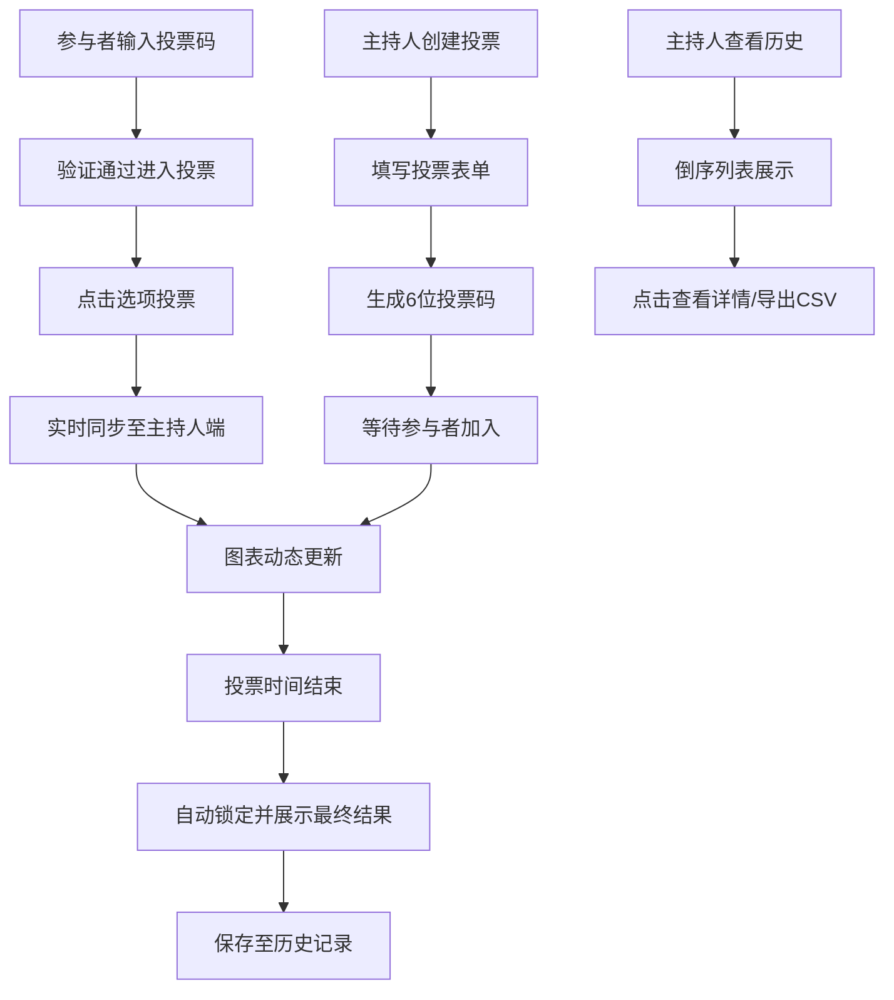

## 1. 产品概述

本产品是一款为小型研讨会或工作坊设计的在线投票与实时结果可视化工具，旨在解决现场互动环节中观众意见收集和即时反馈效率低的问题。通过简洁直观的界面设计和实时数据同步技术，帮助主持人快速收集参与者意见并即时展示投票结果，提升会议互动体验。

## 2. 核心功能

### 2.1 用户角色

| 角色 | 认证方式 | 核心权限 |
|------|----------|----------|
| 主持人 | 无需登录，直接创建投票 | 创建投票、设置投票参数、实时查看投票结果、历史投票回顾、导出CSV |
| 参与者 | 通过6位投票码加入 | 投票、查看投票状态、查看最终结果 |

### 2.2 功能模块

1. **投票创建模块**：主持人设置投票标题、选项（最多8个）、投票类型（单选/多选）、投票时长（1-30分钟），生成6位投票码
2. **投票参与模块**：参与者输入投票码加入，点击选项投票，带有高亮和动画反馈
3. **实时结果展示模块**：主持人端实时显示票数变化（柱状图/饼图）、投票人数，投票结束自动锁定
4. **历史投票管理模块**：倒序列表展示已结束投票，支持查看详细结果和导出CSV

### 2.3 页面详情

| 页面名称 | 模块名称 | 功能描述 |
|-----------|-------------|---------------------|
| 主应用界面 | 左侧面板 | 投票列表、创建投票入口、历史投票列表 |
| 主应用界面 | 右侧主展示区 | 创建投票表单、投票展示区（参与者/主持人视图）、结果可视化图表 |
| 创建投票页面 | 表单组件 | 标题输入、选项动态添加/删除、类型选择、时长设置、提交生成投票码 |
| 投票展示页面 | 参与者视图 | 投票选项按钮、投票状态提示、结果展示 |
| 投票展示页面 | 主持人视图 | 实时图表（柱状图/饼图）、投票人数统计、倒计时、投票码展示 |
| 历史投票页面 | 列表组件 | 倒序排列的投票列表、柱状缩略图、点击查看详情、导出按钮 |

## 3. 核心流程

### 主持人创建投票流程
主持人在左侧面板点击"创建投票" → 填写投票表单（标题、选项、类型、时长）→ 提交生成6位投票码 → 进入等待参与者界面 → 参与者加入并投票 → 实时查看结果 → 投票结束锁定结果

### 参与者投票流程
参与者在加入界面输入6位投票码 → 验证通过进入投票界面 → 点击选项进行投票（高亮+动画反馈）→ 等待投票结束 → 查看最终结果

### 历史投票查看流程
主持人在左侧面板选择"历史投票" → 查看倒序排列的投票列表 → 点击某项查看详细图表 → 可选择导出为CSV文件

## 4. 用户界面设计

### 4.1 设计风格
- **主色调**：深蓝色 #1E3A5F
- **辅色调**：亮橙色 #FF7F50
- **背景效果**：磨砂玻璃（毛玻璃）效果
- **按钮样式**：圆角设计，悬停时平滑渐变背景过渡
- **字体**：现代无衬线字体，标题加粗，正文清晰易读
- **图标风格**：简洁线性图标，与整体风格统一

### 4.2 页面设计概述

| 页面名称 | 模块名称 | UI元素 |
|-----------|-------------|-------------|
| 主应用界面 | 左侧面板 | 深蓝色背景，投票列表卡片，创建按钮，磨砂玻璃效果 |
| 主应用界面 | 右侧展示区 | 白色/浅色背景，内容卡片，图表区域，动画过渡 |
| 创建投票表单 | 表单组件 | 输入框、动态选项列表、单选按钮组、滑块/数字输入、提交按钮 |
| 投票展示 | 选项按钮 | 圆角按钮，选中时高亮放大，轻微弹跳动画 |
| 投票展示 | 图表区域 | 柱状图/饼图平滑增长动画，实时数字更新 |
| 历史投票 | 列表项 | 投票标题、参与人数、柱状缩略图、悬停效果 |

### 4.3 动效设计
- 选项点击：选中选项高亮 + 1.05倍放大 + 轻微弹跳动画
- 图表更新：柱状图高度平滑增长（300ms过渡），数字滚动动画
- 结果切换：淡入淡出 + 缩放动画（400ms）
- 页面切换：左右滑动过渡
- 加载状态：旋转小圆圈动画
- 成功/失败提示：顶部滑入消息条，自动消失

### 4.4 响应式设计
- **桌面端**：左右两栏布局，左侧固定宽度（300-350px），右侧自适应
- **平板端**：左侧面板可折叠，右侧全屏展示
- **移动端**：两栏叠放为上下结构，左侧面板变为顶部导航/抽屉菜单，触摸操作优化（增大点击区域）

### 4.5 性能要求
- 参与者提交投票到主持人端图表更新延迟 ≤ 500ms
- 页面首次加载时间 ≤ 2s
- 动画帧率 ≥ 60fps
