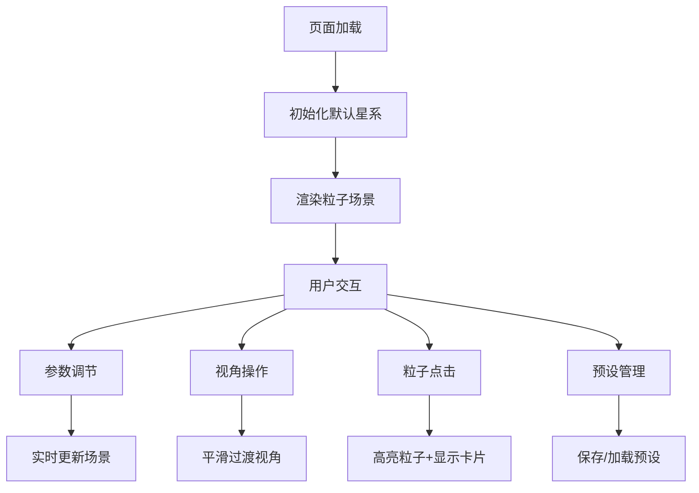

## 1. 产品概述
三维粒子星系交互生成器是一个基于WebGL的实时3D可视化应用，允许用户通过交互式控制面板动态调整粒子参数，生成独特的星系视觉效果。
- 主要面向创意设计师、数据可视化爱好者和3D艺术创作者，提供直观的粒子系统参数调节体验
- 通过高性能WebGL渲染和流畅的交互体验，打造沉浸式的宇宙探索感受

## 2. 核心功能

### 2.1 Feature Module
1. **三维粒子星系渲染**：基于Three.js的高性能粒子系统，支持最多20000个粒子实时渲染
2. **参数控制面板**：滑块、颜色选择器等控件实时调节粒子参数
3. **视角交互系统**：鼠标拖拽旋转视角、滚轮缩放、阻尼平滑过渡
4. **粒子信息交互**：点击粒子查看详细信息，高亮放大效果
5. **预设管理系统**：保存/加载参数预设，后端Express服务持久化存储

### 2.3 Page Details
| 页面名称 | 模块名称 | 功能描述 |
|---------|---------|---------|
| 主页面 | 三维场景渲染 | 实时渲染粒子星系，支持旋转、缩放、点击交互 |
| 主页面 | 左侧控制面板 | 参数调节滑块、颜色选择器、预设管理按钮 |
| 主页面 | 信息卡片 | 粒子详情弹出展示，滑入动画 |
| 主页面 | 预设列表弹窗 | 展示已保存预设，点击加载 |

## 3. 核心流程
用户打开页面后，默认展示5000个粒子组成的旋转星系。用户可以：
1. 拖动左侧控制面板的滑块实时调整粒子参数
2. 按住鼠标左键拖拽旋转视角，滚轮缩放
3. 点击任意粒子查看其详细信息
4. 点击"保存预设"按钮将当前参数保存到后端
5. 点击"加载预设"按钮选择并应用已保存的预设

## 4. 用户界面设计

### 4.1 设计风格
- **主色调**：深空背景 #0a0a1a，粒子光晕使用蓝紫色渐变
- **辅助色**：控制面板采用半透明磨砂玻璃效果（backdrop-filter: blur(12px)），rgba(15, 15, 35, 0.75)
- **按钮样式**：圆角8px，hover时发光边框动画（box-shadow: 0 0 20px rgba(100, 150, 255, 0.5)）
- **滑块样式**：圆角轨道，渐变色填充（从 #6366f1 到 #a855f7）
- **字体**：展示字体使用 'Orbitron'，正文字体使用 'JetBrains Mono'
- **整体风格**：科幻宇宙风，深邃神秘，强调沉浸感和未来感

### 4.2 Page Design Overview
| 页面名称 | 模块名称 | UI Elements |
|---------|---------|-------------|
| 主页面 | 三维场景 | 全屏Canvas，星空背景，粒子光晕效果，深度感渐变 |
| 主页面 | 控制面板 | 左侧280px宽，毛玻璃效果，内部可滚动，标题发光效果 |
| 主页面 | 信息卡片 | 右下角弹出，半透明黑色，圆角12px，滑入动画0.3s ease-out |
| 主页面 | 预设弹窗 | 居中模态框，毛玻璃背景，预设列表卡片式布局 |

### 4.3 响应式
- 桌面端（≥768px）：左侧固定280px控制面板，右侧全屏场景
- 移动端（<768px）：控制面板折叠为底部抽屉，固定按钮展开/收起，占屏80%高度

### 4.4 3D Scene Guidance
- **环境**：深空背景，添加微弱星空点作为环境点缀
- **光照**：粒子自发光效果，无需额外光源，使用AdditiveBlending增强光晕
- **相机**：PerspectiveCamera，初始位置(0, 0, 8)，fov 60度
- **相机运动**：OrbitControls，enableDamping=true，dampingFactor=0.05，zoom范围0.5-10
- **粒子效果**：使用PointsMaterial，sizeAttenuation=true，transparent=true，opacity渐变
- **后处理**：轻微Bloom效果增强光晕，UnrealBloomPass
- **性能优化**：使用BufferGeometry存储所有粒子，共享Material，单DrawCall
