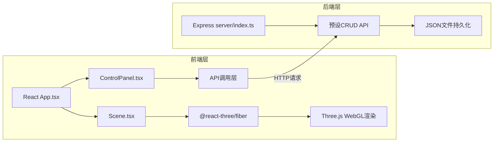
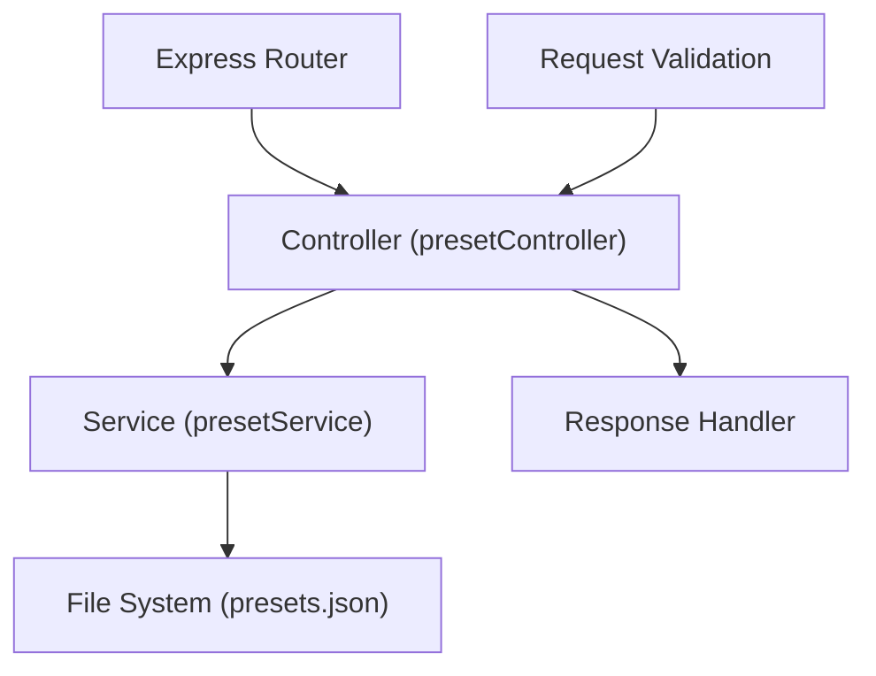
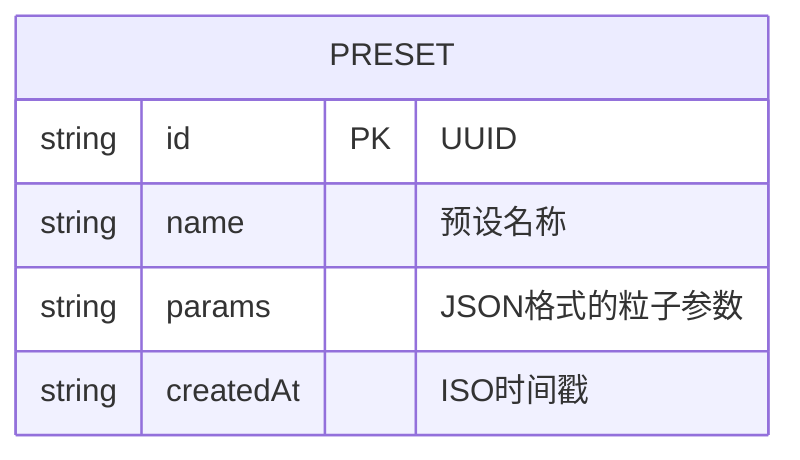

## 1. Architecture Design


## 2. Technology Description
- **前端**：React@18 + TypeScript@5 + Vite@5
- **3D渲染**：Three@0.160 + @react-three/fiber@8 + @react-three/drei@9
- **样式方案**：CSS Modules + CSS Variables，不使用tailwindcss
- **后端**：Express@4 + TypeScript
- **数据存储**：本地JSON文件（server/data/presets.json）
- **初始化工具**：手动创建项目结构

## 3. Route Definitions
| 路由 | 方法 | 用途 |
|------|------|------|
| / | GET | 前端页面入口（Vite dev server） |
| /api/presets | GET | 获取所有预设列表 |
| /api/presets | POST | 保存新预设 |
| /api/presets/:id | GET | 获取单个预设详情 |
| /api/presets/:id | PUT | 更新预设 |
| /api/presets/:id | DELETE | 删除预设 |

## 4. API Definitions

```typescript
// 粒子参数类型
interface ParticleParams {
  count: number;          // 粒子数量 1000-20000
  size: number;           // 粒子大小 0.05-0.5
  color: string;          // 主色调 HEX格式
  rotationSpeed: number;  // 旋转速度 0.0-2.0
  spreadRadius: number;   // 扩散半径 0.5-5.0
}

// 预设类型
interface Preset {
  id: string;             // UUID
  name: string;           // 预设名称
  params: ParticleParams; // 参数配置
  createdAt: string;      // 创建时间 ISO格式
}

// GET /api/presets 响应
interface PresetListResponse {
  success: boolean;
  data: Preset[];
}

// POST /api/presets 请求
interface CreatePresetRequest {
  name: string;
  params: ParticleParams;
}

// POST /api/presets 响应
interface CreatePresetResponse {
  success: boolean;
  data: Preset;
}
```

## 5. Server Architecture Diagram


## 6. Data Model

### 6.1 Data Model Definition


### 6.2 初始数据文件结构
```json
{
  "presets": [
    {
      "id": "default-001",
      "name": "经典蓝紫星系",
      "params": {
        "count": 5000,
        "size": 0.1,
        "color": "#6366f1",
        "rotationSpeed": 0.3,
        "spreadRadius": 2.5
      },
      "createdAt": "2026-06-20T00:00:00.000Z"
    },
    {
      "id": "default-002",
      "name": "金色星云",
      "params": {
        "count": 8000,
        "size": 0.08,
        "color": "#f59e0b",
        "rotationSpeed": 0.5,
        "spreadRadius": 3.0
      },
      "createdAt": "2026-06-20T00:00:00.000Z"
    }
  ]
}
```

### 6.3 项目文件结构
```
auto55/
├── package.json
├── vite.config.js
├── tsconfig.json
├── index.html
├── server/
│   ├── index.ts
│   └── data/
│       └── presets.json
└── src/
    ├── App.tsx
    ├── Scene.tsx
    ├── ControlPanel.tsx
    ├── types.ts
    └── api.ts
```
