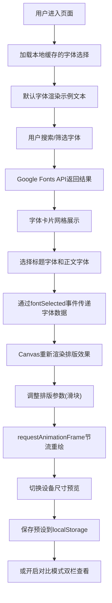

## 1. 产品概述

在线字体搭配预览与排版调节应用，为网页设计师提供轻量级、可视化的字体选型和排版参数调优工具。解决设计师需要频繁切换字体组合、手动调整排版参数并在多设备下验证效果的痛点。

- 目标用户：网页设计师、前端开发者、UI/UX设计师
- 核心价值：实时预览Google Fonts字体组合效果，快速调优排版参数，支持多设备响应式验证，预设方案可保存复用

## 2. 核心功能

### 2.1 功能模块划分
1. **字体选择模块**：Google Fonts搜索与筛选、字体卡片网格展示、标题/正文字体选择
2. **排版预览模块**：Canvas画布实时渲染、多设备尺寸切换、自定义文本输入
3. **控制面板**：字号/行高/字间距/段落间距滑块、对齐方式切换
4. **预设管理**：预设方案保存、预设列表展示与一键应用
5. **对比模式**：当前版本与上次保存预设的双栏对比查看

### 2.2 页面详情

| 页面名称 | 模块名称 | 功能描述 |
|---------|---------|---------|
| 主应用 | 字体选择区 | 左侧320px固定栏，搜索框+分类筛选+字体卡片网格，支持热度/字母排序 |
| 主应用 | 画布预览区 | 右侧主区域，Canvas画布渲染排版效果，支持自定义文本输入 |
| 主应用 | 设备切换栏 | 画布正上方，手机/平板/笔记本/4K四档尺寸切换，弹性动画过渡 |
| 主应用 | 浮动控制面板 | 画布右边缘毛玻璃浮动面板，4个滑块+对齐按钮组 |
| 主应用 | 预设管理栏 | 画布底部横向滚动条，保存预设按钮+预设卡片列表 |
| 主应用 | 对比模式 | 画布右下角切换按钮，双栏并排对比，可拖拽分隔线 |

## 3. 核心流程

## 4. 用户界面设计

### 4.1 设计风格
- **设计定位**：极简iBook风格，强调阅读舒适性和排版专业性
- **主色调**：深灰 `#2C3E50`，背景暖白 `#FDF6E3`，强调色珊瑚橙 `#E27D60`
- **字体选择区背景**：纯白 `#FFFFFF`
- **按钮样式**：方形扁平，边框1px，选中填充深灰，圆角8px
- **滑块样式**：浅灰轨道，珊瑚橙圆点按钮，0.2s弹性反馈
- **控制面板**：半透明毛玻璃效果 `backdrop-filter: blur(8px)`，浮动于画布右边缘
- **预设卡片**：120px×80px，轻阴影，悬停阴影加深+上升动画

### 4.2 页面设计概览

| 页面名称 | 模块名称 | UI元素 |
|---------|---------|--------|
| 主应用 | 字体选择区 | 固定左侧320px，搜索框(圆角8px内阴影聚焦珊瑚橙边框)，排序下拉，卡片网格，选中卡片珊瑚橙边框+放大脉冲动画+小圆点标记 |
| 主应用 | 画布预览区 | 暖白背景，Canvas元素，顶部设备切换按钮组，底部预设横滚条，右下角对比切换按钮 |
| 主应用 | 浮动控制面板 | 毛玻璃背景，4个垂直排列滑块(字号12-72px/行高1.0-2.0/字间距-2至8px/段落间距0-40px)，对齐按钮组(左/中/右)，拖动滑块显示毛玻璃数值提示 |
| 主应用 | 对比模式 | 双栏并排，1px灰分界线，圆形拖拽手柄，两侧独立渲染不同参数 |

### 4.3 响应式设计
- **桌面优先**：默认布局为左侧字体栏+右侧预览区
- **断点768px**：左侧字体选择区折叠为汉堡菜单，点击展开侧滑抽屉
- **画布尺寸**：手机375px、平板768px、笔记本1280px、4K 1920px，宽度弹性动画 `cubic-bezier 0.4s`
- **最小宽度**：768px，保证核心功能可用性

### 4.4 动画与交互规范
- 字体卡片选择：边框高亮→轻微放大(scale 1.03)→脉冲动画1次
- 按钮按下：scale 0.95瞬时微动画
- 滑块拖动：0.2s弹性反馈，数值毛玻璃气泡提示跟随
- 设备切换：画布宽度cubic-bezier过渡0.4s，自动换行适配
- 预设卡片悬停：box-shadow加深+translateY(-2px)上升效果
- 对比模式开启：分隔线从无到有淡入，两栏宽度从100%→各50%弹性展开
