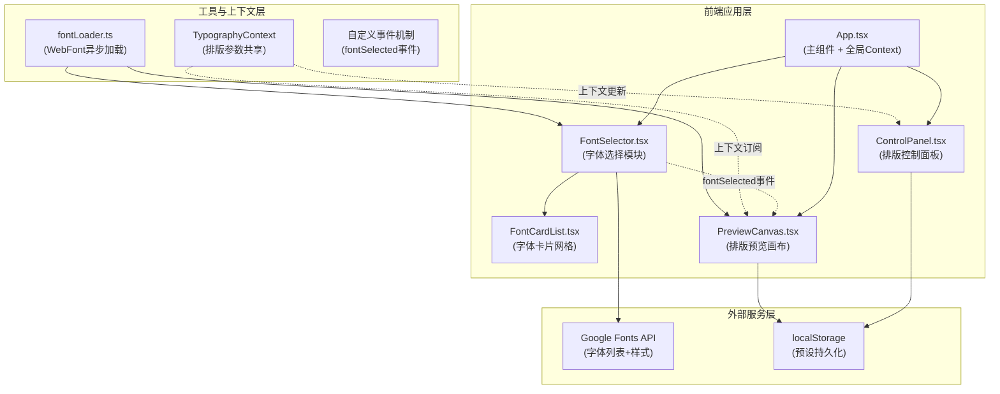

## 1. 架构设计



## 2. 技术选型说明

- **前端框架**：React 18 + TypeScript 5（严格模式，target ES2020）
- **构建工具**：Vite 5 + @vitejs/plugin-react
- **字体加载**：webfontloader（异步非阻塞加载Google Fonts）
- **工具库**：uuid（预设ID生成）、lodash（防抖/节流）
- **Canvas渲染**：原生Canvas 2D API（排版参数实时绘制）
- **状态管理**：React Context API + useState（轻量级，避免引入redux/zustand）
- **持久化**：localStorage（字体选择、预设方案缓存）

## 3. 目录结构与文件职责

```
project-root/
├── package.json              # 依赖: react, react-dom, typescript, vite, @vitejs/plugin-react, webfontloader, uuid, lodash
├── vite.config.js            # React插件构建配置
├── tsconfig.json             # 严格模式 + ES2020 target
├── index.html                # 入口页面，含viewport meta标签
└── src/
    ├── App.tsx               # 主组件：布局协调 + 全局Context提供
    ├── main.tsx              # ReactDOM渲染入口
    ├── index.css             # 全局样式 + CSS变量
    ├── FontSelectorModule/
    │   ├── FontSelector.tsx      # 字体选择主组件：搜索/筛选/Google API请求/派发fontSelected事件
    │   └── FontCardList.tsx      # 字体卡片网格：渐显动画、选中高亮脉冲
    ├── TypographyPreviewModule/
    │   ├── PreviewCanvas.tsx     # 排版画布：监听fontSelected、Canvas渲染、设备尺寸切换、对比模式
    │   └── ControlPanel.tsx      # 控制面板：4滑块+对齐按钮、毛玻璃浮动、上下文实时更新
    ├── utils/
    │   └── fontLoader.ts         # WebFont Loader封装：加载状态检查、异步加载
    ├── contexts/
    │   └── TypographyContext.tsx # 排版参数共享Context
    └── types/
        └── index.ts              # 全局类型定义：FontData, TypographyParams, Preset等
```

## 4. 核心数据结构

```typescript
// 字体数据
interface FontData {
  name: string;           // 字体名称，如 'Roboto'
  category: string;       // 分类：serif/sans-serif/monospace/display/handwriting
  weights: number[];      // 可选粗细，如 [300, 400, 500, 700]
  variants: string[];     // 变体，如 ['regular', '700', 'italic']
  subsets: string[];      // 字符集，如 ['latin', 'cyrillic']
  popularity?: number;    // 热度排序用
}

// 排版参数
interface TypographyParams {
  headingFont: string;    // 标题字体名称
  bodyFont: string;       // 正文字体名称
  headingSize: number;    // 标题字号 12-72px
  bodySize: number;       // 正文字号 12-72px
  lineHeight: number;     // 行高 1.0-2.0
  letterSpacing: number;  // 字间距 -2 至 8px
  paragraphSpacing: number; // 段落间距 0-40px
  textAlign: 'left' | 'center' | 'right'; // 对齐方式
  deviceWidth: number;    // 当前设备宽度 375/768/1280/1920
}

// 预设方案
interface Preset {
  id: string;             // uuid
  name: string;           // 用户自定义名称，默认自动生成
  params: TypographyParams; // 完整排版参数快照
  createdAt: number;      // 创建时间戳
}

// fontSelected自定义事件载荷
interface FontSelectedEventDetail {
  type: 'heading' | 'body';
  font: FontData;
}
```

## 5. 模块通信机制

### 5.1 自定义事件 fontSelected
```typescript
// FontSelector派发
const event = new CustomEvent('fontSelected', {
  detail: { type: 'heading' | 'body', font: FontData } as FontSelectedEventDetail
});
window.dispatchEvent(event);

// PreviewCanvas监听
useEffect(() => {
  const handler = (e: CustomEvent<FontSelectedEventDetail>) => {
    const { type, font } = e.detail;
    loadFont(font.name).then(() => updateTypography(type, font.name));
  };
  window.addEventListener('fontSelected', handler as EventListener);
  return () => window.removeEventListener('fontSelected', handler as EventListener);
}, []);
```

### 5.2 Context 共享排版参数
```typescript
// TypographyContext.Provider 在 App.tsx 中包裹全局
// PreviewCanvas 订阅: useContext(TypographyContext).params
// ControlPanel 更新: useContext(TypographyContext).updateParams(partial)
```

## 6. Canvas 渲染性能优化

1. **requestAnimationFrame节流**：滑块拖动时不直接重绘，将渲染任务推到下一帧，确保≤50ms响应，≥60fps
2. **脏标记模式**：仅当字体、文本、参数任一变化时标记 dirty=true，RAF循环中检测并按需重绘
3. **文本预测量**：缓存 `ctx.measureText()` 结果，相同文本+参数不重复测量
4. **段落智能分段**：自定义文本每100字自动插入段落断点，Canvas逐段渲染并累加段落间距
5. **设备尺寸切换动画**：使用CSS transition控制canvas容器宽度，内部排版通过RAF逐帧适配而非一次性重排

## 7. 性能约束实现方案

| 约束项 | 目标值 | 实现方案 |
|--------|--------|---------|
| 滑块调节重绘延迟 | ≤50ms | requestAnimationFrame + 脏标记 + 局部重绘 |
| 字体加载 | 主线程非阻塞 | WebFont Loader异步回调，不阻塞RAF渲染循环 |
| 设备切换动画帧率 | ≥55fps | CSS transition驱动容器宽度变化，内部Canvas在transitionend后一次性重排 |
| 预设保存/加载 | ≤10ms | 直接操作localStorage同步API，单条数据JSON序列化<1ms |
| 搜索响应 | 输入后300ms防抖 | lodash.debounce包装Google Fonts API请求，避免频繁调用 |
