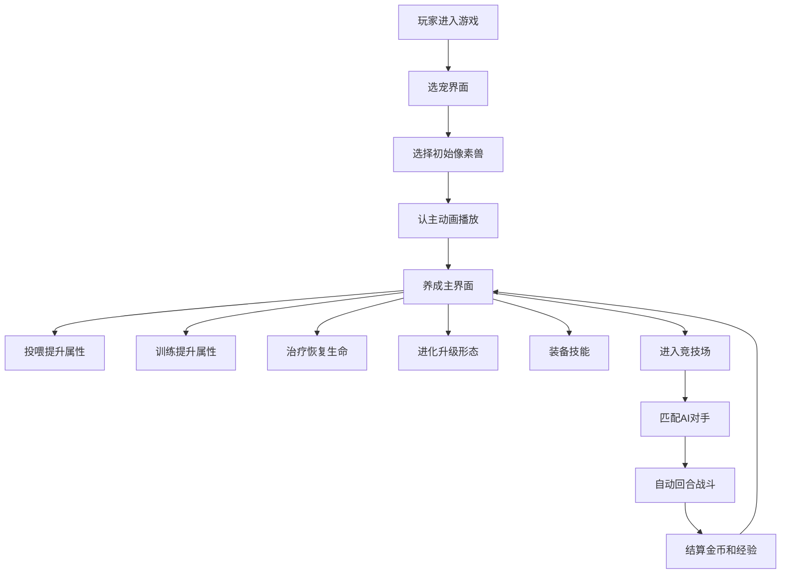

## 1. 产品概述
像素兽养成竞技场是一款融合宠物养成与自动战斗的轻策略HTML5网页游戏。玩家通过选宠、养成、战斗三大核心玩法，体验从新手驯兽师到竞技场冠军的成长历程。
- 面向所有年龄段的休闲游戏玩家，无需下载安装即可在浏览器中畅玩
- 产品目标：打造一个视觉精美、交互流畅、玩法有趣的像素风格宠物养成游戏

## 2. 核心特性

### 2.1 功能模块
1. **选宠界面**：三种初始像素兽（龙、猫、鸟）选择，悬浮动效与粒子特效，认主动画，场景背景过渡
2. **养成主界面**：宠物展示区（大头照+等级名字）、属性面板区（攻击/防御/速度/生命四项属性条）、操作区（投喂/训练/治疗/进化）、技能装备区
3. **竞技场模式**：AI对手匹配、自动回合制战斗、技能对话框、伤害数值弹出、胜负结算面板
4. **技能装备系统**：稀有度分级（普通/稀有/史诗/传说）、拖拽装备、技能槽、装备特效

### 2.2 页面详情
| 页面名称 | 模块名称 | 功能描述 |
|-----------|-------------|---------------------|
| 选宠界面 | 宠物卡片展示 | 三张像素兽卡片，悬浮放大+粒子光点跟随 |
| 选宠界面 | 认主动画 | 选中后宠物中央弹跳三次，背景星空→草地过渡 |
| 养成主界面 | 宠物展示 | 大头照带眨眼/呼吸动画，头顶显示等级名字 |
| 养成主界面 | 属性面板 | 四项属性柱状条，红绿渐变，数值平滑过渡动画 |
| 养成主界面 | 操作按钮 | 投喂（食物飞入）、训练（俯卧撑）、治疗（十字光晕）、进化（全屏粒子） |
| 养成主界面 | 技能装备区 | 横向滚动技能卡，稀有度边框，拖拽装备到技能槽 |
| 战斗场景 | 对战界面 | 双方宠物分列左右，自动回合制战斗 |
| 战斗场景 | 战斗特效 | 技能对话框、伤害值弹出、受伤震动缩小动画 |
| 战斗场景 | 结算面板 | 胜负展示，金币/经验结算 |

## 3. 核心流程
玩家首次进入游戏 → 选择初始像素兽（龙/猫/鸟）→ 进入养成主界面 → 通过投喂/训练提升属性、治疗恢复生命值、进化升级形态 → 解锁技能并装备 → 进入竞技场匹配AI对手 → 自动战斗 → 获得金币和经验奖励 → 循环养成与战斗

## 4. 用户界面设计

### 4.1 设计风格
- **主色调**：深蓝（#0a1628, #1a2744）与金色（#d4af37, #f4d03f）搭配
- **像素复古风格**：所有视觉元素采用像素艺术风格，带8-bit复古感
- **按钮样式**：圆角边框（8-12px），金色描边，微妙辉光投影，hover时放大1.05倍
- **字体**：像素风格字体 "Press Start 2P" 或类似等宽像素字体，标题16-24px，正文12-14px
- **布局风格**：卡片式布局，网格对齐，充足留白，带装饰性边框和辉光
- **动效**：所有交互都有流畅动画反馈（<16ms延迟），战斗帧率≥30fps

### 4.2 页面设计概述
| 页面名称 | 模块名称 | UI元素 |
|-----------|-------------|-------------|
| 选宠界面 | 背景 | 星空渐变→草地渐变动态过渡，粒子光点跟随鼠标 |
| 选宠界面 | 宠物卡片 | 三张横向排列，悬浮放大+金色辉光，像素兽立绘 |
| 养成主界面 | 左区宠物展示 | 大头照圆形像素框，呼吸/眨眼动画，等级和名字标签 |
| 养成主界面 | 中区属性条 | 四个纵向排列柱状条，红→绿渐变填充，数值标签 |
| 养成主界面 | 右区操作按钮 | 2×2网格布局，像素图标+文字，金色边框 |
| 养成主界面 | 底部技能区 | 横向滚动容器，技能卡带稀有度边框，三个技能槽 |
| 战斗场景 | 对战区 | 左右分栏，各显示宠物、名字、血条、等级 |
| 战斗场景 | 中央战斗区 | 技能对话框弹出，伤害数值漂浮，粒子特效 |
| 战斗场景 | 结算面板 | 居中弹出，胜负标题，金币/经验数值，返回按钮 |

### 4.3 响应式
- 桌面端优先设计，最小宽度1024px
- 移动端自适应布局，卡片和按钮适当缩小
- 所有交互支持鼠标和触摸操作
