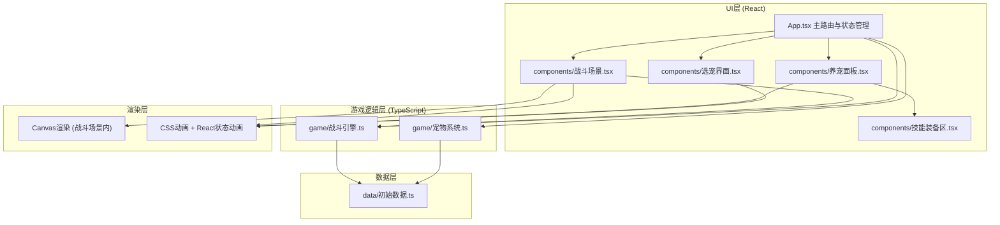
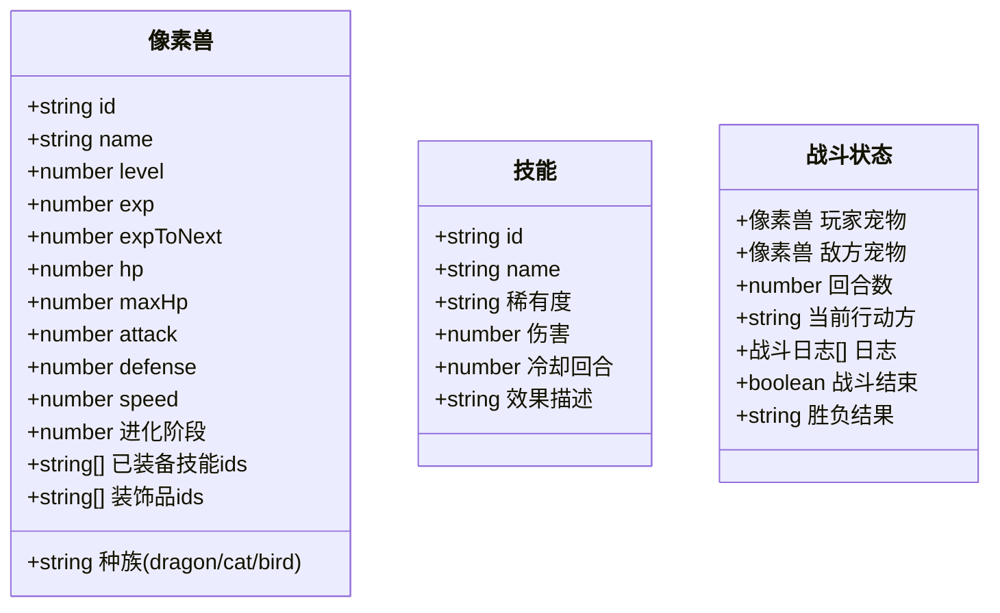

## 1. 架构设计



## 2. 技术描述
- **前端框架**：React@18 + TypeScript
- **构建工具**：Vite@5 + @vitejs/plugin-react
- **状态管理**：React useState/useReducer + 自定义hooks（轻量级）
- **渲染方案**：Canvas API用于战斗场景像素渲染，CSS动画用于UI交互
- **音频**：howler.js用于音效播放
- **唯一ID**：uuid用于宠物和技能实例ID生成
- **初始化工具**：vite-init react-ts模板

## 3. 模块职责

### 3.1 UI层 (src/)
| 文件 | 职责 |
|------|------|
| main.tsx | React入口，挂载App组件 |
| App.tsx | 全局状态管理，路由切换（选宠→养成→战斗），聚合游戏逻辑接口 |
| components/选宠界面.tsx | 宠物选择页面，卡片悬浮粒子特效，认主动画 |
| components/养宠面板.tsx | 养成主界面，宠物展示、属性条、操作按钮、技能装备区 |
| components/战斗场景.tsx | 竞技场战斗UI，Canvas渲染，战斗动画，结算面板 |

### 3.2 游戏逻辑层 (src/game/)
| 文件 | 职责 |
|------|------|
| 宠物系统.ts | 宠物属性管理、经验升级、进化、投喂/训练/治疗操作接口 |
| 战斗引擎.ts | 自动回合制战斗逻辑，AI策略，伤害计算，战斗事件回调 |

### 3.3 数据层 (src/data/)
| 文件 | 职责 |
|------|------|
| 初始数据.ts | 宠物种族模板、技能列表、AI策略、稀有度配置等静态数据 |

## 4. 核心数据模型



## 5. 接口定义

### 5.1 宠物系统接口
```typescript
interface PetSystem {
  createPet(race: 'dragon' | 'cat' | 'bird', name: string): Pet;
  feedPet(petId: string): { pet: Pet; gained: { hp: number; exp: number } };
  trainPet(petId: string, stat: 'attack' | 'defense' | 'speed'): { pet: Pet; gained: number };
  healPet(petId: string): { pet: Pet; healed: number };
  evolvePet(petId: string): { pet: Pet; success: boolean };
  equipSkill(petId: string, skillId: string, slotIndex: number): { pet: Pet; success: boolean };
  getPet(petId: string): Pet | undefined;
}
```

### 5.2 战斗引擎接口
```typescript
interface BattleEngine {
  startBattle(playerPet: Pet, enemyPet: Pet): BattleState;
  nextTurn(): BattleEvent;
  isBattleOver(): boolean;
  getBattleResult(): { winner: 'player' | 'enemy'; gold: number; exp: number };
  onBattleEvent(callback: (event: BattleEvent) => void): void;
}

interface BattleEvent {
  type: 'skill' | 'damage' | 'heal' | 'turn_start' | 'battle_end';
  actor: 'player' | 'enemy';
  skillName?: string;
  damage?: number;
  message: string;
}
```
