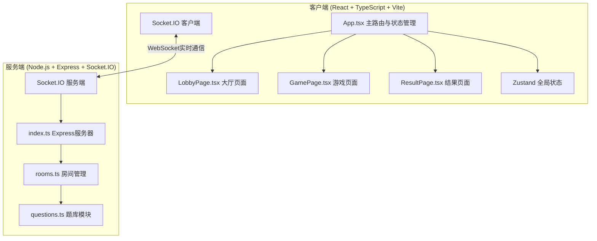
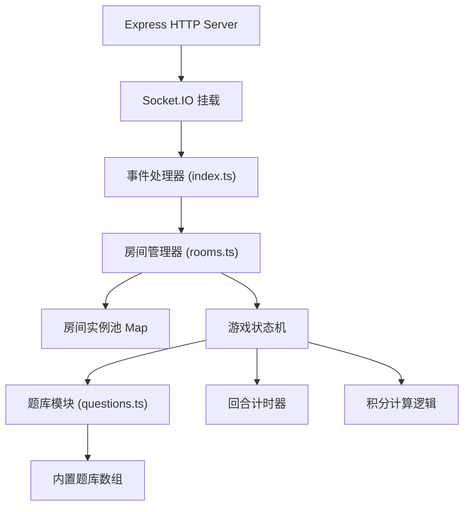

## 1. 架构设计



## 2. 技术描述

- **前端**: React@18 + TypeScript + Vite + Zustand + Socket.IO Client
- **后端**: Node.js + Express@4 + Socket.IO + TypeScript
- **状态管理**: Zustand 管理全局游戏状态
- **实时通信**: Socket.IO 实现 WebSocket 双向通信
- **样式方案**: TailwindCSS@3 + 自定义CSS动画
- **构建工具**: Vite (前端) + ts-node (后端开发)
- **音效**: Web Audio API 播放简短音效

## 3. 路由与页面定义
| 路径 | 页面 | 功能 |
|------|------|------|
| / | LobbyPage | 创建/加入房间大厅 |
| /room/:code | GamePage | 游戏主页面 |
| /result | ResultPage | 回合结果与最终胜利页 |

## 4. API与Socket事件定义

### 4.1 Socket.IO 客户端事件
```typescript
// 客户端发送事件
interface ClientToServerEvents {
  'room:create': (data: { nickname: string; config: RoomConfig }) => void;
  'room:join': (data: { nickname: string; roomCode: string }) => void;
  'room:leave': () => void;
  'player:ready': (ready: boolean) => void;
  'game:start': () => void;
  'game:answer': (data: { answerId: number }) => void;
  'game:useHelp': () => void;
  'game:helpAnswer': (data: { answerId: number; targetTeamId: string }) => void;
  'game:nextRound': () => void;
}

// 服务端发送事件
interface ServerToClientEvents {
  'room:created': (data: { roomCode: string; playerId: string }) => void;
  'room:joined': (data: { room: RoomState; playerId: string }) => void;
  'room:error': (message: string) => void;
  'room:update': (room: RoomState) => void;
  'game:started': (state: GameState) => void;
  'game:newRound': (round: RoundState) => void;
  'game:answerResult': (data: { teamId: string; correct: boolean; score: number }) => void;
  'game:helpRequested': (data: { fromTeamId: string; toTeamId: string; hint: string }) => void;
  'game:roundEnd': (data: RoundResult) => void;
  'game:ended': (data: FinalResult) => void;
}
```

### 4.2 核心数据类型
```typescript
interface Player {
  id: string;
  nickname: string;
  teamId: string;
  isReady: boolean;
  isHost: boolean;
  isCaptain: boolean;
  avatarGradient: string;
}

interface Team {
  id: string;
  name: string;
  color: string;
  score: number;
  helpUsed: boolean;
  hasAnswered: boolean;
  lastAnswerCorrect: boolean | null;
}

interface RoomConfig {
  totalRounds: number;
  timePerQuestion: number;
  teamCount: number;
}

interface RoomState {
  code: string;
  config: RoomConfig;
  players: Player[];
  teams: Team[];
  status: 'waiting' | 'playing' | 'ended';
  allReady: boolean;
}

interface Question {
  id: number;
  keywords: string[];
  options: string[];
  correctAnswerId: number;
  explanation: string;
  category: string;
}

interface RoundState {
  roundNumber: number;
  totalRounds: number;
  question: Question;
  timeRemaining: number;
  teamsAnswered: string[];
  helpActive: { fromTeamId: string; toTeamId: string } | null;
}

interface RoundResult {
  roundNumber: number;
  question: Question;
  teamAnswers: { teamId: string; answerId: number; correct: boolean; score: number }[];
  teamScores: { teamId: string; score: number }[];
}

interface FinalResult {
  winnerTeam: Team;
  allTeams: Team[];
  totalRounds: number;
}
```

## 5. 服务端架构



## 6. 项目文件结构

```
auto61/
├── package.json
├── vite.config.js
├── tsconfig.json
├── index.html
├── src/
│   ├── client/
│   │   ├── App.tsx
│   │   ├── main.tsx
│   │   ├── index.css
│   │   ├── pages/
│   │   │   ├── LobbyPage.tsx
│   │   │   ├── GamePage.tsx
│   │   │   └── ResultPage.tsx
│   │   ├── components/
│   │   │   ├── StarryBackground.tsx
│   │   │   ├── CountdownRing.tsx
│   │   │   ├── OptionCard.tsx
│   │   │   ├── PlayerAvatar.tsx
│   │   │   ├── ScoreBarChart.tsx
│   │   │   └── CelebrationEffect.tsx
│   │   ├── hooks/
│   │   │   ├── useSocket.ts
│   │   │   └── useGameStore.ts
│   │   ├── utils/
│   │   │   ├── gradients.ts
│   │   │   └── audio.ts
│   │   └── types/
│   │       └── index.ts
│   └── server/
│       ├── index.ts
│       ├── rooms.ts
│       └── questions.ts
```
