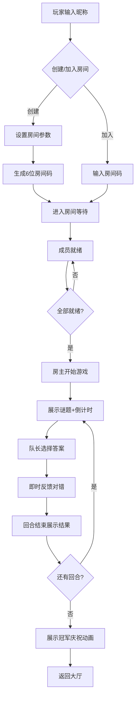

## 1. 产品概述

星际知识竞技场是一款基于局域网的多人实时组队竞技答题游戏，通过WebSocket实现低延迟状态同步，结合文字谜题与团队协作，为玩家提供沉浸式知识竞赛体验。

- 核心目标：解决传统答题游戏缺乏实时互动与团队竞技结合的轻量化方案问题
- 目标用户：局域网内的朋友、同事、同学等小群体
- 市场价值：轻量级部署、无需账号注册、即开即玩的实时团队竞技游戏

## 2. 核心功能

### 2.1 用户角色
| 角色 | 注册方式 | 核心权限 |
|------|----------|----------|
| 房主 | 输入昵称创建房间 | 设置房间参数、分配队伍、手动开始游戏 |
| 玩家 | 输入昵称+房间码加入 | 就绪/取消就绪、答题、使用求援技能 |

### 2.2 功能模块
1. **大厅页面 (LobbyPage)**: 昵称输入、创建房间、加入房间、房间参数设置
2. **游戏页面 (GamePage)**: 成员列表展示、倒计时、题目展示、选项选择、积分展示
3. **结果页面 (ResultPage)**: 回合结果解析、积分柱状图、最终胜利庆祝

### 2.3 页面详情
| 页面名称 | 模块名称 | 功能描述 |
|----------|----------|----------|
| 大厅页面 | 昵称输入框 | 玩家输入昵称，校验非空和长度限制 |
| 大厅页面 | 创建房间表单 | 设置回合数(3-10)、每题限时(10-60秒)、队伍数(2-4队) |
| 大厅页面 | 加入房间表单 | 输入6位房间码加入房间 |
| 大厅页面 | 房间成员列表 | 显示昵称、随机渐变头像、队伍分配、就绪状态 |
| 大厅页面 | 就绪控制 | 玩家切换就绪状态，全部就绪后房主可开始游戏 |
| 游戏页面 | 环形倒计时 | 顶部展示剩余时间的环形进度条 |
| 游戏页面 | 题目展示 | 大字号展示文字谜题和四个关键词 |
| 游戏页面 | 选项卡片 | 四个平行选项卡片，悬浮阴影+点击缩放反馈 |
| 游戏页面 | 答案反馈 | 即时显示对错状态，播放音效 |
| 游戏页面 | 求援技能 | 每队一次求援机会，随机向其他队求助 |
| 游戏页面 | 队伍状态 | 显示各队积分、答题状态、技能剩余次数 |
| 结果页面 | 回合解析 | 展示正确答案与详细解析 |
| 结果页面 | 作答统计 | 展示所有队伍的作答情况 |
| 结果页面 | 积分排名 | 横向柱状图展示各队积分，弹性动画 |
| 结果页面 | 胜利庆祝 | 五彩粒子+彩带+漂浮文字的全屏庆祝效果 |

## 3. 核心流程

玩家进入首页输入昵称，选择创建房间或加入房间。创建者设置房间参数后生成6位房间码，其他玩家通过房间码加入。所有玩家就绪后，房主开始游戏。每回合系统随机抽取谜题，队长在限时内作答，作答后即时反馈。每队可使用一次求援技能。回合结束展示解析与积分排名，所有回合结束后展示冠军队伍庆祝动画。

## 4. 用户界面设计

### 4.1 设计风格
- **主色调**: 深色科幻 #0a0a2e（背景）、#00d4ff（主题青蓝高亮）、#ff6b6b（警告红）
- **按钮风格**: 圆角卡片式按钮，带发光边框和悬浮放大效果
- **字体**: 采用 Orbitron（标题）和 Rajdhani（正文）组合，营造科技感
- **布局风格**: 卡片式布局，玻璃态半透明效果，霓虹发光边框
- **图标风格**: Lucide 图标库，霓虹发光效果

### 4.2 页面设计概述
| 页面名称 | 模块名称 | UI元素 |
|----------|----------|--------|
| 大厅页面 | 星空背景 | Canvas动态粒子星空，流动的星点连线效果 |
| 大厅页面 | 主标题 | 大字号发光文字，霓虹蓝青色渐变 |
| 大厅页面 | 输入表单 | 玻璃态卡片，发光边框，聚焦时主题色高亮 |
| 大厅页面 | 成员卡片 | 彩色渐变圆形头像，就绪态绿色对勾标记 |
| 游戏页面 | 环形进度条 | SVG绘制的倒计时环，随时间变色（蓝→黄→红） |
| 游戏页面 | 题目卡片 | 大字号居中，关键词用发光标签展示 |
| 游戏页面 | 选项卡片 | 平行四张卡片，悬浮提升+阴影加深，点击缩放0.95 |
| 结果页面 | 柱状图 | 横向进度条，弹性过渡动画，数值实时递增 |
| 结果页面 | 庆祝场景 | 全屏五彩粒子喷泉，彩带飘落，漂浮文字动画 |

### 4.3 响应式
- 桌面端优先设计，最小支持宽度1280px
- 移动端自适应布局，选项卡片改为2x2网格
- 触摸设备优化点击区域，增大按钮触控范围

### 4.4 动画与性能
- 页面切换采用 CSS transform + opacity 过渡，确保60FPS
- WebSocket消息延迟目标低于500ms
- 粒子动画使用 requestAnimationFrame，限制最大粒子数
- 柱状图使用 spring 弹性动画曲线
