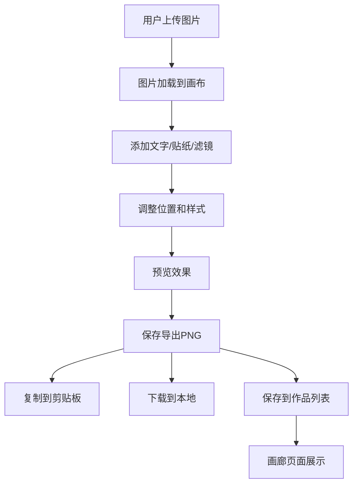

## 1. 产品概述

表情包制作与分享工具是一个网页端应用，用户可快速上传图片并添加文字、贴纸、滤镜来生成自定义表情包，保存后可一键复制到剪贴板或分享给好友。

- 主要用途：为用户提供简单易用的表情包创作平台，支持个性化定制和社交分享
- 目标用户：社交媒体用户、内容创作者、喜欢表达个性的年轻群体
- 产品价值：降低表情包制作门槛，提供丰富的创意工具，让用户快速生成专属表情包

## 2. 核心 Features

### 2.1 用户角色

| 角色 | 注册方式 | 核心权限 |
|------|----------|----------|
| 普通用户 | 无需注册，本地存储 | 图片上传、编辑、保存、复制、分享、浏览画廊 |

### 2.2 功能模块

1. **编辑器页面**：图片上传、画布操作、文字添加、贴纸添加、滤镜控制、导出保存
2. **画廊页面**：用户作品展示、模板浏览、搜索、删除、分享、全屏预览

### 2.3 页面详情

| 页面名称 | 模块名称 | 功能描述 |
|---------|----------|----------|
| 编辑器页面 | 图片上传模块 | 支持JPG/PNG/GIF上传，自动缩放适配画布 |
| 编辑器页面 | 工具栏模块 | 文字添加（字体/大小/颜色/对齐/加粗/斜体）、贴纸添加、滤镜选择 |
| 编辑器页面 | 画布操作模块 | 图片拖拽缩放、文字拖拽缩放、贴纸拖拽旋转、透明网格背景 |
| 编辑器页面 | 滤镜模块 | 6种滤镜（黑白、复古、胶片、冷色调、暖色调、漫画风格）、强度调节、叠加支持 |
| 编辑器页面 | 导出模块 | PNG导出、复制到剪贴板、下载本地、保存到作品列表 |
| 画廊页面 | 瀑布流展示 | 用户作品+官方模板、无限滚动、骨架屏加载动画 |
| 画廊页面 | 搜索模块 | 模糊搜索作品名称和标签 |
| 画廊页面 | 作品操作 | 删除、分享、全屏预览（时间戳+标签） |

## 3. 核心流程

### 用户制作表情包流程
用户上传图片 → 图片自动适配画布 → 添加文字/贴纸/滤镜 → 调整位置和样式 → 预览效果 → 保存导出 → 复制/下载/分享

### 浏览画廊流程
进入画廊页面 → 加载作品列表（骨架屏）→ 瀑布流展示 → 搜索/筛选 → 点击预览 → 删除/分享操作

## 4. 用户界面设计

### 4.1 设计风格

- **主色调**：#1a1a2e（深色背景）
- **辅色调**：#16213e（卡片背景）
- **强调色**：#e94560（按钮、高亮）
- **选中发光色**：#00d2ff（滤镜选中、边框）
- **按钮风格**：圆角设计，悬停微光效果，点击震动动画
- **字体**：采用现代无衬线字体，标题加粗，正文清晰可读
- **布局风格**：卡片式布局，圆角设计，深色主题，毛玻璃效果
- **图标风格**：使用 lucide-react 图标库，简洁线性风格

### 4.2 页面设计概述

| 页面名称 | 模块名称 | UI 元素 |
|---------|----------|----------|
| 编辑器页面 | 整体布局 | 左侧工具栏、中央画布、顶部操作栏、底部导出栏 |
| 编辑器页面 | 工具栏 | 文字、贴纸、滤镜三个选项卡，图标带微光悬停 |
| 编辑器页面 | 画布区域 | 透明网格背景、虚线裁剪框、半透明圆形拖拽手柄 |
| 编辑器页面 | 滤镜区域 | 3x2网格排列、淡入动画、选中时#00d2ff发光边框 |
| 画廊页面 | 整体布局 | 顶部搜索栏、瀑布流卡片网格、无限滚动加载 |
| 画廊页面 | 作品卡片 | 渐变占位骨架图、缩放动画出现、删除和分享按钮 |
| 画廊页面 | 全屏预览 | 时间戳、标签、关闭按钮、背景模糊 |

### 4.3 响应式设计

- **设计优先**：桌面端优先（768px以上）
- **响应式适配**：
  - ≥768px：完整布局，工具栏左侧悬浮
  - <768px：工具栏改为底部选项卡，画布自适应
  - 触摸优化：拖拽区域增大，按钮最小尺寸44px

### 4.4 动画与交互

- **微交互**：按钮点击震动动画、保存/复制成功提示
- **加载动画**：骨架屏渐变占位、卡片缩放出现
- **过渡效果**：滤镜切换淡入淡出、页面切换滑入滑出
- **悬停效果**：工具栏图标微光、卡片上浮阴影
