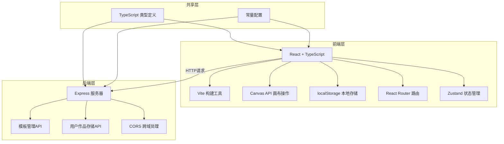
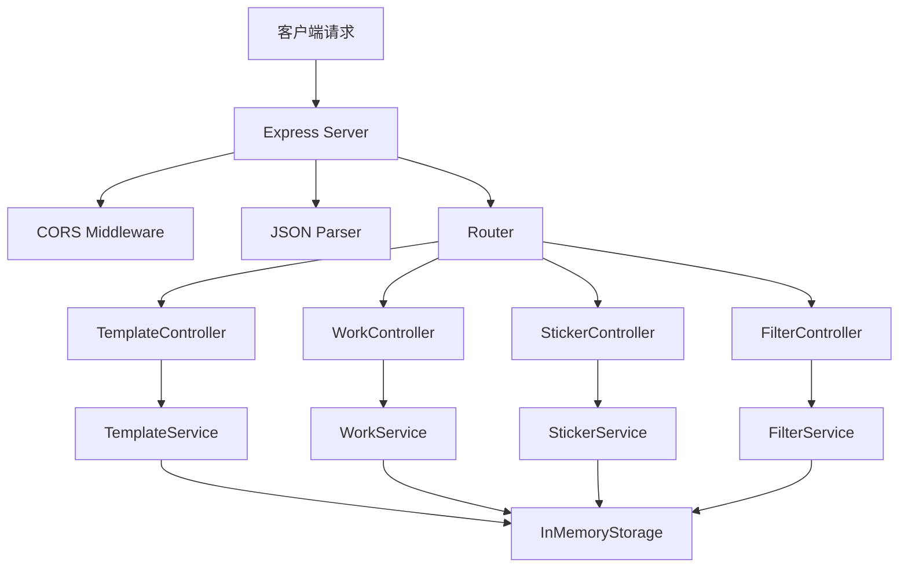
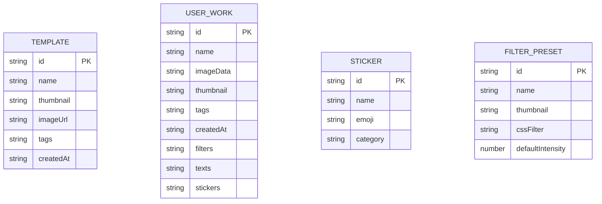

## 1. 架构设计



## 2. 技术描述

- **前端**：React@18 + TypeScript + Vite + React Router + Zustand + lucide-react
- **后端**：Express@4 + TypeScript + CORS + UUID
- **数据存储**：前端 localStorage + 后端内存存储
- **第三方库**：
  - file-saver：文件下载
  - clipboard-polyfill：剪贴板操作
  - uuid：唯一ID生成

## 3. 目录结构

```
auto62/
├── package.json
├── vite.config.js
├── tsconfig.json
├── index.html
├── src/
│   ├── client/
│   │   ├── App.tsx              # 主组件，路由和全局状态
│   │   ├── Editor.tsx           # 编辑器模块
│   │   ├── Gallery.tsx          # 画廊模块
│   │   ├── components/          # 可复用组件
│   │   │   ├── Canvas.tsx       # 画布组件
│   │   │   ├── Toolbar.tsx      # 工具栏组件
│   │   │   ├── FilterPanel.tsx  # 滤镜面板
│   │   │   ├── StickerPanel.tsx # 贴纸面板
│   │   │   ├── TextPanel.tsx    # 文字面板
│   │   │   ├── GalleryCard.tsx  # 画廊卡片
│   │   │   ├── Skeleton.tsx     # 骨架屏组件
│   │   │   └── Toast.tsx        # 提示组件
│   │   ├── hooks/               # 自定义hooks
│   │   │   ├── useCanvas.ts     # 画布操作hook
│   │   │   ├── useDrag.ts       # 拖拽操作hook
│   │   │   └── useToast.ts      # 提示hook
│   │   ├── store/               # 状态管理
│   │   │   └── useEditorStore.ts
│   │   ├── utils/               # 工具函数
│   │   │   ├── canvas.ts        # 画布工具
│   │   │   ├── filters.ts       # 滤镜算法
│   │   │   └── storage.ts       # 存储工具
│   │   └── styles/              # 样式文件
│   │       └── index.css
│   ├── server/
│   │   └── index.ts             # Express后端
│   └── shared/
│       └── types.ts             # 共享类型定义
└── .trae/
    └── documents/
        ├── PRD.md
        └── TECH_ARCHITECTURE.md
```

## 4. 路由定义

| Route | 页面 | 说明 |
|-------|------|------|
| / | 编辑器页面 | 默认页面，图片编辑功能 |
| /gallery | 画廊页面 | 作品浏览、模板展示 |

## 5. API 定义

### 类型定义

```typescript
// 滤镜参数
interface FilterParams {
  id: string;
  name: string;
  intensity: number; // 0-100
  enabled: boolean;
}

// 文字元素
interface TextElement {
  id: string;
  content: string;
  x: number;
  y: number;
  fontSize: number;
  color: string;
  fontFamily: string;
  bold: boolean;
  italic: boolean;
  align: 'left' | 'center' | 'right';
  scale: number;
}

// 贴纸元素
interface StickerElement {
  id: string;
  emoji: string;
  x: number;
  y: number;
  scale: number;
  rotation: number;
}

// 贴纸
interface Sticker {
  id: string;
  name: string;
  emoji: string;
  category: string;
}

// 模板
interface Template {
  id: string;
  name: string;
  thumbnail: string;
  imageUrl: string;
  tags: string[];
  createdAt: string;
}

// 用户作品
interface UserWork {
  id: string;
  name: string;
  imageData: string; // base64
  thumbnail: string;
  tags: string[];
  createdAt: string;
  filters: FilterParams[];
  texts: TextElement[];
  stickers: StickerElement[];
}

// 滤镜预设
interface FilterPreset {
  id: string;
  name: string;
  thumbnail: string;
  cssFilter: string;
  defaultIntensity: number;
}
```

### 后端 API

| Method | Path | 描述 | 请求参数 | 返回值 |
|--------|------|------|----------|--------|
| GET | /api/templates | 获取模板列表 | - | Template[] |
| GET | /api/templates/:id | 获取单个模板 | id | Template |
| GET | /api/works | 获取用户作品列表 | - | UserWork[] |
| POST | /api/works | 保存用户作品 | UserWork | UserWork |
| DELETE | /api/works/:id | 删除用户作品 | id | { success: boolean } |
| GET | /api/stickers | 获取贴纸列表 | - | Sticker[] |
| GET | /api/filters | 获取滤镜列表 | - | FilterPreset[] |

## 6. 服务器架构图



## 7. 数据模型

### 7.1 数据模型定义



### 7.2 初始数据

后端启动时初始化以下数据：

- **贴纸数据**：至少10种风格化贴纸（笑哭、点赞、吃瓜、狗头、捂脸、OK、生气、爱心、火、666）
- **滤镜数据**：6种滤镜（黑白、复古、胶片、冷色调、暖色调、漫画风格）
- **模板数据**：至少5个内置模板作品

## 8. 性能优化策略

1. **画布渲染优化**：
   - 使用 requestAnimationFrame 批量渲染
   - 离屏 canvas 预渲染滤镜效果
   - 元素拖拽时使用 CSS transform 而非重绘

2. **导出优化**：
   - 使用 canvas.toBlob 异步导出
   - Web Worker 处理大图片导出

3. **画廊加载优化**：
   - 无限滚动分页（每次10张）
   - 图片懒加载
   - 虚拟列表（如数据量大）

4. **状态管理优化**：
   - Zustand 状态分片
   - 避免不必要的重渲染
   - 使用 useMemo/useCallback 优化

## 9. 开发脚本

- `npm run dev`：启动前后端开发服务器
- `npm run build`：构建生产版本
- `npm run server`：仅启动后端服务器
- `npm run client`：仅启动前端开发服务器
