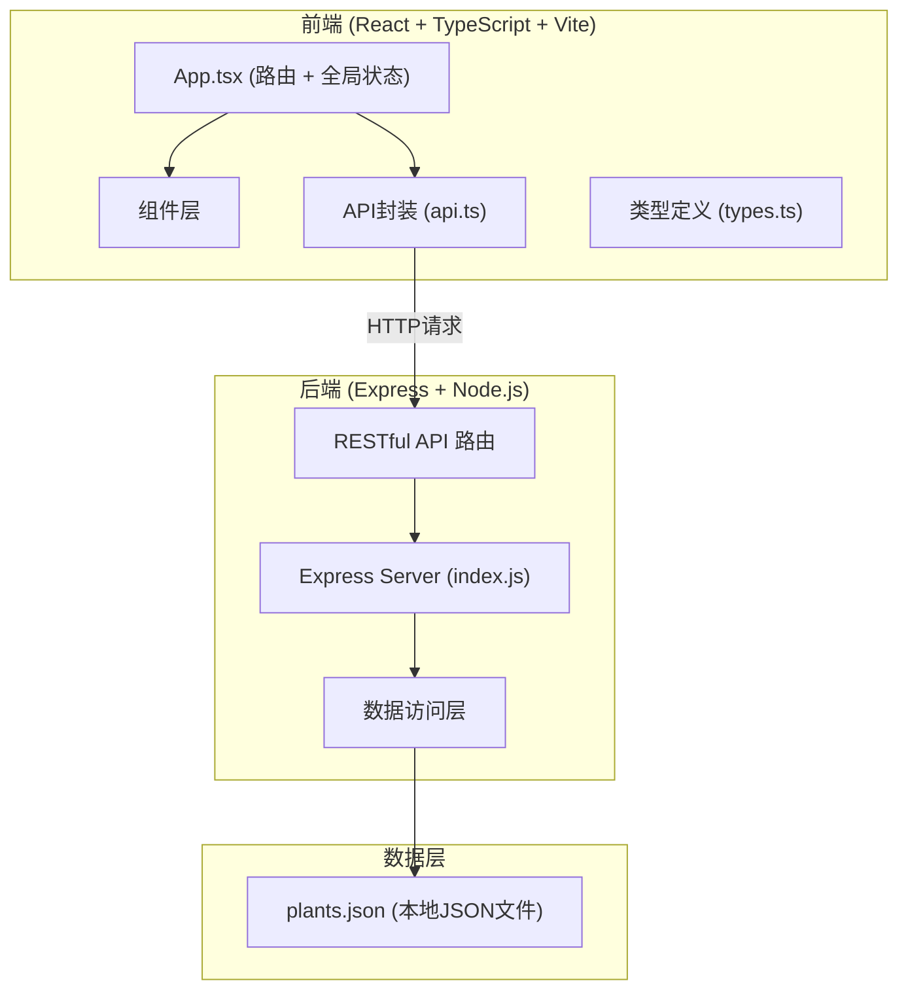
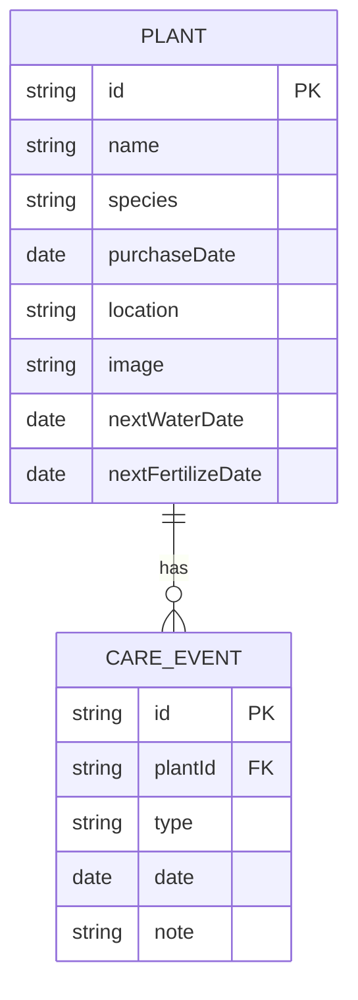

## 1. 架构设计



## 2. 技术栈说明

### 2.1 前端技术栈
- **框架**：React 18 + TypeScript
- **构建工具**：Vite
- **路由**：React Router DOM
- **HTTP客户端**：Fetch API
- **日期处理**：date-fns
- **唯一ID**：uuid
- **样式**：原生CSS（CSS变量 + 动画）

### 2.2 后端技术栈
- **框架**：Express 4
- **运行时**：Node.js
- **中间件**：body-parser、cors
- **数据存储**：本地JSON文件（server/data/plants.json）

### 2.3 开发工具
- **开发服务器**：Vite Dev Server（前端，端口5173）+ Express（后端，端口3001）
- **代理**：Vite 代理配置，将 API 请求转发到后端 3001 端口

## 3. 路由定义

### 3.1 前端路由

| 路由路径 | 页面组件 | 功能说明 |
|---------|---------|---------|
| `/` | HomePage | 主页：待办提醒 + 花园网格 + 种类筛选 |
| `/plant/:id` | PlantDetailPage | 植物详情页 |
| `/add` | AddPlantPage | 添加植物页面 |
| `/edit/:id` | EditPlantPage | 编辑植物页面 |

### 3.2 后端 API 路由

| 方法 | 路径 | 功能描述 |
|------|------|---------|
| GET | `/api/plants` | 获取所有植物列表 |
| GET | `/api/plants/:id` | 获取单个植物详情 |
| POST | `/api/plants` | 创建新植物 |
| PUT | `/api/plants/:id` | 更新植物信息 |
| DELETE | `/api/plants/:id` | 删除植物 |
| GET | `/api/plants/:id/events` | 获取植物的所有照料事件 |
| POST | `/api/plants/:id/events` | 为植物添加照料事件 |
| DELETE | `/api/plants/:id/events/:eventId` | 删除植物的照料事件 |
| GET | `/api/reminders` | 获取所有待办提醒 |

## 4. API 数据定义

### 4.1 类型定义

```typescript
// 照料类型
type CareType = 'water' | 'fertilize' | 'repot' | 'prune';

// 照料事件
interface CareEvent {
  id: string;
  type: CareType;
  date: string; // ISO date string
  note?: string;
}

// 植物
interface Plant {
  id: string;
  name: string;
  species: string; // 种类名称，如 "多肉"、"绿萝"
  purchaseDate: string; // ISO date string
  location: string; // 位置，如 "阳台"、"客厅"
  image?: string; // 图片URL或base64
  events: CareEvent[];
  nextWaterDate?: string; // 下次浇水日期
  nextFertilizeDate?: string; // 下次施肥日期
}

// 提醒项
interface Reminder {
  plantId: string;
  plantName: string;
  careType: CareType;
  dueDate: string;
  daysFromToday: number; // 正数表示还剩X天，负数表示已逾期X天
  status: 'overdue' | 'upcoming' | 'normal';
}
```

### 4.2 照料间隔预设

| 植物种类 | 浇水间隔（天） | 施肥间隔（天） |
|---------|--------------|--------------|
| 多肉 | 7 | 30 |
| 绿萝 | 3 | 30 |
| 兰花 | 5 | 30 |
| 其他 | 4 | 30 |

## 5. 项目文件结构

```
auto65/
├── package.json
├── vite.config.js
├── tsconfig.json
├── index.html
├── src/
│   ├── main.tsx          # React入口
│   ├── App.tsx           # 主应用组件（路由 + 全局状态）
│   ├── types.ts          # TypeScript类型定义
│   ├── api.ts            # 后端API封装
│   ├── styles.css        # 全局样式
│   ├── components/
│   │   ├── PlantCard.tsx      # 植物卡片组件
│   │   ├── PlantForm.tsx      # 植物表单组件
│   │   ├── CareTimeline.tsx   # 照料时间线组件
│   │   └── CareReminder.tsx   # 提醒面板组件
│   └── pages/
│       ├── HomePage.tsx       # 主页
│       ├── PlantDetailPage.tsx # 详情页
│       └── AddPlantPage.tsx   # 添加页
└── server/
    ├── index.js          # Express服务器
    └── data/
        └── plants.json   # 植物数据存储
```

## 6. 数据模型

### 6.1 ER图



### 6.2 初始数据

plants.json 文件包含示例植物数据，便于开发和演示。
