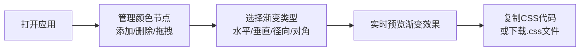

## 1. 产品概述

本产品是一款面向插画师和设计师的在线渐变调色板设计与导出工具，解决协作场景下快速生成统一渐变背景素材的需求。支持实时编辑颜色节点、多渐变类型预览和CSS代码一键导出，填补了轻量级渐变生成工具的市场空白。

## 2. 核心功能

### 2.1 用户角色

| 角色 | 注册方式 | 核心权限 |
|------|----------|----------|
| 设计师用户 | 无需注册 | 完整使用所有渐变编辑、预览和导出功能 |

### 2.2 功能模块

1. **主编辑页面**：颜色节点管理、渐变类型切换、实时预览画布、CSS代码生成与导出

### 2.3 页面详情

| 页面名称 | 模块名称 | 功能描述 |
|----------|----------|----------|
| 主编辑页面 | 颜色节点编辑器 | 添加/删除/拖拽排序颜色节点，支持拾色器调整颜色 |
| 主编辑页面 | 渐变类型切换 | 水平、垂直、径向、对角四种渐变类型切换按钮 |
| 主编辑页面 | 渐变预览画布 | 实时渲染当前渐变效果，支持响应式布局 |
| 主编辑页面 | CSS代码导出 | 单行紧凑格式CSS代码显示、一键复制、下载为.css文件 |

## 3. 核心流程

用户打开应用 → 添加/拖拽/调整颜色节点 → 选择渐变类型 → 实时预览渐变效果 → 复制CSS代码或下载文件

## 4. 用户界面设计

### 4.1 设计风格
- **主色调**：深色主题，主背景 #121212，面板背景 #1a1a2e，文字色 #e0e0e0
- **按钮样式**：圆角按钮，选中状态带下划线和高亮色块
- **字体**：等宽字体 Fira Code 用于代码显示，搭配现代无衬线字体用于界面文字
- **布局风格**：左右分栏布局（平板以上），上下堆叠布局（手机）
- **视觉特效**：代码块渐变边框动画，节点拖拽放大阴影效果，渐变切换过渡动画

### 4.2 页面设计概述

| 页面名称 | 模块名称 | UI元素 |
|----------|----------|--------|
| 主编辑页面 | 左侧控制面板 | 渐变类型按钮行（4个按钮）、色块条（圆形颜色节点+添加按钮）、1px #333 分割线 |
| 主编辑页面 | 右侧预览画布 | 渐变背景预览区（占60%宽度）、CSS代码块（深色背景#1e1e1e、Fira Code字体）、复制/下载按钮 |
| 主编辑页面 | 交互反馈 | 节点拖拽放大至40px+阴影、按钮点击100ms内响应、渐变切换0.3s ease过渡 |

### 4.3 响应式
- **桌面端（≥768px）**：左右分栏布局，左侧控制面板，右侧预览画布
- **移动端（<768px）**：上下堆叠布局，控制面板在上，预览画布在下
- **触摸优化**：颜色节点直径32px，保证触摸区域充足

### 4.4 性能约束
- 预览画布渲染帧率 ≥ 30fps
- 拖拽节点更新延迟 ≤ 16ms
- 所有交互反馈 ≤ 100ms
