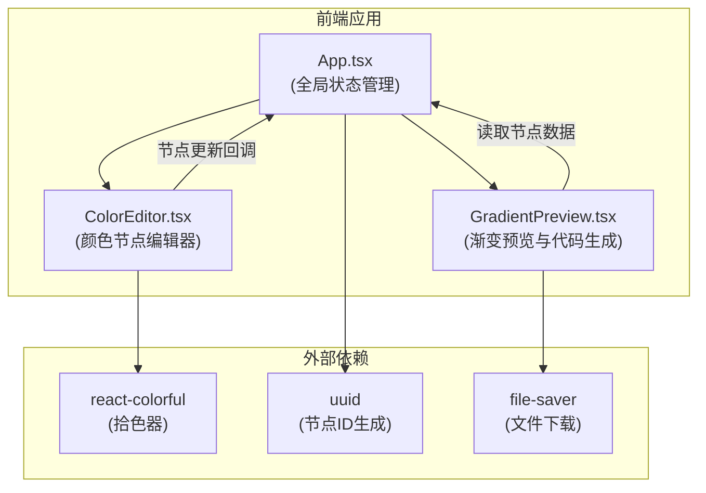

## 1. 架构设计



## 2. 技术描述
- **前端**：React@18 + TypeScript + Vite
- **初始化工具**：Vite
- **状态管理**：React useState (组件内局部状态)
- **样式方案**：内联样式 + CSS
- **核心依赖**：
  - react-colorful：轻量级拾色器组件
  - uuid：生成颜色节点唯一标识
  - file-saver：CSS文件下载功能
  - @vitejs/plugin-react：Vite React 插件

## 3. 数据流向与调用关系

### 3.1 文件结构与职责

| 文件路径 | 职责 | 依赖关系 |
|----------|------|----------|
| `src/App.tsx` | 主应用组件，管理全局状态：渐变类型、颜色节点列表 | 调用 ColorEditor、GradientPreview |
| `src/components/ColorEditor.tsx` | 颜色节点编辑器：添加/删除/拖拽/颜色调整 | 被 App 调用，使用 react-colorful |
| `src/components/GradientPreview.tsx` | 渐变预览与CSS代码生成：渲染渐变、生成代码、复制/下载 | 被 App 调用，使用 file-saver |
| `src/types.ts` | TypeScript 类型定义 | 被所有组件引用 |

### 3.2 数据流向

1. **App.tsx** → 传递 `colorNodes` 和 `gradientType` 给子组件
2. **ColorEditor.tsx** → 用户操作节点后，通过 `onNodesChange` 回调更新 App 状态
3. **GradientPreview.tsx** → 读取 App 传递的状态，实时渲染渐变并生成CSS代码
4. **GradientPreview.tsx** → 复制/下载操作不影响全局状态，仅与浏览器交互

### 3.3 核心数据类型

```typescript
interface ColorNode {
  id: string;
  color: string;
  position: number; // 0-100
}

type GradientType = 'horizontal' | 'vertical' | 'radial' | 'diagonal';
```

## 4. 核心算法

### 4.1 CSS渐变生成
根据节点列表和渐变类型生成CSS代码：
- 水平：`linear-gradient(to right, color1 pos%, color2 pos%, ...)`
- 垂直：`linear-gradient(to bottom, color1 pos%, color2 pos%, ...)`
- 径向：`radial-gradient(circle, color1 pos%, color2 pos%, ...)`
- 对角：`linear-gradient(to bottom right, color1 pos%, color2 pos%, ...)`

### 4.2 拖拽排序
使用原生HTML5拖拽API实现节点重排序，拖拽时更新节点position值。

## 5. 性能优化策略
- 使用 React.memo 优化子组件重渲染
- 颜色节点更新使用批量更新
- 渐变CSS代码生成缓存（仅当节点或类型变化时重新计算）
- 使用 useCallback 缓存事件处理函数
